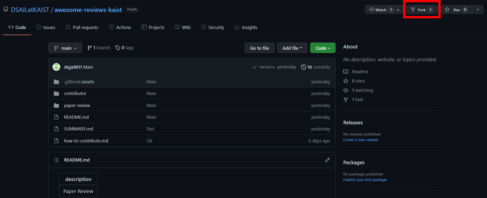

---  
description : 글 작성 방법  
---

# How to contribute?  

이 글에서는 리뷰 작성 방법에 관한 안내를 다룹니다.

This writing is the guideline of how to write review.

## 1. Preparing for your manuscript  

* Fork repository  
먼저, [awesome-reviews-kaist](https://github.com/DSAILatKAIST/awesome-reviews-kaist) repository를 자신의 github에 fork를 합니다. 

 <>