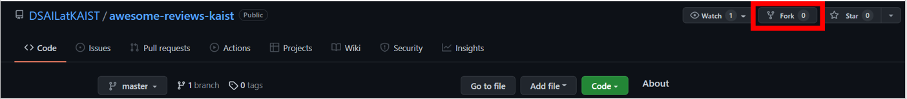
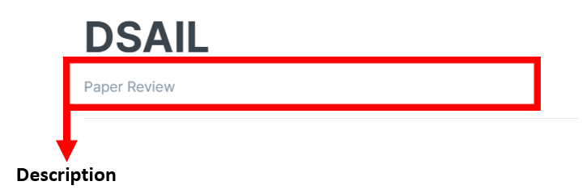
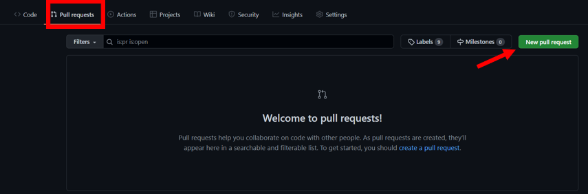
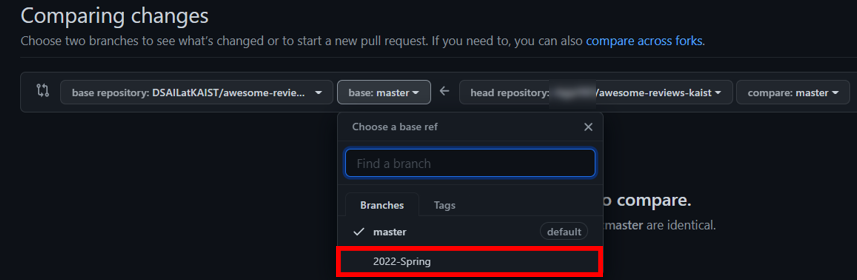

# How to contribute?  

이 글에서는 리뷰 작성 방법에 관한 안내를 다룹니다.

This writing is the guideline of how to write review.

## Preparing for your manuscript  

### **Fork repository**  

먼저, [awesome-reviews-kaist](https://github.com/DSAILatKAIST/awesome-reviews-kaist) repository를 자신의 github repository에 fork하여 추가합니다.  

At first, you should fork the [awesome-reviews-kaist](https://github.com/DSAILatKAIST/awesome-reviews-kaist) repository to make a repository on your account.  

<p align="center"></p>  


### **Write reviews on .md format**  

리뷰를 작성할 때는 마크다운으로 작성해야 합니다. 마크다운이 처음이신 분들은 [Tutorial](https://www.markdowntutorial.com/)에서 연습하여 작성해주시길 바랍니다.   
또는 [StackEdit](https://stackedit.io/app#)에서 자유롭게 연습이 가능합니다.  

You should write reviews on markdown format.  
For the beginner of markdown, [Tutorial](https://www.markdowntutorial.com/) site is available for practice.


마크다운용 편집기 [Typora](https://typora.io/)을 활용하시면 편리하게 작성이 가능합니다.  
자신이 사용하던 편집기를 이용하여 작성하셔도 무방합니다.   

It is possible to write conveniently when you utilize the [Typora](https://typora.io/) edition.  
It is also okay to utilize your own edition.  

### **Directory Structure**  

본 메인 리뷰 파일(.md)는 "paper-review/2022-spring" 위치에 넣어주세요.   

You should put the main review file(.md) on "paper-review/2022-spring" directory.  

사진을 첨부한다면, ".gitbook/2022-spring-assets/\<article-id\>/\<image.png\>" 위치에 사진 파일을 넣어주세요.  
메인 리뷰 파일에서도 사진 위치에 맞는 파일명을 넣어주세요.   

If you want to put an image, you should put an image on ".gitbook/2022-spring-assets/\<article-id\>/\<image.png\>" location.  
You also write the file name corresponding to image path on main review file.  

**E.g.**
``` bash  
  
```  

### **SUMMRAY.md**  

SUMMARY.md는 리뷰 파일의 위치를 Gitbook에 알려주는 용도로 사용이 됩니다.  
SUMMARY.md에 자신이 작성한 메인 리뷰 파일의 위치를 적어야 합니다.  

SUMMARY.md file is used for recognizing the location of review file path on Gitbook.  
You should write the location of path of your own review file on SUMMARY.md.  

**E.g.**
``` bash  
* [\[2022 Spring\] Paper Review](paper-review/README.md) 
    * [BGNN](paper-review/2022-spring/bgnn.md) # [Title](path) 
```  

### **Description**  

메인 리뷰 파일 상단에는 description 포맷을 써주시길 바랍니다.  
descrpition을 작성할 경우 아래 그림의 "Paper Review" 글씨에 들어가게 됩니다.  

You should write description format on the top of main review file.  
Referred to above figure, "Paper Review" font will be put as you write description format.  

Description 양식을 아래와 같이 지켜주시길 바랍니다.   
You should follow the below description format.  

저자 / 제목 / 학회-년도  
Author / Title / Conference-year  

**E.g.**  

``` bash  
---
description: Li et al./ Bipartite Graph Network With Adaptive Message Passing For Unbiased Scene Graph Generation / CVPR-2021
---   
```  


<p align="center"></p>


### **File Name**  

메인 리뷰 파일명은 아래와 같은 양식을 지켜서 만들어주시길 바랍니다.  

You should follow the above format to make the name of review file.  

``` bash  
학회-연도-제목
Conference-Year-Title  
```  
위와 같은 양식으로 파일명에는 하이픈(-)으로 구별해주시길 바랍니다.  
또한, 파일명은 소문자로만 구성되어야 합니다.    

Following to above format, hyphen(-) is used to split the file name.  
Also, file name should be composed of lower case.

**E.g.**  
```bash  
cvpr-2021-bgnn
```  

### **Pull Request**  

제출을 원하는 경우에, fork한 레포지토리로 가서 pull request를 합니다.  
아래 그림과 같이 "Pull Requests"로 들어가서 "New pull request"를 클릭합니다.  

If you want to submit it, you should enter your repository which has been forked and pull request.  
As shown in above picture, go to "Pull Requests" and click "New pull request".  

<p align="center"></p>

제출시 **master**가 아닌 **2022-Spring** branch로 제출해주시길 바랍니다.  
  
You should submit it to **2022-Spring** branch, not **master** branch.  

<p align="center"></p>

### **Review Format**  

리뷰 포맷은 [Review Format](https://github.com/DSAILatKAIST/awesome-reviews-kaist/blob/master/paper-review/template.md)을 통해서 확인할 수 있습니다.  

You can check the review format on [Review Format](https://github.com/DSAILatKAIST/awesome-reviews-kaist/blob/master/paper-review/template.md) link. 