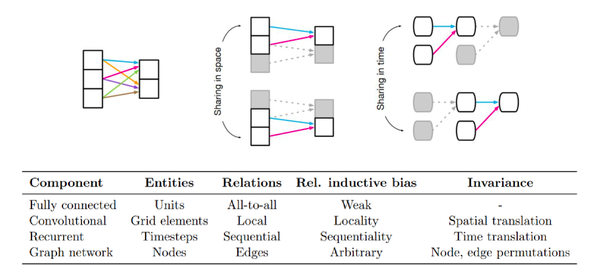

# **Graph Neural Ordinary Differential Equations** 

## **1. Problem Definition**  
> Appropriate Relational Inductive Bias on GNN in terms of Continuous Domain !

적절한 'Inductive Bias'를 부여하는 것은 딥러닝 모델에서 아주 중요한 요소로 부각된다. 이때, 우리는 Inductive bias가 무엇인지 조금 더 엄밀하게 짚고 넘어가야할 필요가 있다. Inductive Bias는 모델이 unseen data에 대해서 더욱 잘 예측하기 위해 우리가 도입하는 *추가적인 가정* 으로 이해하면 좋다. 이 중에서도 Relational Inductive Bias는 이름 그대로 모델을 이루는 entities 간의 relationship 에 대해 우리가 부여하는 추가적인 가정으로 이해할 수 있다. 대표적으로, MLP와 CNN을 비교해보면, MLP는 하나의 인풋이 모든 아웃풋에 관여하지만 인풋 간의 관계성은 등한시되는 반면 CNN은 convolution filter가 window sliding을 하며 업데이트를 이어나가게 되고 이를 바탕으로 local한 인풋은 서로 weight sharing을 하는, 서로 관계가 비슷할 것이라는 가정이 들어가게 된다. 즉, Relational Inductive Biase 측면에서 MLP는 Weak한 반면 CNN은 Local내에서 Strong하다고 볼 수 있다. 이 관점에서, *Relational Inductive Bias*는 *Weight Sharing*과 대응되는 개념으로 바라볼 수 있게 된다.

그렇다면, 이제 본론으로 넘어와서 우리가 현재 포커싱하고 있는 'Graph Neural Network' 관점에서 바라보면 어떠한가? GNN은 node와 edge를 바탕으로 한 그래프 자료구조에서 딥러닝을 접목시켰기 때문에 Relation은 직관적으로 edge를 바탕으로 이뤄지고 있음을 알 수 있다. 이때, Relational Inductive Bias는 정형화되지 않은, arbitrary한 특성을 가지고 있다. 이는 GNN에서는 특정 두 노드를 기준으로 엣지가 정의되고 있는 본질적인 성질 때문이다. 예를 들어보자면, 전 세계 대학원생의 그래프를 만들어본다고 했을 때, 각 국가를 라벨로 가지고 노드는 해당 대학원생의 특성으로 정의된다고 해보자. 이때, 두 대학원생을 이어주는 엣지는 취미생활이 같은 경우(e.g., 축구)라고 하면 한국 내에서 대학원생 김 모군 - 박 모군 의 관계도 있을 것이고 미국에서 John - Andrew 의 관계도 있을 것이다. 두 Pair(김-박, John-Andrew)는 그래프 내에서 local하지는 않아도 관계는 일치하기 때문에 비슷한 weight를 share할 가능성도 크다. 이러한 경우가 바로 aribitrary한 Relational Inductive Bias를 갖는 경우로 볼 수 있다. 앞선 두 문단을 하나의 사진으로 그래프로 요약하면 아래와 같다. 이 외에도 Inductive Bias에 대한 더욱 깊은 이해를 원하면, reference를 참고하길 바란다.

우리가 오늘 특히 집중할 Inductive Bias는 시스템 내 데이터를 바탕으로 한 'Temporal Behavior', 즉 시간에 따른 행동양상이다. 앞서 우리는 inductive bias를 *추가적인 가정*에 대응되는 개념이라고 했다. 즉, 현재 경우에 접목시켜보면 우리의 추가적인 가정은, 시간에 변화 따라 시스템의 dynamics이 **discrete**한 지, **continuous**인지 등의 가정을 부여해줄 수 있다. 이 중, 특히 신경망을 연속적인 layer의 구조로 표현하는 관점 그리고 *상미분방정식(ODE)의 초기값 문제의 해*를 통해 이를 업데이트 하는 과정은 최근 딥러닝 모델로 하여금 새로운 패러다임을 제안했다고 볼 수 있다.

이러한 흐름 즉, GNN관점에서 Temporal Behavior 측면 상 적절한 Inductive Bias를 부여하기 위해 해당 paper는 아래 3가지의 문제에 접근하고자 한다.

1. **Blending graphs and differential equtations**
- 상미분방정식(ODE)을 GNN으로 parameterize하고 system-theoretic한 framework, **Graph neural Ordinary Differential Euqations, GDE**를 제안하고자 한다. 이때 GDE는 ODE를 바탕으로 한 연속적인 관점, 그리고 GNN의 본질적인 Reltaional Inductive bias를 내포한 체로 디자인된다는 특징점을 가진다. 이러한 GDE는 효과성은 semi-supervised의 node classification task와 spatio-temporal foecasting task에서 실험적으로 입증한다.

2. **Sequence of graphs**
- GDE의 framework를 spati-temporal 세팅으로 가저간 뒤, hybrid dynamical system관점에서 일반적인 autoregressive(자가회귀모형)으로 모델링한다. 이때, autoregressive GDE는 ODE의 적분 구간을 변경해줌으로써, irregular한 데이터 관측에서도 잘 대응할 수 있게 해준다.

3. **GDEs as general-purpose models**
- 특히, GDE는 연속적인 환경에서 GDE를 효과적이게 모델링하기 위한 별도의 assumption, 가정이 불필요하다는 장점을 가진다. 즉, 범용적인 측면에서 높은 성능을 내고 효과적임을 실험적으로 입증한다.

## **2. Motivation**  
> GNN + Neural ODE = Continuous GNN !

이 Paper에서 기존의 GNN이 가지는 discrete한 모델링의 한계를 극복하고자 한다. 즉, continuous한 'Graph Neural Network'을 모델링해보고자 함이다. 무엇을 통해? 바로 NeurIPS 2018 best paper로 선정된 'Neural Ordinary Differential Equations'에서 제안된 신경망을 미분방정식의 해로 바라보는 관점을 통해. 앞선 두 문장에서 유추할 수 있듯, 우리는 두 가지 key concept을 먼저 이해하고 본격적인 GDE의 모델링 측면으로 넘어가고자 한다.

### (1) Graph Neural Network
- 먼저, GNN을 이해할 필요가 있는데, 이 중 가장 대표적인 'GCN(Graph Convolutional Networks)'을 간단히 설명해보고자 한다. 기존의 딥러닝 분야(e.g., CNN)과 달리 GNN은 non-euclidean space에서 정의되고 feature들이 독립적이지 않다는 속성을 key motivation으로 삼아 발전한, Graph 자료구조에 신경망을 접목시킨 모델이라고 이해할 수 있다. 그 중, GCN은 이름에서 유추할 수 있듯, CNN에서의 Convolution 연산을 그래프 자료구조에 접목시킨 대표적인 모델이다. Graph에서 Convolution을 적용하기 위한 과정으로는 퓨리에 변환(Signal을 Frequency로 변환하는 과정)이 필수적으로 수반되게 되고 이때 우리는 Signal을 node의 label, Frequency를 중심노드와 이웃노드의 차이로 대응할 수 있게 된다. 핵심은, 우리는 이러한 중심노드와 이웃노드의 차이가 적기를 바라며, 이러한 *이웃노드들로부터 자신의 노드를 업데이트하는 과정*이 바로 GCN의 본질이라는 것이다. 이에 대한 더욱 자세한 설명은 해당 페이지에서 GCN에 대한 PDF를 참고하면 도움이 된다. (https://github.com/SukwonYun/GNN-Papers)

 

- 수식을 통해 이해해보면 아래와 같이 설명할 수 있다. 이때, %h_v^{l}%은 노드 v의 hidden representation 이고 %N_v%는 노드 v의 이웃노드들의 집합이다. 수식에서 보듯 자기자신의 representation을 업데이트하는 과정에서 이웃노드들의 representation을 바탕으로 한다는 것이 GNN의 핵심이다. GCN은 이 중에서도 Laplacian 연산(i.e.,%DAD%)을 통해 자기자신과 이웃노드들의 representation 평균 합으로 AGGREGATE하는 GNN으로 이해하면 된다. 이때, %W^{l-1}%은 l-1번째 layer에서 업데이트되는 파라미터이다.

$$
\begin{equation}
\mathbf{h}_{v}^{(l)}=\text{COMBINE}^{(l)}\left(\mathbf{h}_{v}^{(l-1)}, \text{AGGREGATE}^{(l-1)}\left(\left\{\mathbf{h}_{u}^{(l-1)}: u \in \mathcal{N}(v)\right\}\right)\right)
\end{equation}
$$

$$
\begin{equation}
    \mathbf{H}^{(l)} = \sigma(\mathbf{\hat{D}}^{-1/2}\mathbf{\hat{A}}\mathbf{\hat{D}}^{-1/2}\mathbf{H}^{(l-1)}\mathbf{W}^{(l-1)})
\end{equation}
$$

### (2) Nerual ODE
- 2018년 발표된 Neural Ordinary Differential Equations는 Neural Network를 Continuous Domain에서 바라볼 수 있게 한, 새로운 패러다임을 제안한 논문으로 평가되고 있다. 사실 이 논문의 key contribution은 신경망을 미분방정식의 해로 표현하는 그 주춧돌 역할을 제안했다기 보다는, Backward pass를 adjoint sensitivity method를 도입하므로써 gradient를 아주 효과적으로 구할 수 있게 해준데 있다. 먼저, 어떻게 discrete했던 기존의 신경망을 continuous하게 바라볼 수 있게 되었는지 'ResNet'을 통해 간단히 intuition을 살펴보고자 한다.
핵심은 ResNet에서 비롯된 residual connection을 좌변으로 넘겨서 1이었던 변화량을 generalize하여 미분의 관점으로 바라보는 것이다. 이로써, discrete했던 layer의 index 혹은 timestamp, t를 하나의 variable로 모델링할 수 있어진다. 이는 아래의 식과 같이 나타낼 수 있고 이러한 변화를 통해 Residual Network와 ODE Network의 Depth별 gradient의 흐름, hidden state의 업데이트 과정을 아래와 같이 이미지화 할 수 있다.

$$
\begin{equation}
\begin{align*}
\mathbf{h}_{t+1} = f(\mathbf{h}_{t}, \theta_t) + \mathbf{h}_{t} \\
\mathbf{h}_{t+1} - \mathbf{h}_{t} = f(\mathbf{h}_{t}, \theta_t) \\
\frac{\mathbf{h}_{t+\Delta} - \mathbf{h}_{t}}{\Delta}|_{\Delta=1} = f(\mathbf{h}_{t}, \theta_t) \\
\lim_{\Delta \rightarrow 0}  \frac{\mathbf{h}_{t+\Delta} - \mathbf{h}_{t}}{\Delta} = f(\mathbf{h}_{t}, \theta_t) \\
\frac{d\mathbf{h}(t)}{dt} =f(\mathbf{h}(t),t,\theta) \\
\end{align*}
\end{equation}
$$

 

- 이러한 intuition을 바탕으로 2018년 Neural ODE는 Backward Pass에 Adjoint Sensitivity Method를 접목시켜서 parameter를 업데이트 시키는 과정에서 gradient를 훨씬 효과적으로 구해낼 수 있게 하였고 이는 연구자들로 하여금 새로운 출발점을 알린 획기적인 시점이 되었다. Forward Method와 대비되는 Adjoint Sensitivity Method는 과연 무엇인지 아래 슬라이드 두개로 대체하고자 한다. 간단히 요약하자면, 초기값 문제를 풀고 Loss를 정의하여 parameter를 업데이트하는 과정에서 time dependent solution function에 대한 parameter 변화량을 구해야하는데 이를 구하기가 상당히 수고스러웠었는데 Adjoint Sensitivity Method는 이를 직접적으로 구하지 않고 Optimization 문제로 치환하여 Lagrangian을 도입하고 앞선 변화량의 계수를 0으로 만드는 별도의 초기값 문제를 하나 더 제안하여, 총 2개의 ODE를 푸는 것으로 파라미터를 업데이트 한다는 것이다.구체화 된 과정은 아래 슬라이드와 같이 나타낼 수 있다.

 

 

- 이러한 'Neural ODE'는 기존의 딥러닝 모델과 같이 gradient를 직접적으로 구하는 것이 아닌 gradient를 mimic하는 과정으로 볼 수 있기에 별도의 gradient를 저장할 필요가 없어진다. 따라서, *memory efficient*하다는 장점, Timestamp에 종속적이었던 시간 t를 별도의 변수로 모델링하여 *구간 내의 dynamics를 하나의 함수로 모델링*할 수 있다는 장점, *irregular한 time에 대한 대응*, 그 간 *수리적으로 입증되었던 미분방정식 풀이법을 딥러닝에 접목*시킬 수 있다는 장점 등 다수의 매력을 내포한 체 딥러닝에 새로운 패러다임을 제안하게 되었다.

## **3. Method**  
본격적으로 Method로 들어가고자 한다. 앞선 Motivation이 어느정도 구체적이었고 길었던 이유는 바로 오늘의 Graph neural ordinary Differential Euqations, GDE가 결과적으로 'GNN과 Neural ODE를 접목시킨 퍼스트 펭귄의 역할을 하는 paper'로 볼 수 있기 때문이다. 먼저 순서는 GDE에 대한 definition, Static Model에서의 GDE, Spatio-Temporal Model에서의 GDE순으로 이번 파트를 설명하고자 한다.

### (1) Definition of GDE
 
 
 

### (2) GDE on Static Models
 
 

### (3) GDE on Spatio-Temporal Models
 
 

Please write the methodology author have proposed.  
We recommend you to provide example for understanding it more easily.  

## **4. Experiment**  

In this section, please write the overall experiment results.  
At first, write experiment setup that should be composed of contents.  

### **Experiment setup**  
* Dataset  
* baseline  
* Evaluation Metric  

### **Result**  
Then, show the experiment results which demonstrate the proposed method.  
You can attach the tables or figures, but you don't have to cover all the results.  
  

## **5. Conclusion**  

Please summarize the paper.  
It is free to write all you want. e.g, your opinion, take home message(오늘의 교훈), key idea, and etc.

—  
## **Author Information**  

* Author name  
    * Affiliation  
    * Research Topic

## **6. Reference & Additional materials**  

Please write the reference. If paper provides the public code or other materials, refer them.  

* Github Implementation  
* Reference  

