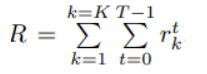
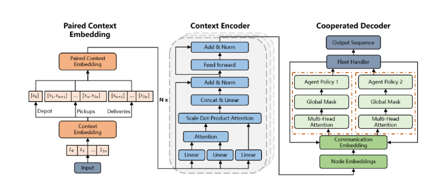
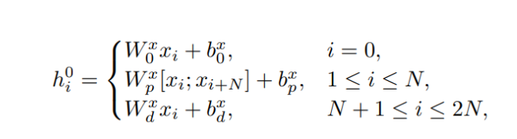
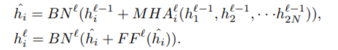
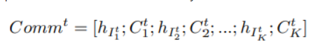
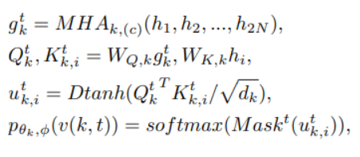
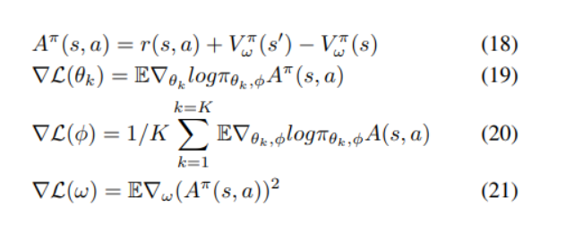
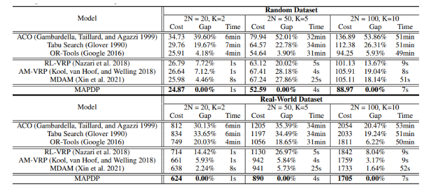
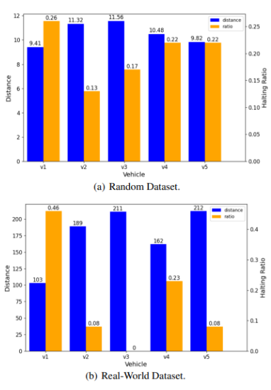
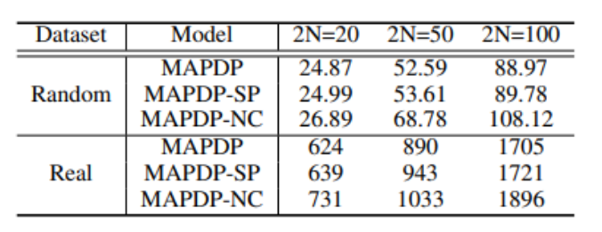

# **MAPDP(Cooperative Multi-Agent Reinforcement Learning to Solve Pickup and Delivery Problems)** 
 

## **1. Problem Definition**  

차량경로문제 (Vehicle Routing Problem ; VRP)는 거점(depot)에서 출발한 차량이 배달(delivery)이나 수집(pick-up) 등의 서비스를 요구하는 고객(customer)을 특정한 순서대로 방문하고 다시 거점으로 돌아오는 최소 비용의 경로를 결정하는 문제입니다.

VRP문제는 NP-hard 성질을 가지고 있어, 문제사이즈가 커질 수록 exact의 해를 구하기 위해서는 time-cunsuming문제가 남아있어 exact해를 approximate하는 접근 방법이 보다 현실적으로 적용할 수 있는 방법이라 할 수 있습니다. approximate하는 접근 방법 중 DRL(Deep-Reinforcement-Learning)을 이용하는 방법이 있는데, 휴리스틱 방법들보다 더 큰사이즈 문제들에 대해서 inference가 대체적으로 빠르고, 적당히 좋은 해를 제공해주기 때문에 연구가 활발히 이루어지고 있습니다.

본 논문에서는 VRP(Vehicle Routing Problem)의 일종인 Pickup & Delivery문제를 접근하는데 depot에서 출발하여 pickup or delivery만하는 typical VRP문제와 달리, pickup하는 구간 및 delivery하는 구간이 여러 곳이 있고, 각각의 노드가 서로 대응관계를 가지고 있습니다. (pick up 노드에서 받은 물건을 그에 대응되는 delivery 노드로 배달해야된다라는 관계를 가지고 있다는 뜻입니다.)  또한 여러대의 차를 이용하여 모든 차량이 움직인 거리의 합이 최소가 되도록 하는 문제를 풀기 때문에 보통 vrp문제보다 더 복잡한 문제라고 생각할 수 있습니다.  

## **2. Motivation**  

본 논문에서는 따라서 기존 vrp문제와는 다르게 고려해야될 부분에 대해 다음과 같이 말하고 있습니다.

1. pick-up node와 delivery노드들 사이에 복잡한 relationship을 고려하는 부분이 필요
    - pickup node를 들린 뒤에 delivery노드를 방문할 수 있는 선행관계에 대한 constraint가 존재하므로 위 관계를 explicit하게 representation할 수 있는 부분이 모델에 들어가야된다고 합니다.
2. paired node와 unpaired node들 사이의 representation은 달라질 필요가 있음
    - paired노드라는 것은 pickup node에 대응되는 delivery 노드(ie. 배달기사가 여러 음식점을 들려 배달하는 음식들을 각각 주문을 시킨 집으로 배송한다고 할 때, 분식집(pickup node)에서 가져온 음식을 분식을 배달시킨 집(delivery node)에 배송을 해야되는데 이 둘사이를 paired 관계라고 합니다.)  unpaired node는 분식집과 피자를 주문한 집사이의 관계를 의미하는데 이 paired, unpaired관계는 서로 다르게 표현해야된다라고 직관적으로 생각될 수 있습니다.
3.  각 vehicle이 communication할 수 있는 구조가 필요
    - vehicle이 여러대인 경우 각 vehicle의 가능한 action space는 다른 vehicle에게 영향을 받기  때문에 vehicle이 1개일 때와 여러 대 일때의 상황은 다를 수 밖에 없고 이는 Global objective는 다르다고 할 수 있습니다

논문에서 각 한계를 풀고자 시도한 방법으로는 paired context embedding을 이용하여 1,2번에 대한 문제를 해결하고자 하였고, agent들의 state를 서로 공유할 수 있도록 하는 communication layer를 통해 3번 문제를 해결하고자 하였습니다.

## **3. Method**  

PDP문제를 MDP로 표현하면 다음과 같습니다.

State : $S_k^t$ → agent k의 current location

- 가정 : All states are fully observable via centralized control

Action : step t에서 vehicle agent k가 다음 타겟노드를 결정하는 것 → $v(k,t)$

Transition : 모든 agent의 타겟 노드가 바뀌는 것. 각 agent의 state와 capacity도 업데이트 됩니다.

- $S_k^{t+1} = (S_k^tl \{v_{I_k^t} \})$
- $C_k^{t+1} = C_k^t - d_{I_k^t}$

Reward : 모든 agent는 누적 거리의 합을 최소화시키는 공통의 목적식을 가짐

- $r_k^t$ = - $e_{I_k^t,I_k^{t+1}}$ : one step reward
- total reward
- 

MAPDP 모델은 paired context embedding → context encoder → cooperated decoder로 구성이 되어있는데 아래 그림이 그 구조에 대해 보여주고 있고, 이제부터 각각의 구조에 대해서 알아보겠습니다. 

- 

### paired context embedding

- 
paired context embedding은 위의 식에서 알 수 있듯이 각 embedding된 pickup node와 delivery node에 대해 pickup node가 delivery node에 대한 정보를 가지고 있을 수 있도록 concat 후 다시 linear layer를 통해 embedding하는 과정이다.

### context encoding(transformer encoding)

- 

context encoding은 transformer의 encoding구조를 따르는 multi attention layer, skip-connection layer, feed-forward layer, batch normalization layer로 구성되어있다. 이를 통해 pickup node, delivery node간의 관계에 대한 representation이 가능하도록 합니다.

Cooperative Multi-agent Decoder

### Communication Embedding

각 agent들의 update된 state들을 저장하는 layer입니다.

- 

또한 $h_{k,(c)}^t$가 나타내는 것은 agent가 decision making을 하는데 global representation, agent의 현 state, t시점의 모든 agent들의 상태($Comm^t$)를 사용한다는 것입니다.

$h_{k,(c)}^t = [ \bar h;h_{I_k^t};C_k^t;Comm^t]$ 

아래를 통해 $h_{k,(c)}^t$가  single query vector로 사용되며 attention과 softmax를 통해 나온 분포가 policy의 분포가 됩니다. 이때  모든 unfeasible한 노드의 compatibility를 -inf로 하는 Masking을 해주어 feasible한 solution을 만들도록 합니다. 

- 

마지막으로 feasible한 solution을 낼 수 있도록 도와주는 보조적인 fleet Handler의 역할은 만약 2개의 decoder가 있다고 가정을 했을 때(agent가 2) 같은 decision(같은 노드)를 선택할 때, 하나의 노드만 action(target node change)하고 다른 노드는 그대로 유지합니다.

### A2C
- 
agent수 만큼의 decoder가 있을텐데, decoder만큼의 policy network가 존재하며 critic network는 모두가 공유하도록 Actor-Critic 구조를 이용하고, Policy, Critic network에 대한 loss를 계산하여 학습을 합니다.

## **4. Experiment**  

실험은 다음 3가지에 대해 입증하고자 하였다. (1) 다른 휴리스틱과 RL 기반 방법론들보다 본 논문에서 제안한 MAPDP의 성능이 좋은가  (2) 모델 내 구성하고 있는 fleet handler와 다른 agent간의 협동을 얼마나 균형사이의 관계 (3) communication embedding이 모델의 성능에 얼마나 효과가 있었는가 

### **Experiment setup**  
- Dataset
    - Random Generated Dataset : node $v_i$의 위치인 x, y좌표를 uniform 분포 (0,5)로 sampling하여 정하였고, 각 pick up node의 demand의 크기는 (1,10)의 uniform 분포를 따르도록 하였다. 또한 각 vehicle의 capacity는 10이 되도록 설정했습니다..
    - Real-World Dataset : 중국 광동시에 존재하는 실제 pickup-delivery pair 10만개 이상의 데이터 셋을 사용하였고, 각 vehicle의 capa를 6으로 설정했습니다.
    - 두 데이터 셋 모두 각각 pair 수를 20, 50, 100일 때, 각각vehicle수를 2, 5, 10로 두고 실험했습니다.
- baseline
    - 대표적인 휴리스틱 알고리즘인 Ant Colony Optimization, Tabu Search, OR Tools를 휴리스틱의 baseline으로 삼았고, RNN 모델을 이용한 RL-VRP, Transformer 구조를 이용한 AM모델, Multi Decoder, KL divergence를 additional training loss term으로 이용한 MDAM을 RL기반의 baseline 모델로 삼았습니다.
    - 위의 RL알고리즘 같은 경우 PDP를 위한 알고리즘이 아니므로 공평한 비교를 위해 pickup delivery 에 대한 마스킹을 통해 feasible한 해를 찾을 수 있도록 하였습니다.
    - 또한 모든 모델들이 multi agent환경이 아니므로 vehicle의 배정 순서를 정해 배정이 되도록 하였습니다.
- Evaluation Metric
    - 각 vehicle의 이동한 총 거리의 합, inference하는데 걸린 시간을 모델의 성능을 평가하는데 사용하였습니다.

## Result

(1) MAPDP의 Performance

- 

위 결과는 각 다른 scale 마다의 결과는 MAPDP가 Cost(모든 vehicle이 움직인 거리)와 Time(해를 찾아내는 속도)측면 모두 성능이 가장 좋았다는 결과를 보여줍니다. 

(2) Dataset에 따른 vehicle간의 balance

- 

위에서 이미 설명했던 fleet handler를 통해 action이 미뤄진 횟수를 각 vehicle마다 측정을 하고 이를 전체 step으로 나눈 비율(haltingtimes / T)을 위 그래프에서 노란색 막대그래프로 표현된 halt ratio입니다. halt ratio가 큰 vehicle일 수록 적은 거리를 움직인 것을 확인할 수 있습니다. 또한 Random으로 generate된 Dataset이나 Real-World Dataset를 비교해보면 Real dataset에서 vehicle간의 balance가 잘 맞지않는 것을 확인할 수 있는데 이는 실제 pickup, delivery 노드의 위치의 불균형에 의해 발생한 것이라고 위 논문에서는 말하고 있습니다.

(3) Ablation study

- 

MAPDP-SP, MAPDP-NC는 각각 agent가 모든 decoder를 공유하고 있는 모델, communicate embedding구조가 없는 모델인데 위 결과를 보면 MAPDP의 두 구조 모두 성능에 있어 기여하고 있다는 것을 확인할 수 있습니다.
### **Result**  
Then, show the experiment results which demonstrate the proposed method.  
You can attach the tables or figures, but you don't have to cover all the results.  
  

## **5. Conclusion**  

위 논문은 PDP문제를 MARL로 접근한 최초의 논문으로써 충분한 의미가 있습니다.. paired context embedding을 통해 pickup node와 delivery node간의 constraint를 explictly하게 representation하였고, communication embedding 및 각 agent마다 decoder를 배정하여 policy 파라미터를 학습시키면서 보다 cooperative한 multi-agent를 만들 수 있었습니다. 그렇지만 MDP구조상 translation되는 부분이 모든 agent의 position이 바뀌었을 때라는 것은 현실과는 맞지 않다고 생각이 들었는데, 현실에서는 도시에 먼저 도착한 agent가 있을 것이고, 만약 이 논문과 같은 방식을 따른다면 각각 agent들은 모든 agent들이 각각의 도시에 도착할 때까지 action을 할 수 없게 되기 때문입니다. 비록 minsum 구조에서는 위와 같은 순서가 중요하진 않지만 실제 application측면에서 잘 맞지 않을 수 있다라는 생각이 들었습니다.

---  
## **Author Information**  

* Author name  
    * Affiliation  
    * Research Topic

## **6. Reference & Additional materials**  

Please write the reference. If paper provides the public code or other materials, refer them.  

* Github Implementation  
* Reference  
