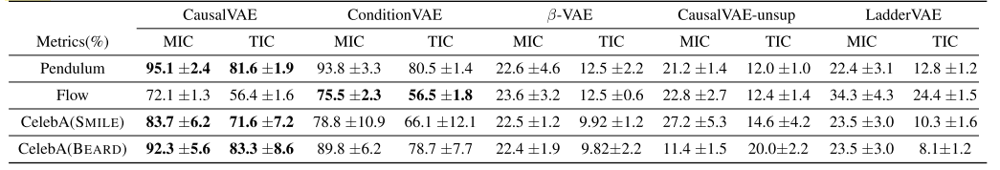

# **Title** 

[Disentangled Representation Learning via Neural Structural Causal Models](https://arxiv.org/abs/2004.08697)

## **1. Problem Definition**  

Variational autoencoder(VAE) is designed to disentangle independent latent variables from observed variables. However, this may not be true in reality. As in Fig. 1, Latent variables Z could be dependent on each other and even causally linked. 

<figure>
    
    <figcaption align = "center"><b>Fig. 1 - Original VAE model</b>
    </figcaption>
</figure>

The image is from this website https://lilianweng.github.io/posts/2018-08-12-vae/

One good example is shown in Fig. 2.

<figure>
    
    <figcaption align = "center"><b>Fig. 2 - A swinging pendulum: an illustrative example</b>
    </figcaption>
</figure>

In a swinging pendulum system,  there could be four concepts or latent variables including the position of the illumination source, the angle of the pendulum, the position, and the length of the shadow. These 4 latent variables are actually not independent of each other. The position of the illumination source and the angle of the pendulum are actually causing the position and length of the shadow. Theoretically, if we change either the position of the illumination source or the angle of the pendulum, the position and the length of the shadow will change accordingly as well. This is exactly the concept of "do-operation" in causality[1].

In summary, the problem is how to add the causal relationship among latent variables to the VAE model. To represent this causal relationship, this paper proposes a new model called the CausalVAE model, which adds one causal representation learning layer to the encoder part and one masking layer(assigning intervention layer) to the decoder part. The causal layer and mask layer are based on the structural causal model. The causal representation learning layer transforms exogeneous independent factors into causal representations. 

The problem is whether this model can represent the causal structures well. This paper conducted experiments on both synthetic datasets and real-world datasets to validate the efficacy of CausalVAE.

## **2. Motivation**  

There have been previous efforts to combine causality and disentangled relationships in the community. Suter et al.[2] linked causality and disentangled representations. Kocaoglu et al.[3] proposed a model called CausalGAN which integrated causality but requires predefined causal graphs. Besserve et al.[4] adds a layer which contains outputs of mutually independent causal mechanisms. CausalGAN requires predefined causal structures while Besserve et al's model made the assumption that causal mechanisms are mutually independent which may not hold in reality. There is a research gap for a more non-parametric model which requires fewer assumptions about the causal structures which motivate this work.

## **3. Method**   

As in Fig. 3, the proposed CausalVAE model adds a causal layer to learn causal representations to encoder and also a mask layer to simulate the intervention assignment to the decoder. However, unsupervised learning may fail due to identifiability issue[5]. This paper handles this issue through adding additional information u which is related to real causal relationships among latent variables. The key concept in the method is the mask layer. In the mask layer, as shown in step 3 and 4 in Fig. 3. The intervention based on the causal graph is given to latent factors to exert the influence of causal relationships in the output.

<figure>
    
    <figcaption align = "left"><b>Fig. 3 - Model structure of CausalVAE. The encoder takes observation x as inputs to generate independent exogenous variable ?, whose prior distribution is assumed to be standard Multivariate Gaussian. Then it is transformed by the Causal Layer into causal representations z (Eq. 1) with a conditional prior distribution p(z|u). A Mask Layer is then applied to z to resemble the SCM in Eq. 2. After that, z is taken as the input of the decoder to reconstruct the observation x.</b>
    </figcaption>
</figure>

## Causal Graphs(DAGs)

Causal relationships can be represented using Directed Acyclic Graph (DAG) with an adjacency matrix A.  

<figure>
    
    <figcaption align = "center"><b>Fig. 4 - A Simple Example of Causal Graph</b>
    </figcaption>
</figure>

## **Causal Layer: Transforming Independent Exogenous Factors into Causal Representations**   

The causal layer implements a linear structural causal model as in equation 1 to learn causal structures. A is the adjacency matrix and is the parameters to be learned in this layer. Epsilons are independent Gaussian exogenous factors and z ∈ Rn is a structured causal representation of n latent factors that is generated by a DAG thus A can be permuted into a strictly upper triangular matrix.

## Mask Layer: Structural Causal Model Layer

In equation 2, zi denotes the ith variable in the vector z. The adjacency matrix in the causal graph is A = [A1| . . . |An] where Ai ∈ Rn is the weight vector such that Aji encodes the causal strength from zj to zi. There are also a set of mild nonlinear and invertible functions [g1, g2, . . . , gn] that map parental variables to the child variable. 

where ◦ is the element-wise multiplication and ηi is the parameter of gi(·).

In equation 2, this model uses a nonlinear function instead of a linear structural causal model as in equation 1 since nonlinear functions result in more statable performance.

## **4. Experiment**  

This paper conducted experiments on both synthetic datasets such as the pendulum dataset and a real face dataset CelebA[6].  The baseline includes ConditionVAE[7] which is a supervised VAE model which requires the true causal graph as input. 

## **Experiment Setup**  

* Dataset
  * synthetic datasets such as the pendulum dataset and flow dataset
  * A real face dataset CelebA[6]
* Baseline  
  * Unsupervised methods
    * CausalVAE-unsup, LadderVAE[7], and β-VAE[8]
  * Supervised method
    * ConditionVAE
* Evaluation Metric
  * Maximal Information Coefficient (MIC) and Total Information Coefficient (TIC)[9]
    * Both of them indicate the degree of information relevance between the learned representation and the ground truth labels of concepts.

### **Results**  

The results are in the Fig. 5. There are 4 latent factors in Fig. 5, including PENDULUM ANGLE, LIGHT ANGLE, SHADOW LENGTH, and SHADOW LOCATION. The results of CausalVAE which only requires some additional information related to the causal graph are almost the same as the supervised VAE with the full real causal graph as input. As in first line in Fig. 5 (a), if intervening the pendulum angle to 0, the angles are almost the same which is aligned with the supervised model on the right side. The shadow location and shadow length under the light are actually reasonable and aligned with physical law.

<figure>
    
    <figcaption align = "left"><b>Fig. 5 - The results of Intervention experiments on the pendulum dataset. Each row shows the result of controlling the PENDULUM ANGLE, LIGHT ANGLE, SHADOW LENGTH, and SHADOW LOCATION respectively. The bottom row is the original input image.</b>
    </figcaption>
</figure>

The results of the experiment on the dataset CelebA are given in Fig. 6. If we intervene in the latent factor smile, the latent factor mouth open will change accordingly which is aligned with common sense that smiling causes an open mouth. 

<figure>
    
    <figcaption align = "left"><b>Fig. 6 - The results of Intervention experiments on the pendulum dataset. Each row shows the result of controlling the PENDULUM ANGLE, LIGHT ANGLE, SHADOW LENGTH, and SHADOW LOCATION respectively. The bottom row is the original input image.</b>
    </figcaption>
</figure>

The full results are given in the table below. 

The MIC and TIC between learned representation z and the label u. The results show that among all compared methods, the learned factors of our proposed CausalVAE achieve the best alignment to the concepts of interest. The metrics include mean ± standard errors in the table.

As shown in the table, CausalVAE beats any baseline model in terms of MIC and TIC.

## **5. Conclusion**  

This paper is the first to really integrate causal relationship in VAE and successfully experiment on the dataset which requires weak prior assumption. This research opens the door to further research on the causal relationship among the latent variables in the latent models such as VAE. This paper also suffers from limitations in that additional information u related to causal graphs is still required for the model. Unsupervised learning is still infeasible in practice.

---
## **Author Information**  

* Panyu ZHANG  
    * KAIST ICLab
    * Causal inference & Human-centered computing

## **6. Reference & Additional materials**  

[1]Judea Pearl. Causality. Cambridge university press, 2009.

[2]Raphael Suter, Dorde Miladinovic, Bernhard Scholkopf, and Stefan Bauer. Robustly disentangled causal mechanisms: Validating deep representations for interventional robustness. arXiv preprint arXiv:1811.00007, 2018.

[3]Murat Kocaoglu, Christopher Snyder, Alexandros G. Dimakis, and Sriram Vishwanath. Causalgan: Learning causal implicit generative models with adversarial training. CoRR, abs/1709.02023, 2017.

[4]Michel Besserve, Remy Sun, and Bernhard Scholkopf. Counterfactuals uncover the modular structure of deep generative models. arXiv preprint arXiv:1812.03253, 2018.

[5]Francesco Locatello, Stefan Bauer, Mario Lucic, Gunnar Ratsch, Sylvain Gelly, Bernhard Scholkopf, and Olivier Bachem. Challenging common assumptions in the unsupervised learning of disentangled representations. arXiv preprint arXiv:1811.12359, 2018.

[6]Ziwei Liu, Ping Luo, Xiaogang Wang, and Xiaoou Tang. Deep learning face attributes in the wild. In 2015 IEEE International Conference on Computer Vision, ICCV 2015, Santiago, Chile, December 7-13, 2015.

[7]Daniel D. Lee, Masashi Sugiyama, Ulrike von Luxburg, Is- abelle Guyon, and Roman Garnett, editors. Advances in Neural Information Processing Systems 29: Annual Conference on Neural Information Processing Systems 2016, December 5-10, 2016, Barcelona, Spain, 2016.

[8]Irina Higgins, Loic Matthey, Arka Pal, Christopher Burgess, Xavier Glorot, Matthew Botvinick, Shakir Mohamed, and Alexander Lerchner. beta-vae: Learning basic visual concepts with a constrained variational framework. Iclr, 2(5):6, 2017.

[9]Justin B Kinney and Gurinder S Atwal. Equitability, mutual information, and the maximal information coefficient. Proceedings of the National Academy of sciences, 111(9):3354– 3359, 2014.