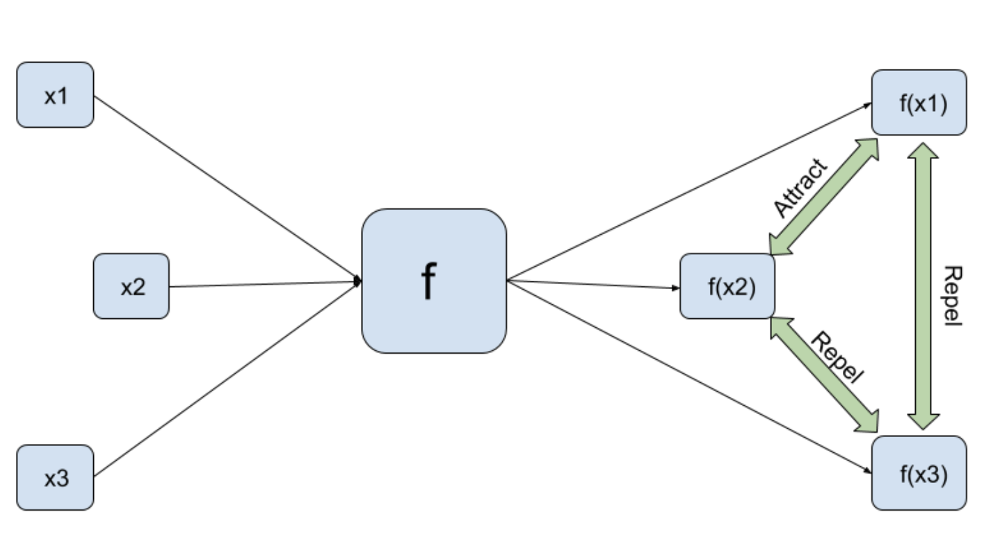
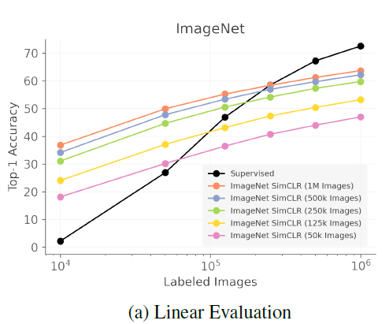
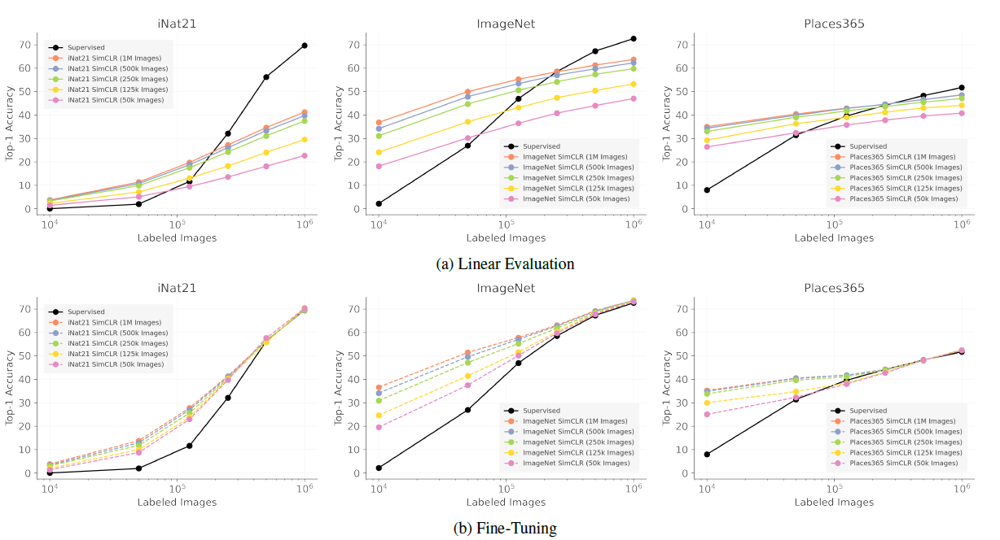
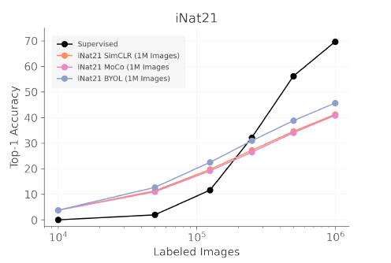
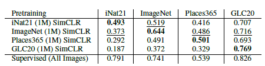
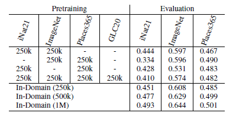
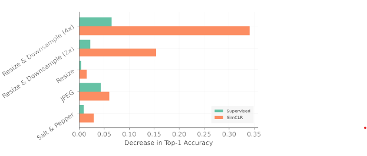
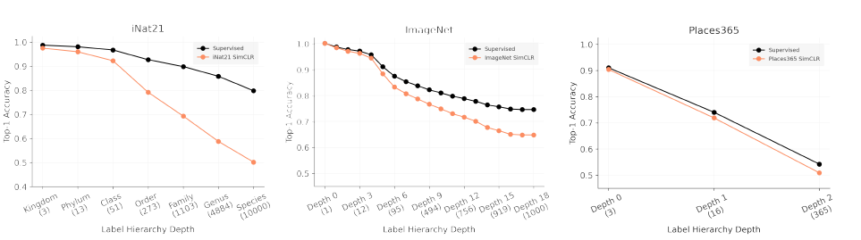

# When Does Contrastive Visual Representation Learning Work?

Link: [https://arxiv.org/abs/2011.11765](https://arxiv.org/abs/2105.05837)

## 0. Self-Supervised Learning

Self-supervised learning is an unsupervised learning method where the supervised learning task is created out of the unlabelled input data.

This task could be as easy as knowing the upper half of an image and predicting the lower half, or knowing the grayscale version of a colorful image and predicting the RGB channels of the same image, and so on.

### Why Self-Supervised Learning?

A lot of labelled data is usually required for supervised learning. Obtaining high-quality labelled data is costly and time-consuming, especially for more complex tasks like object detection and instance segmentation, which require more detailed annotations. Unlabeled data, on the other hand, is in plentiful supply.

The goal of self-supervised learning is to first learn useful representations of data from an unlabeled pool of data and then fine-tune the representations with a few labels for the supervised downstream task. The downstream task could be as straightforward as image classification or as complex as semantic segmentation, object detection, and so on.

Notably, most state-of-the-art methods are converging around and fueled by the central concept of contrastive learning [1,2]

### What is Contrastive Learning?

Contrastive learning aims to group similar samples closer and diverse samples far from each other. 

Suppose we have a function f(represented by any deep network Resnet50 for example), given an input x, it gives us the features f(x) as output. Contrastive Learning states that for any positive pairs x1 and x2, the respective outputs f(x1) and f(x2) should be similar to each other and for a negative input x3, f(x1) and f(x2) both should be dissimilar to f(x3).

  

Figure 1: Contrastive Learning

## **1. Problem Definition**

Recent self-supervised representation learning techniques have largely closed the gap between supervised and unsupervised learning on ImageNet classification. While the particulars of pretraining on ImageNet are now relatively well understood, **the field still lacks widely accepted best practices for replicating this success on other datasets.**

## **2. Motivation**

As a result, the authors set out to investigate contrastive self-supervised learning on four different large-scale datasets (INat21, ImageNet, Places365, and GLC20) in order to address the aforementioned problem. 

> **By looking through the lenses of data quantity, data domain, data quality, and task granularity, the authors provide new insights into the necessary conditions for successful self-supervised learning**
> 

Their key findings include observations such as:

- The benefit of additional pretraining data beyond 500k images is modest
- Adding pretraining images from another domain does not lead to more general representations
- Corrupted pretraining images have a disparate impact on supervised and self-supervised pretraining
- Contrastive learning lags far behind supervised learning on fine-grained visual classification tasks

Existing work has also investigated other aspects of self-supervised learning, e.g. [3] examined the invariances learned, [4] showed that easily learned features can inhibit the learning of more discriminative ones,  [5] explored the impact of different image augmentations, etc. Most relevant to the author's work are studies that vary the amount of data in the pretraining dataset [6]. 

> The authors extend this analysis by presenting a more detailed evaluation of the impact of the size of the unlabeled and labelled datasets and investigating the role of data quality, data domain, and task granularity.
> 

## **3. Method**

As mentioned before, the authors performed experiments on four complementary large-scale datasets: ImageNet, iNat21, Places365, and GLC20. Collectively, these datasets span many important visual properties, including curated vs “in-the-wild” images, fine vs coarse-grained categories, and object-centric images vs scenes. Each dataset has at least one million images, which allows for making a fair comparison against the traditional ImageNet setting.

### Fixed-size subsets

For some experiments, they controlled for dataset size by creating subsampled versions of each dataset with **sizes of 1M, 500k, 250k, 125k, and 50k images**. They referred to these datasets using the name of the parent dataset followed by the number of images in parentheses, e.g. ImageNet (500k). **Note that subsets of increasing size are nested**, so e.g. ImageNet (500k) includes all of the images in ImageNet (250k). **These subsets are also static across experiments**, e.g. ImageNet (500k) always refers to the same set of 500k images.

### Training details

All experiments in this paper are based on a ResNet-50, which is standard in the contrastive learning architecture. **They primarily performed experiments on SimCLR,** a simple and popular contrastive learning method that contains all the building blocks for state-of-the-art self-supervised algorithms**. They followed the standard protocol of first training with self-supervision alone and then evaluating the learned features using linear classifiers or end-to-end fine-tuning.** They also considered MoCo and BYOL for certain experiments.

## **4. Experiment**

### Experiment setup

The authors tested in the same configurations as SimCLR V2 for pretraining and evaluation.

- Base encoder: ResNet-50
- SSL models: SimCLR (main), MoCo, BYOL
- Dataset: ImageNet ILSVRC-2012, Places365-Standard, iNat21, GLC20
- Baseline: supervised learning accuracy
- Evaluation metric: accuracy (TP + TN / TP + TN + FP+ FN)

### 4.1 Data Quantity

1. **There is a little benefit beyond 500k pretraining images**

  

Figure 2: Linear Evaluation on ImageNet

The gap between the 500k (blue) and 1M (orange) pretraining image curves are typically less than 1-2% in top-1 accuracy. This means for a dataset with one million images, we can **trade a small decrease in accuracy for a 50% decrease in pretraining time.**

> **SimCLR seems to saturate well before we get to ImageNet-sized pretraining sets**
> 

2. **Self-supervised pretraining can be a good initializer when there is limited supervision available**

  

Figure 3: Linear Evaluation and Fine-Tuning across several datasets

In the bottom row of figure 3, we can see that when only 10k or 50k labelled images are available, **fine-tuning a SimCLR representation is significantly better than training from scratch.**

> **When supervision is plentiful, fine-tuned SimCLR representation achieves performance similar to supervised training from scratch**
> 

3. **Self-supervised representations can approach fully supervised performance for some datasets, but only by using lots of labelled images**

The ultimate goal of SSL is to match supervised performance without the need for large amounts of labelled data. In figure 3, the gap between SimCLR (pretrained on 1M images) and “good” supervised performance is quite large unless well over 100k labelled images are used.

> **Although SSL works well when lots of supervision is available, further innovation is needed to improve the utility of self-supervised representations in the low-to-moderate supervision regime**
> 

4. **INat21 is a valuable SSL benchmark**

Figure 3 shows a surprisingly large gap (~30%) between supervised and self-supervised performance on iNat21 in the high supervision regime.

  

Figure 4: SimCLR compared to other self-supervised methods in the INat21 dataset

The newer BYOL outperforms MoCo and SimCLR, but a considerable gap (~25%) remains.

> **It seems that INat21 reveals challenges for SSL that are not apparent in ImageNet and it can be a valuable benchmark for future SSL research**
> 

### 4.2 Data Domain

1. **Pretraining domain matters**

  

Table 1: Importance of Pretraining domain

In table 1, we see that **in-domain pretraining (diagonal entries) consistently beats cross-domain pretraining (off-diagonal entries)**. It also shows that **training SimCLR on ImageNet leads to the best cross-domain performance**, while GLC20 leads to the worst cross-domain performance

> **The strong cross-domain performance of SimCLR pre-trained on ImageNet may be due to semantic similarity because there are classes in ImageNet that are similar to classes in other datasets**
> 

2. **Adding cross-domain pretraining data does not necessarily lead to more general representations**

  

Table 2: The Effect of Dataset Pooling

If we compare the “In-Domain (500k)” row against the (equally sized) pooled datasets in the first rows of table 2, we see that the **in-domain pretraining is always better** on 500k.

> **The more diverse pooled pretraining sets always lead to worse performance compared to the more homogeneous pretraining sets of the same size**
> 

They hypothesized that the reason for this performance is that diverse images are easier to tell apart, which makes the contrastive pretext task easier → the quality of the representation will suffer

3. **Self-supervised representations can be largely redundant**

Combining ImageNet SimCLR and iNat21 SimCLR is worse than ImageNet SimCLR alone on ImageNet (-0.6%), but better than iNat21 SimCLR alone on iNat21 (+1.4%).

> **This suggests that the two self-supervised representations are largely redundant**
> 

### 4.3 Data Quality

1. **Image resolution is critical for SSL** 

  

Figure 5: Effect of Pretraining Image Corruption

**Downsample (2x) and downsample (4x) are by far the most damaging corruptions for SimCLR,** reducing accuracy by around 15% and 34% respectively. Since SimCLR already involves extreme cropping, we might expect more robustness to changes in image resolution.

> **This finding could be partially explained by the difficulty of generalizing to higher resolution images during linear classifier training**
> 

2. **SSL is relatively robust to high-frequency noise**

JPEG and Salt & Pepper both add high-frequency noise to the image. For SimCLR, **these corruptions have a much milder impact than the downsampling corruptions.**

> **Downsampling destroys texture information, which is known to be a particularly important signal for CNN**
> 

### 4.4 Task Granularity

1. **The performance gap between SSL and supervised learning grows as task granularity becomes finer**

  

Figure 6: Performance depends on Label Granularity

The supervised and SimCLR pretrained models perform similarly at the coarsest levels of the label hierarchy (”Kingdom”) in the iNat21 dataset. Both models perform worse as task granularity increases, but the SimCLR model degrades much more rapidly (”Species”).

> **SimCLR may fail to capture fine-grained semantic information as effectively as supervised pretraining**
> 

2. **Are the augmentations destructive?**

If color is a key fine-grained feature for species classification then the “color-jitter” augmentation used by SimCLR may destroy important information for iNat21 classification.  Could this explain the rapid drop in performance exhibited by iNat21 SimCLR for fine-grained classes?

> **Since the ImageNet-tuned augmentations are presumably not destructive for ImageNet, it does not seem likely that this fully explains their observations**
> 

3. **Does contrastive learning have a coarse-grained bias?**

They hypothesized that **contrastive loss tends to cluster images based on overall visual similarity**. The intuition is that fine-grained features are often subtle, and subtle features are unlikely to be very useful for distinguishing between pairs of images in the contrastive pretext task. 

> **They also hypothesized that the boundaries between different clusters would not be well-aligned with the boundaries between fine-grained classes**
> 

## **5. Conclusion**

In this paper, the authors presented a comprehensive set of experiments on under what conditions self-supervised learning work well. They found that fewer than 500k pretraining images before encountering severe diminishing returns. However, even the best self-supervised representations are still much worse than peak supervised performance without hundreds of thousands of labelled images. They also found that simple methods for combining different datasets do not lead to large gains, and image resolution is critical for contrastive learning. Finally, they figured out that supervised pretraining retains a substantial edge when it comes to fine-grained classification.

This paper also has limitations such as only focusing much on SimCLR and it is important to validate the results on other self-supervised methods, different base encoders (not only Resnet 50), and test it for segmentation or detection as well.

I believe that trying this type of experiment with medical images would be very beneficial as well, as they are not the same as the natural images that the authors used throughout the experiments, which leaves room for future research.

---

## **Author Information**

- Bryan Wong
    - Master Student at Korea Advanced Institute of Science and Technology (KAIST)
    - Exploring Self-Supervised Learning, Vision Transformers, and Incremental Learning in medical domain

## **6. Reference & Additional materials**

### Website References:

- Github Code: None
- [**Self-supervised-learning-methods-for-computer-vision**](https://towardsdatascience.com/self-supervised-learning-methods-for-computer-vision-c25ec10a91bd)
- [**Illustrated SimCLR**](https://amitness.com/2020/03/illustrated-simclr/#:~:text=b.&text=SimCLR%20uses%20a%20contrastive%20loss,these%20two%20images%20being%20similar)

### Paper References:

[1] T.Chen, S. Kornblith, M. Norouzi, and G. Hinton. A simple framework for contrastive learning of visual representations. In Proc. *Int’l Conf. on Machine Learning* *(ICML)*, 2020.

[2] K. He, H. Fan, Y. Wu, S. Xie, and R. Girshick. Momentum contrast for unsupervised visual representation learning. In Proc. *IEEE Conf. on Computer Vision and Pattern Recognition (CVPR)*, 2019.

[3] Senthil Purushwalkam and Abhinav Gupta. Demystifying contrastive self-supervised learning: Invariances, augmentations and dataset biases. In NeurIPS, 2020.

[4] Ting Chen, Calvin Luo, and Lala Li. Intriguing properties of contrastive losses. In NeurIPS, 2021.

[5] Ting Chen, Simon Kornblith, Mohammad Norouzi, and Geoffrey Hinton. A simple framework for contrastive learning of visual representations. In ICML, 2020.

[6] Klemen Kotar, Gabriel Ilharco, Ludwig Schmidt, Kiana Ehsani, and Roozbeh Mottaghi. Contrasting contrastive self supervised representation learning pipelines. In ICCV, 2021.