# Equivariant Subgraph Aggregation Networks

We will present a blog post on [_"Equivariant Subgraph Aggregation Networks"_](https://arxiv.org/abs/2110.02910) from Beatrice Bevilacqua et al. [1], which has been accepted as a Spotlight presentation in [ICLR 2022](https://iclr.cc/). 

## **1. Problem Definition**  

### Message Passing Neural Networks and their Drawbacks
The commonly used Message-passing Graph Neural Networks (MPNNs) consist of several layers which perform node-wise aggregation of information from neighbour nodes.

There are two main important characteristics which make these graph neural networks appealing:

- **Locality**: computations require only the immediate neighbours of a node. Unlike Convolutional Neural Networks (CNNs), which require structured data, MPNNs are able to capture complex relationships on unstructured graphs, which makes them suitable for a number of different tasks that cannot be solved by the classical convolutions of CNNs. 
- **Linear complexity**: MPNNs benefit from linear in the number of edges: this means that they can be easily _scalable_ to large numbers of nodes and edges. Roughly speaking, this _linear complexity_ property means that doubling the number of nodes in our graph will double the requirement in computational resources.

However, MPNNs suffer from a limitation on their expressive power. In particular, it has been demonstrated that they are at most as expressive as the [Weisfeiler-Lehman graph isomorphism test](https://towardsdatascience.com/expressive-power-of-graph-neural-networks-and-the-weisefeiler-lehman-test-b883db3c7c49), a classical method that can be used to determine if the structure of two graphs is _equivalent_ (i.d. _iso_: same, _morphic_: shape). So, what is this Weisfeiler-Lehman test?

### A Brief Introduction to the Weisfeiler-Lehman Test
  
The Weisfeiler-Lehman (WL) graph isomorphism test is a _necessary_ but _insufficient_ condition to determine if two graphs have the same structure. In particular the WL-test is an efficient _heuristics_ that can tell in polynomial time if two graphs are not isomorphic:

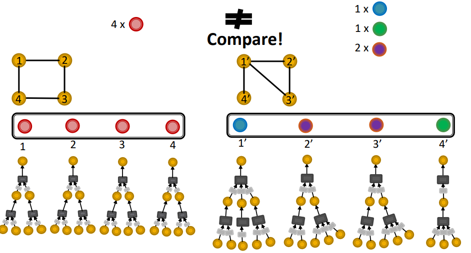

The algorithm works by _colouring_ the graph nodes (i.d. assigning labels) and keeps assigning these colors by aggregating neighbors (we note that this aggregation is indeed a form of message passing!) and stops when the coloring is stable. When this happens, there are two possibilities:

- The colors are **different**: the two graphs are **not** isomorphic
- The colors are **same**: the two graphs **may be** (we are not sure!) isomorphic

This is the reason why it is an _insufficient_ condition for isomorphism. Let's look at this example:

  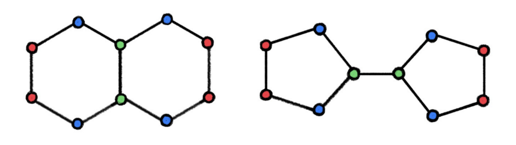

In this case, both of the graphs have the same number of nodes and edges and they are the same for the WL-test (same colors). However, they are clearly **not isomorphic**! This kind of structure occurs frequently in many graphs, such as molecular bonds. 

### Extension to _k_-WL
It has been shown that we can extend the WL-test to a higher order (_k_) version, namely the _k_-WL test. Except for 2-WL, it can be shown that (_k + 1_)-WL is strictly stronger than _k_-WL. However, there is no version for infinite dimensional WL, i.d. having a _general_ and most importantly _sufficient_ condition for isomorphism for _any_ graph.

## **2. Motivation**  

We have seen how MPNNs suffer from an _expressive power_ drawback. While a number of approaches have been introduced in the literature to have more expressive GNNs, these have limitations such as:

- Poor generalization
- Computationally expensive
- Require deep domain knowledge

What if we had a way a _general, inexpensive and domain-agnostic_ way of performing augmenting GNN expressivity?

### Using Subgraphs as WL-tests
A core idea of the paper is to divide a graph into subgraphs. We can use some _selection policies_ (described later in the post) to obtain a _bag of subgraphs_ from the original graph. Let's see this example:

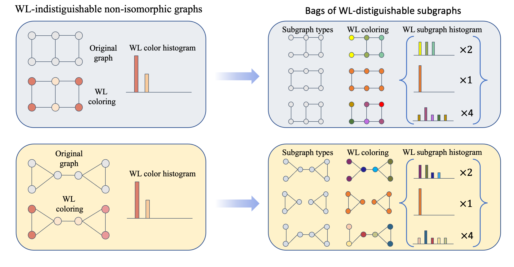

As we can see on the left, there are WL-indistinguishable subgraphs: they are **not-isomorphic**, but they yield the **same coloring**. Now, if we split them into subgraphs (on the right) and run again the WL-test, we will notice that the produce coloring are indeed **different**: this implies that they are actually **_not isomorphic_**!

## **3. Method**  

We will introduce the framework devised by the authors, _ESAN_ (Equivariant Subgraph Aggregation Networks). The main idea behind ESAN is to represent the graph $$G$$ as a _bag_ (i.d. a multiset):

$$
S_G=\{\{ G_1,\dots,G_m \}\}
$$

of its subgraphs. Then, we can make predictions on a graph based on this subset:
$$F(G):=F(S_G)$$

There are two essential points to consider then:
Two crucial questions pertain to this approach: (1) , and (2) 

1. How to define $$F(S_G)$$, i.e. architecture should we use to process bags of graphs?
2. How do we select $$S_G$$, the graph subgraph selection policy?

### Bag-of-Graphs Encoder Architecture

#### Symmetry groups
First of all, let's start by describing how to represent a set of graphs (the so-called _bag-of-graphs_). We can summarize it in the following image:

  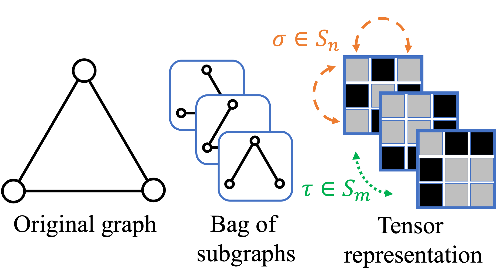

The graph is split into a bag of subgraphs where $\tau$ permutes the subgraphs in the set and $\sigma$ permutes the nodes in the subgraphs. In other words, this representation creates a _symmetry group_: by requiring the representation to permute the subgraphs and their nodes, we can obtain a neural architecture which is **equivariant** to this group. 

Equivariant means that no matter the order of transformations, the output will be always the same (on the left):

  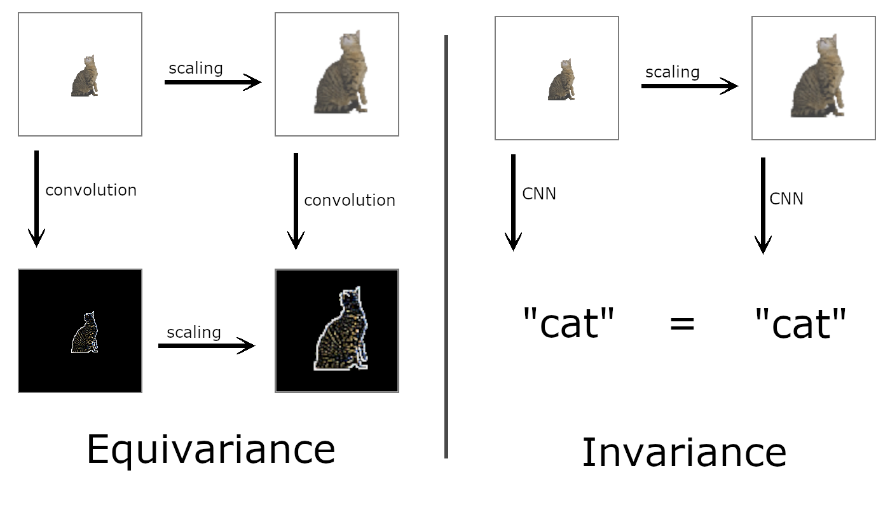

which is a desirable property in the realm of Graph Neural Networks - in the example above, it is easy to see how this is desirable for a classification CNN.

#### Architecture Overview
Now, we can formulate the architecture of **DSS-GNN**:

  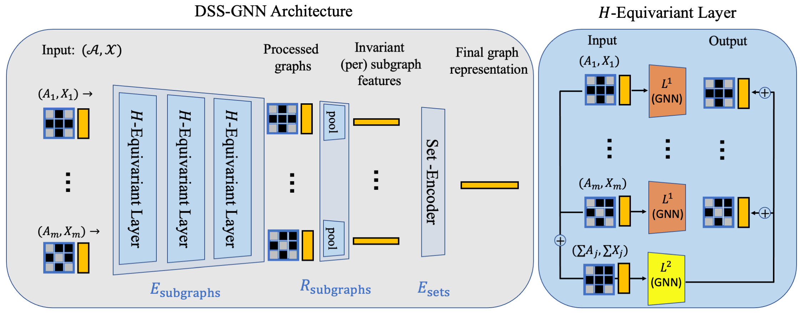

where DSS-GNN stands for the somewhat-lenghty "Deep Sets of Symmetric Objects - Graph Neural Network"; the symmetric objects are the bags of subgraphs that we obtained before. This architecture is composed of three main layers:

$$
    F_{\text{DSS-GNN}} = E_{\text{sets}}\circ R_{\text{subgraphs}} \circ E_{\text{subgraphs}}
$$

Let's decompose them one by one!

1. **Equivariant Feature Encoder**: $$E_{\text{subgraphs}}$$ is composed of several $$H$$-equivariant layers. Its purpose is to learn useful node features for all the nodes in all subgraphs. Each $H$-equivariant layer (on the right) processes bags of
subgraphs accounting for their natural symmetry and it is composed by the following:
$$
    (L(\mathcal{A},\mathcal{X}))_i= L^1(A_i,X_i) + L^2\left(\textstyle\sum _{j=1}^m A_j,\textstyle\sum _{j=1}^m X_j\right)
$$
where, $$A_j, X_j$$ are the adjacency and feature matrices of the $$j$$-th subgraph and $$(L(\mathcal{A},\mathcal{X}))_i$$ is the output of the layer on the $i$-th subgraph.
So what are these $$L_1$$ and $$L_2?$$ These can be any type of GNN layer. While $$L_1$$ encodes each subgraph _separately_ , $$L_2$$ _aggregates_ information among the subgraphs (which is called _information sharing_). This is also common with the seminal DSS paper [2]. 

2. **Subgraph Readout Layer**: $$R_{\text{subgraphs}}$$ given the output from the first step, this generates an invariant feature vector for each subgraph independently by aggregating the graph node and/or edge data. The modalities can change, but we can for instance aggregate with a mean operator.

3. **Set Encoder**: $$E_{\text{sets}}$$ is is a universal set encoder, such as DeepSets [3] or PointNets [4]. This part aggregates the set of preprocessed subgraphs with _invariant-per-subgraph_ features, so that we can obtain the final graph representation.

### Subgraph Selection Policies

Selecting the subgraphs is of paramount importance: this determines how _expressive_ our representation will be! The authors study four main policies:

1. **Node-deleted policy**: a graph is mapped to the set containing all subgraphs that can be obtained from the original graph by removing a single node
2. **Edge-deleted policy**: similar to above, but it is defined as the set of all subgraphs we obtain by removing a single edge.
3. **EGO-networks policy**: this policy maps each graph to a set of ego-networks of some specified depth, one for each node in the graph. An ego-network is, simply put, the network obtained by looking at the neighboorhood of a node only (where _ego_ means "I", meaning we focus on the perspective of one node). A $$k$$-Ego-network of a node is its $$k$$-hop neighbourhood with the induced connectivity).
4. **EGO+ policy**: We can also consider a variant of the ego-networks policy where the root node (a is _e_ in the example below) holds an identifying feature (EGO+).

  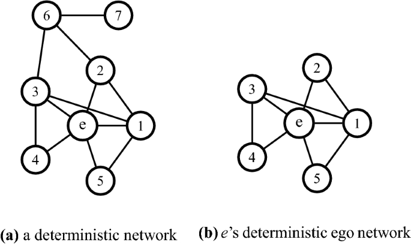

However, obtaining the set of subgraphs from a large network can be overly expensive. That is why the authors propose a **stochastic subsampling** in which only a small subset of subgraphs is sampled to calculate the loss function. 

### Theoretical Contributions

An important contribution of the authors is showing that their model ESAN is expressive by demonstrating it theoretically.

In particular, the authors devise a new variant of the Weisfeiler-Lehman test dubbed “DSS-WL” with different architectural and subgraph selection policies. To sum up, an important theoretical conclusion is that the ESAN architecture can distinguish 3-WL equivalent graphs using only a WL graph encoder - which is, the standard MPNN. Moreover, this can enhance the expressive power of stronger architectures.

## **4. Experiments**  

The experiments demonstrate strong performance of the DSS-GNN model. The authors also compare the case in which the _information sharing_ layer $$L_2$$ is set to $$0$$. Base encoders and graph selection policies are reported in parentheses.

### Demonstrating Expressive Power on Synthetic Datasets

The authors use _EXP, CEXP_ and _CS_ which are designed so that any 1-WL GNN cannot do better than random guess, such as a vanilla MPNN.

  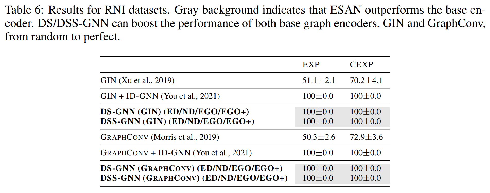

We notice how the variants of baselines with DSS-GNN manage to - perfectly - solve the tasks while 1-WL GNN basically perform random guesses.

### TUDatasets
This is a benchmark set of real datasets for classification and regression of various type, such as user molecules (PROTEINS) and movies (IMDB).

  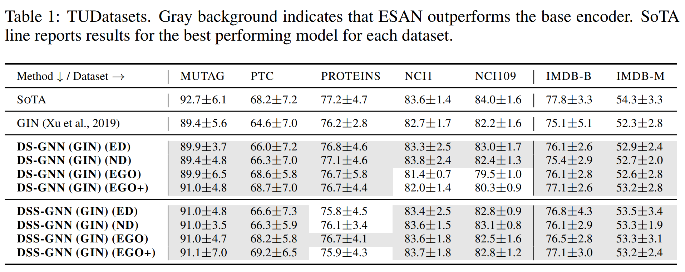

Results show that the approach achieves state of the art in one dataset (PTC), but it still retains comparable results to the SoTA (state-of-the-art).

### OGB
These datasets comprise _OGBG-MOLHIV_ and _OGBG-MOLTOX21_, which are dedicated to molecular property predictions.

  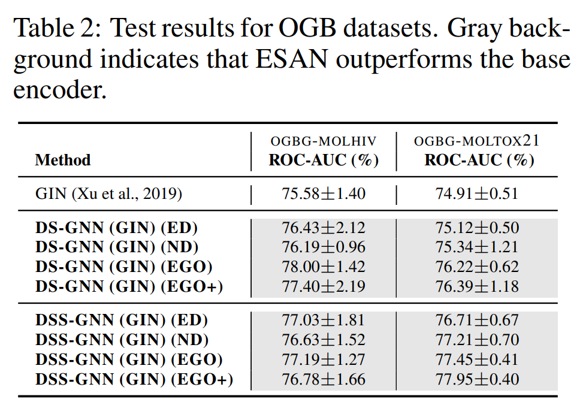

These results shows how ESAN achieve SoTA in both datasets with basically all of the selection policies.

### Zinc12k

_ZINC12K_ is a larger scale molecular benchmark: here, the authors want to demonstrate how their method can scale up to much larger dimensions:

  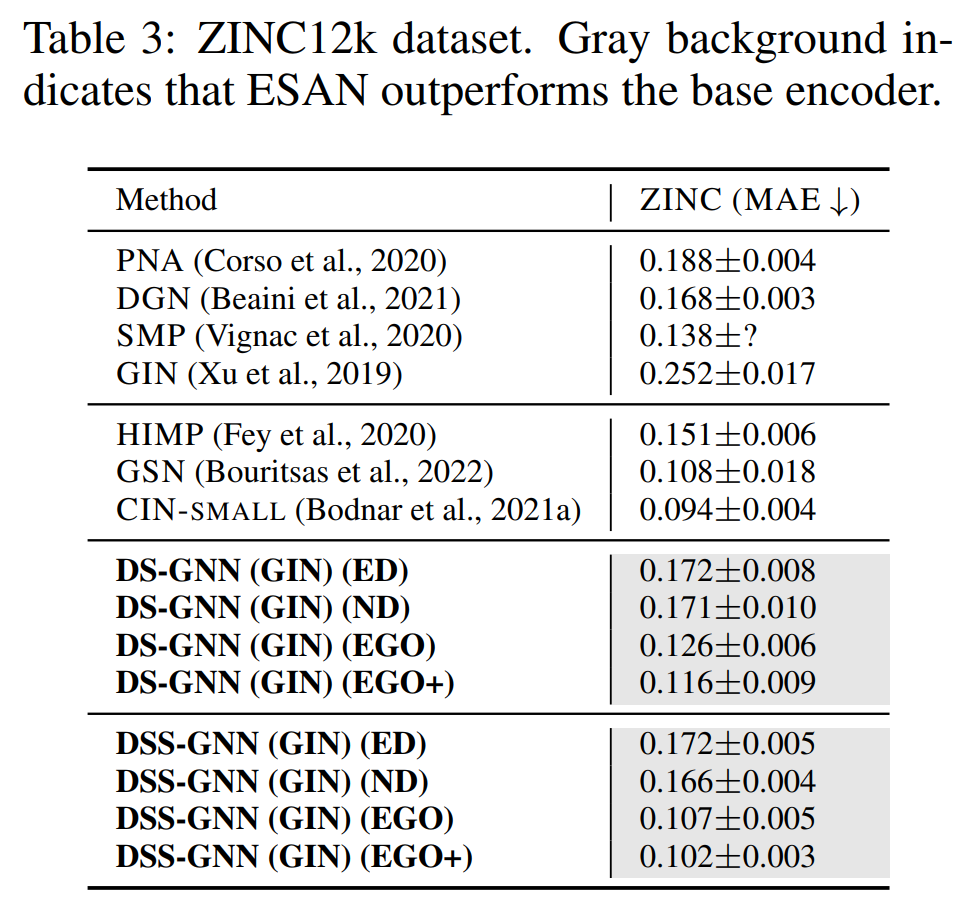

As the table shows, ESAN does not achieve SoTA. _However_, it achieves SoTA among the **domain-agnostic** models: indeed, SoTA is achieved by a model employing strong inductive biases, which is somewhat an "unfair" comparison since the authors employ _ad-hoc_ tricks to solve the problem. This shows how ESAN can expand on large scales by being both _powerful_ and _domain-agnostic_.

## **5. Conclusion**  

We have reviewed _ESAN_: Equivariant Subgraph Aggregration Networks, a novel graph paradigm. The core idea of ESAN is to decompose a graph into bags of subgraphs via subgraph selection policies and process them according to symmetry groups. A further contribution is that the proposed model is provably more powerful than standard MPNNs in performing WL graph isomorphism tests. Experimental results reach state-of-the-art in certain tasks and, where they don't, still remain very competitive by achieving close results while being domain-agnostic.

#### Limitations
The proposed model needs to select the bags of subgraphs and by processing a large amount of obtained subgraphs it is strictly more computationally expensive than standard MPNNs, which limit their applicability, although the authors include a subsampling policy to partly overcome this issue. A further limitation is that, while it is true that the authors provide mathematical proofs and code, their approach still does not achieve SoTA in many of the TUDatasets, a standard graph benchmarking problem, highlighting the fact that further studies should be done to prove that the proposed ESAN approach is strictly superior to competitors not only theoretically, but also _experimentally_.

---
## **Author Information**  

**Federico Berto**
[Personal Website](https://fedebotu.github.io/)

Affiliation: KAIST, Industrial & Systems Engineering Department
MSc students at [SILAB](http://silab.kaist.ac.kr/)
Member of the open research group [DiffEqML](https://github.com/DiffEqML)

## **6. Reference & Additional materials**  

#### Github Implementation: [https://github.com/beabevi/ESAN](https://github.com/beabevi/ESAN).

### References

[1] Bevilacqua, Beatrice, et al. "Equivariant subgraph aggregation networks." ICLR 2022.

[2] Maron, Haggai, et al. "On learning sets of symmetric elements." International Conference on Machine Learning. PMLR, 2020.

[3] Zaheer, Manzil, et al. "Deep sets." Advances in neural information processing systems 30 (2017).

[4] Qi, Charles R., et al. "Pointnet: Deep learning on point sets for 3d classification and segmentation." Proceedings of the IEEE conference on computer vision and pattern recognition. 2017.