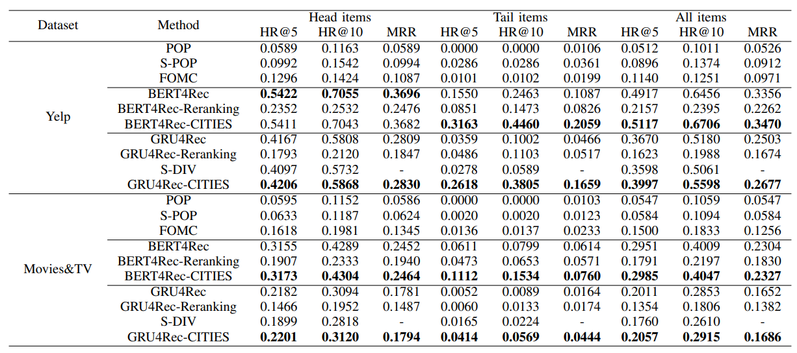
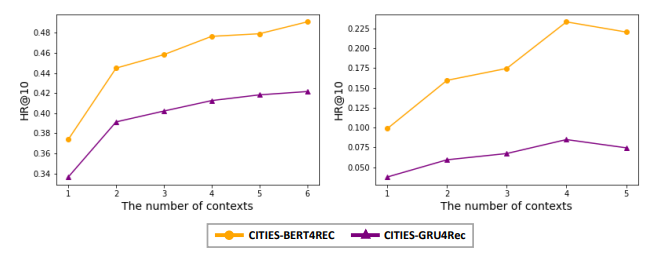

# **CITIES - Contextual Inference of Tail-item Embeddings for Sequential Recommendation** 

## **1. Problem Definition**  

Sequential Recommendation(SR)은 Item의 순서를 반영하여 다음 Item을 무엇을 볼지 예측하는 추천시스템이다. General Recommendation과의 가장 큰 차이점은 순서를 고려한다는 점이다.  

  

그림 출처: [Arxiv 20]Déjà vu: A Contextualized Temporal Attention Mechanism for Sequential Recommendation  

예시로, 위 그림과 같이 Item 순서를 고려하여 User가 소비했을 때, 다음에 어떤 Item을 소비할지 예측하는 것이 SR의 메인 문제이다. 이전 소비 패턴 및 성향을 파악하여 다음 Item을 추천하는 것이다.  

## **2. Motivation**  

이 논문의 주된 동기는 SR에서 Long-Tail Item 문제를 완화하는 것이다. Long-Tail Item 문제는 학습 과정에서 빈번하게 등장하는 Item의 경우에는 많이 학습되어 높은 Quality의 임베딩을 얻게 된다. 반면, Tail Item은 적게 학습되기 때문에 낮은 Quality의 Item 임베딩을 얻게 된다.   

Item 임베딩의 Quality가 중요한 이유는 Sequence 모델링할 때, Item 임베딩이 사용되고 그리고 예측 과정에서 User 임베딩과 Item 임베딩이 사용되는 과정에서 Item 임베딩이 사용된다. 이처럼 Item 임베딩이 여러 곳에서 사용되고 Quality에 따라서 성능에 변화를 일으킨다.  

General Recommendation에서는 Long-Tail 문제를 많이 다루지만 Sequential Recommendation에서는 많이 다루어지지 않고 있다. 이 논문에서는 Sequential Recommendation에서 Long-Tail Item 문제를 다루는 것이 가장 큰 contribution이다.  

## **3. Method**  

해당 논문은 model agnostic하기 때문에 이전의 어느 Sequential Modeling에서 적용이 가능하여 Long Tail 문제를 완화시킬 수 있다.

기존의 Sequential Modeling은 크게 3가지 파트로 나뉠 수 있다.  

### 1. Item Embedding Layer
Item Embedding Layer은 Item Embedding Lookup table를 구성하여 Sequential modeling에 들어가는 Item의 Embedding을 만든다. 

^T&space;=f_{\theta_E}([s_{L-l&plus;1}^u,&space;...,&space;s_{L}^u])^T)  

  

### 2. Sequence Modeling Layer 

Sequence Modeling Layer은 기존 Sequence recommendation을 modeling하는 방법론을 가져온다. 이 논문에서는 GRU4Rec, Bert4Rec으로 Item Sequence를 encoding하여 모델링한다.  

)

  

는 User의 Item Sequence를 modeling하여 나온 현재 status 및 preference를 나타낸다. 는 Input으로 Item Embedding을 넣고 sequence modeling을 나타낸다. 여기서는 종류로 GRU4Rec, Bert4Rec을 이용한다.  

### 3. Recommendation Layer

Recommendation Layer에서는 Encoding된 Item Sequence를 활용하여 다음에 어떤 Item을 추천할지 modeling한다. 주로 item score가 높은 Top K의 Item을 추천한다.  

) 

은 현재 status 를 이용하여 어떤 item을 추천할지의 modeling 함수다. 여기서는 matrix factorization 방법을 활용하여 score가 높은 Top K Item을 추천한다.

위의 3가지 Layer를 거쳐서 추천하면 일반적인 Sequenctial Recommendation의 절차를 따르게 된다. 아래 그림의 빨간색 화살표를 나타낸다.  

  

Overall Framework

하지만, 위와 같은 절차로 추천을 하게 되면 Low Quality의 tail item이 Sequence Modeling layer의 input으로 들어가짐과 동시에 recommendation layer에서 사용이 되어 성능 저하를 일으키게 된다. 이 논문에서는 low quality의 tail item을 high quality의 embedding으로 추론하게 만드는 것이 목표다.  

이 논문에서는 위의 3가지 Layer를 걸쳐서 학습하게 된다면 Head Item의 Embedding을 High quality를 얻는다고 주장한다. High Quality의 head item embedding을 활용하여 tail item의 embedding의 quality를 올린다.  

### **Proposed Framework**  

여기서부터는 위의 3가지 layer를 걸쳐서 item embedding layer()과 sequence modeling layer()가 모두 pretrained된 상태로 시작한다. Embedding Inference Function()에서는 Head Item Embedding을 활용하여 Head Item의 여러 Context들의 정보로 Head Item Embedding을 추론하는 방법으로 Training한다. 그리고 Overall Framework에서의 Inferred Tail Item Embeddings를 통해서 tail item의 high quality embedding을 추론한다. 추론된 high quality의 tail item은 sequence modeling의 input과 recommendation layer에서의 item embedding에 사용된다.  

### Embedding Inference Function  

Embedding Inference Function()에서는 head Item이 있는 sequence context의 임베딩을 활용하여 head item embedding을 추론하는 방식을 이용한다. 예를 들어, 아래의 그림과 같이 맥주 모양이 있는 여러 sequence context를 모아서 맨 오른쪽의 회색 모양의 맥주(head item embedding)을 맞추도록 하는 방식이다.  

Embedding Inference Function

예시로, 맥주가 있는 Context set을 ), K는 context의 개수라고 하자. 맥주가 있는 sequence context를 pretrained된 sequence modeling을 통하여 encoding하면 contextual interpreter를 지난 맥주가 나오게 된다. Embedding Inference Function 그림에서 가운데 맥주는 맥주가 있는 context를 반영한 embedding이다.  

context가 반영된 맥주를 aggregator, 즉 self-attention을 거쳐서 나온 맥주를 합치면 여러 context를 반영한 하나의 맥주 embedding이 도출하게 된다. 맨 오른쪽의 맥주 embedding을 )라고 하자. 그러면 다음과 같은 식을 통해서 Embedding Inference Function에 있는 parameter를 학습하게 된다.  

$$
\hat{\phi}=\underset{\phi}{argmin}\sum_{i\in I^h}\sum_{C_i^\kappa\in C_i}(F_{\phi}(C_i^\kappa)-f_{\theta_E}(s_{[i]}))^2
$$

즉, L2 norm을 활용하여 학습하게 된다. 여기서 주의할 점은 tail item의 경우에 context가 많이 없다는 점을 반영하여 few shot learning setting을 이용한다. head item이 있는 여러 context 중에서 3~5개의 context만을 반영하여 학습한다.  

### Inferred Tail item Embeddings  

Embedding Inference Function을 활용하여 tail item이 있는 sequence context를 활용하여 high quality의 tail item embedding을 추론하는 단계다. 위의 Embedding Inference Function에서 Head item context를 이용하여 high quality embedding을 추론했다면 여기에서는 tail item이 있는 few context를 이용한다.  

추론된 tail item의 embedding은 sequence modeling의 input과 recommendation layer에서 inner-product할 때 사용이 된다.  

## **4. Experiment**  

### **Experiment setup**  
* Dataset  
**Yelp** : Local Business에 대한 user의 review이다. 예를 들어, 레스토랑, 바와 같은 곳을 들렀을 때의 review를 남긴 dataset이다.   
**Movies&TV** : Amazon dataset에서 movies 카테고리의 상품에 대해서 review와 rating을 남긴 dataset이다.

* baseline  
**POP** : Item을 training set에서의 popularity에 따라서 re-rank하여 추천한다.  
**S-POP** : Target User의 Sequence에서 Popularity에 따라서 item을 re-rank하여 추천한다.  
**FOMC** : Markov 가정을 이용하여, transition probability에 따라서 item을 re-rank한다.  
**Bert4Rec** : Sequence Modeling할 때 Transformer를 활용하여 User의 Sequence를 모델링한다.  
**GRU4Rec** : Sequence Modeling할 때 GRU를 활용하여 User의 Sequence를 모델링한다.  
**S-Div** : Content Feature를 활용하여 Tail item을 Clustering하여 tail item에 pseudo ground truth를 준다. pseudo ground truth를 이용하여 ranking loss로 학습한다.  
* Evaluation Metric    
**HR@k(Hit Ratio)** : Top K 추천 item list안에 ground truth item이 있는지 확인하는 protocol이다.  
**MRR(Mean Reciprocal Rank)** : Top K 추천 Item list안에서 순서까지 고려한 protocol이다.  

### **Result**  

  

Experiment Result
  

이 논문은 Model Agnostic하기 때문에 Bert4Rec과 GRU4Rec에 실험을 한다. 실험 결과에서는 Yelp에서 Head Item에서 Ber4Rec은 약간의 성능 저하가 있었지만, Tail Item에서 성능이 크게 향상되어 전반적인 성능이 올라간 것을 확인 할 수 있다. GRU4Rec에서는 Head, Tail Item에서 모두 성능 향상이 존재하여 Long-Tail 문제를 완화시켰다.  

Movies&TV에서는 Bert4Rec, GRU4Rec에서 head와 tail item에서 모두 성능을 향상시켜 전반적인 성능을 가져왔다. 

### **Ablation Study**  

  
  

Left: Tail Threshold에 따른 성능 변화, Right: Context 반영 개수에 따른 성능 변화
  
  
#### **Tail Item 비중**  

Head와 Tail Item을 나눌 때 Pareto 법칙에 따라서 2:8 비율로 나눈다. 하지만, 이 논문에서는 head와 tail기준에 따른 성능 변화를 관찰한다. 왼쪽이 Yelp, 오른쪽이 Movies&TV 성능 변화를 나타낸다. Yelp에서는 Tail Item의 비중이 높아질수록 성능 변화를 얻는 것을 관찰 할 수 있다. 이는 Head Item을 통해 좋은 Quality의 embedding 추론할 때 소수의 Item만이 중요하다는 것을 알 수 있다. 반면, Movies&TV에서는 반드시 Tail 비중을 올린다고 해서 성능 향상이 있는 것은 아니다.  

#### **Context 반영 수에 따른 성능 변화**  

Few shot task setting을 이용하면서 head item의 context를 모두 이용하는 것이 아니라 일부만을 이용한다. 반영 context 수에 따른 성능 변화를 나타낸다. 왼쪽이 Yelp, 오른쪽이 Movies&TV 성능 변화를 나타낸다. Movies&TV에서는 Context 수가 많아졌을 때 성능 저하를 가져오는 것을 볼 수 있다. 이는 few shot task 설정이 중요함을 알려준다.  

## **5. Conclusion**  

General Recommendation에서는 long-tail item 문제를 많이 다루지만, sequential recommendation에서는 많이 다루어지지 않고 있다. 이 논문에서는 Sequential Recommendation에서 long-tail item의 성능 향상을 크게 가져오면서 전체적은 성능 향상을 가져왔다. 

이 논문은 자연어 처리에서 문장에 별로 등장하지 않은 단어의 embedding quality를 높이는 방법론을 가져와서 적용시킨 논문이다. 이와 같은 방법으로 다른 도메인의 방법론을 자신이 연구하고 있는 도메인으로 가져와서 해결을 하는 것이 좋은 연구임을 알게 되었다.  

---  
## **Author Information**  

* Kim Kibum(김기범)  
    * Kaist, ISysE, DSAIL Labs 
    * GNN, Recommendation System, Scene Graph  

## **6. Reference & Additional materials**  

* Github Implementation  
[Implementation](https://github.com/swonj90/CITIES)

* Reference  

1. Wu, J., Cai, R., & Wang, H. (2020, April). Déjà vu: A contextualized temporal attention mechanism for sequential recommendation. In Proceedings of The Web Conference 2020 (pp. 2199-2209).  
2. Sun, F., Liu, J., Wu, J., Pei, C., Lin, X., Ou, W., & Jiang, P. (2019, November). BERT4Rec: Sequential recommendation with bidirectional encoder representations from transformer. In Proceedings of the 28th ACM international conference on information and knowledge management (pp. 1441-1450).
3. Hidasi, B., Karatzoglou, A., Baltrunas, L., & Tikk, D. (2015). Session-based recommendations with recurrent neural networks. arXiv preprint arXiv:1511.06939.
4. Kim, Y., Kim, K., Park, C., & Yu, H. (2019, August). Sequential and Diverse Recommendation with Long Tail. In IJCAI (Vol. 19, pp. 2740-2746).
5. Rendle, S., Freudenthaler, C., & Schmidt-Thieme, L. (2010, April). Factorizing personalized markov chains for next-basket recommendation. In Proceedings of the 19th international conference on World wide web (pp. 811-820).  
....

