# Title
Shaked Brody/ How attentive are graph neural network? / ICLR-2022

# 1. Problem Definition

Graph Neural Network(GNN)는 graph structure data의 representation learning을 위한 deep learning based framework이다. 아래 그림[1]과 같이 GNN에서는 graph structure data와 node나 edge의 attribute data를 활용한다. Arbitrary structure를 가진 graph data로부터 meaningful feature를 학습하기 위해서 새로운 구조의 model design이 필요하다.  따라서 message passing의 개념을 도입해 neighborhood node로부터 가져온 정보를 자신과 combine하여 update하는 방식의 process를 고안한다.

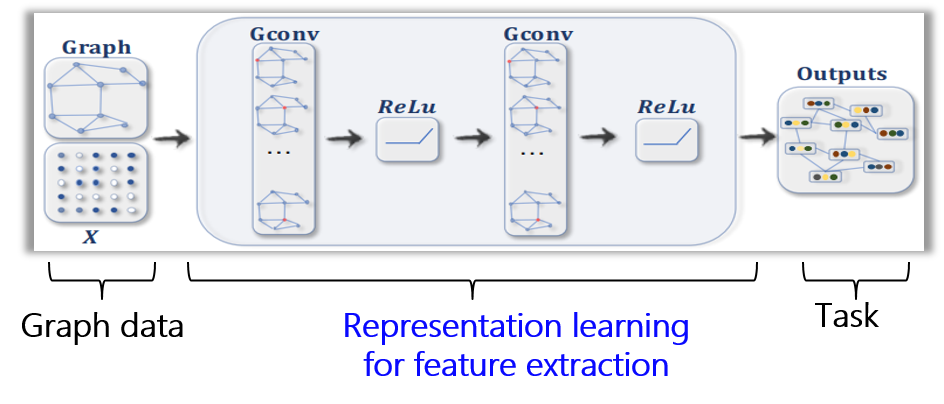

먼저 Notation을 다음과 같이 정리할 수 있다. 

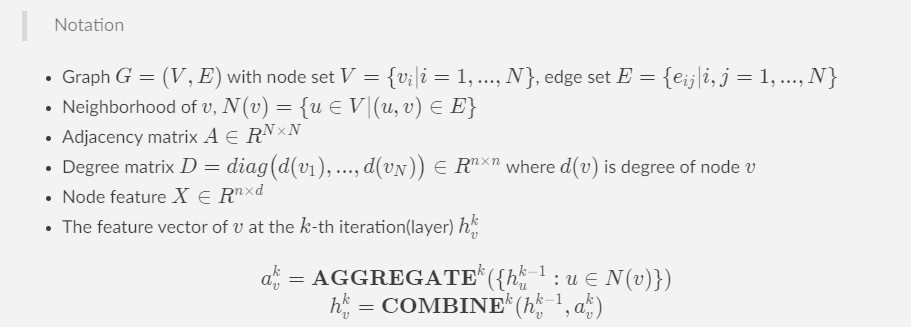

AGGREGATE function은 주변에서 모아온 정보를 어떻게 취합할 것인가를 결정하고, COMBINE function은 자신의 정보와 어떻게 합쳐서 update할 것인가를 결정한다. 따라서 GNN 연구 모델은 $AGGREGATE$과 $COMBINE$의 modeling에 의해 결정된다.  

# 2. Motivation

GNN의 대표 baseline으로 Graph Convolutional Neural Network (GCN) [2]을 소개하겠다. 이는 모든 node에 self-loop을 추가해 자기 자신도 neighborhood set에 포함되어 $AGGREGATE$과 $COMBINE$ function이 통합된 형태이다.  

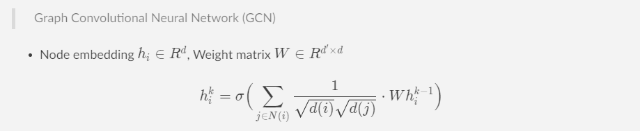

GCN은 주변 node 정보를 가져올 때 degree normalization으로 가중치를 조절한다. 이 과정에서 생각해볼 수 있는 것은 주변 node들이 모두 동일하게 target node에게 중요할까 하는 것이다. 따라서 이 가중치 정도를 parameterization하여 target node representation 학습에 도움이 되는 node는 가중치를 크게, 그렇지 않은 node는 가중치를 낮게 하는 attention 기반의 방법론 Graph Attention Network (GAT) [3]이 제안되었다. 즉, $AGGREGATE$ function이 attention weight function으로 modeling된 것이다.  

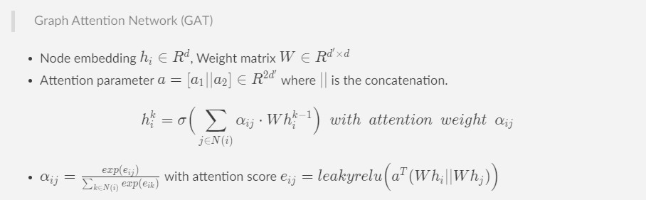

여기서 attention score $e_{ij}$는 node $i$에 대한 node $j$의 importance를 의미하며 학습과정에서 adaptive하게 조절되기를 바란다.

오늘 소개하는 논문은 이 GAT의 attention score가 target node(query node)에 dependent하게 neighbor node(key node)들이 학습되지 않음을 보인다. 이에 대한 직관을 다음의 toy example로 보인다. 

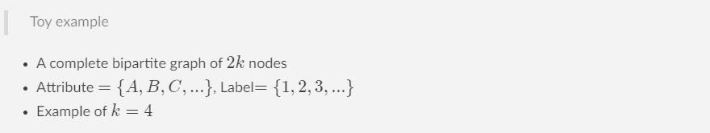

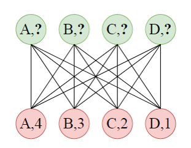

	- Upper row : Query node
	- Bottom row : Key node
	- Goal : Prediction the label of every query node according to its attribute

- Attention coefficient distribution when $k=10$

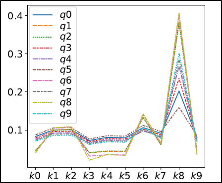

toy example에서 attention coefficient distribution을 보면 GAT는 query node에 상관없이 key node의 importance ranking이 모두 동일한 것을 알 수 있다.  따라서 GAT2에서는 attention mechanism이 query node에 dependent하게 이뤄지도록 하고자 한다. 

# 3. Method 

Motivation section에서 본 기존 GAT의 limitation을 formulation하기 위해 다음과 같이 Definition을 정립한다. 

> Definition of static and dynamic attention

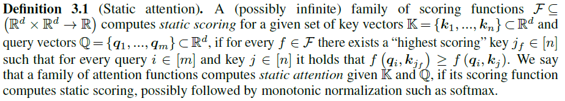

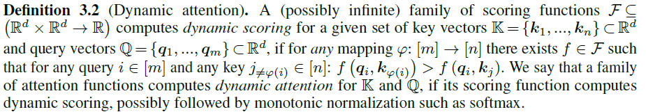

즉, 기존의 GAT는 Definition 3.1의 static attention을 계산한다는 건데, 다음의 theorem을 통해 간단히 증명할 수 있다. 사실 GAT의 attention score 계산 식을 뜯어보면 linear sum으로써 증명과정 없이도 직관적으로 받아들일 수 있는 문제이다. 

> Analysis of expressive power of GAT

$$e_{ij}=leakyrelu \Big( a^T(Wh_i ||Wh_j) \Big)$$

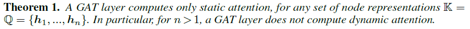

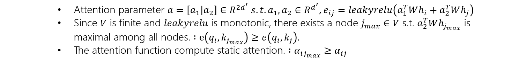

이 분석을 기반으로 본 논문은 Definition 3.2의 dynamic attention을 계산할 수 있는 attention mechanism으로 GAT의 attention layer와 nonlinear activation의 위치를 바꿔주는 간단한 방법을 제안한다. 

> Proposed methodology, GATv2

$$e_{ij}=a^Tleakyrelu \Big( W(h_i ||h_j) \Big)$$

제안한 방법론이 dynamic attention을 계산할 수 있음을 밝히는 요지는 간단하다. query node와 key node의 좀 더 복잡한 관계를 반영하는 dynamic function을 학습하고싶은 것인데, 기존의 GAT는 parameter $a$와 $W$가 바로 붙어서 계산되고, 그 뒤에 nonlinear가 오면서 almost linear하다고 볼 수 있는 반면,  GATv2는 하나의 hidden layer를 포함한 MLP로써 좀 더 복잡한 function을 approximation할 수 있게 된다는 것이다. 

GAT와 GATv2는 서로 exclusive한 property를 가지지만, complementary한 관계는 아니며, 결국 둘의 차이는 dataset이 dynamic score function을 학습할 수 있는 정도의 복잡성을 가지느냐에서 발생한다.
 

# 4. Experiment

## 	Experiment setup

- Task : Node classification
- Dataset : orgb(open graph benchmark) dataset
- Evaluation metric : Test accuracy

## Result

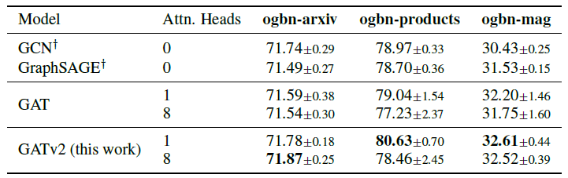

모든 case에서 GATv2가 baseline들보다 우위의 성능을 가짐을 알 수 있다. 심지어 single head의 GATv2가 8개의 multi attention head의 GAT보다도 우수한 성능을 보인다. GATv2에서 multi head가 single head보다 성능이 좋지 않은 것은 single head만으로 충분한 expressivity를 가지며, multi head는 오히려 overfitting되는 것으로 해석 가능하다. 

또 다른 실험으로 noise에 대한 robustness를 분석했다. original graph에 없는 edge를 $|E|\times \rho$만큼 randomly sample하여 noise edge set $E'$를 만들고, $G=(V, E \bigcup E')$으로 GAT와 GATv2를 각각 학습한다. 아래는 각각의 Accuracy를 서로 다른 dataset에서 비교한 모습이다.

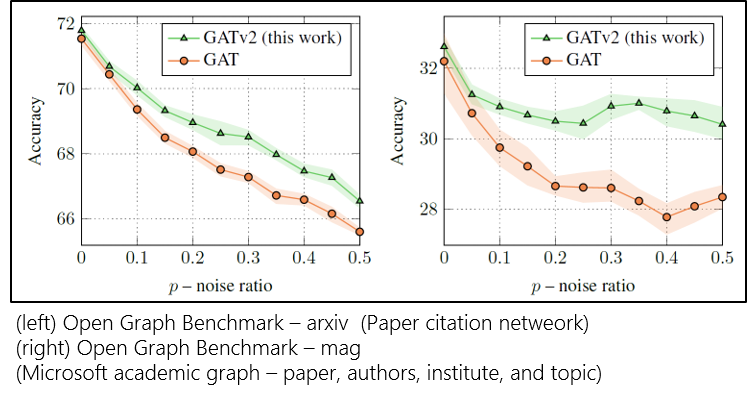

noise ratio에 따라 성능을 비교해보면 GATv2가 우위의 성능을 유지하며, dynamic attention score가 static attention score에 비해 noise setting에서 좀 더 robust함을 알 수 있다. 

# 5. Conclusion

- 본 논문에서는 기존 GAT가 static attention score를 계산한다는 limitation을 밝히고, 간단한 operation의 변경만으로 dynamic attention score를 계산하는 mechanism GATv2를 제안한다. 최초로 GAT의 작동 원리를 분석했다는 것과, static/dynamic attention score를 정립했다는 점에서 의의가 있다. 
- 이 연구는 GATv2가 GAT보다 무조건 낫다는 것을 보이는 것이 아니다. 둘의 차이를 발생시키는 dynamic attention score function의 필요성은 dataset property에 의존한다. 
- 저자는 이에 대한 measure modeling을 위해 dataset의 평균 node degree, clustering 개수 등의 가설을 세우며 실험해봤지만 어떤 correlation을 찾을 수 없었다고 한다. 다만 GAT는 global한 attention ranking을, GATv2는 node dependent attention ranking을 계산한다는 점에서, dataset의 node들이 global importance를 가지느냐를 고민해볼 수 있다. 
- 예를 들어, instagram과 같은 social network dataset에서 어떤 celebrity node(key)는 그의 follower들(query)에게 generally important node이므로 global importance가 크다고 볼 수 있다. 반대로 molecular structure graph에서는 심지어 edge로 연결된 node 사이도 서로에게 중요하지 않을 수 있다. 이런 점에서 보다 간단한 dataset은 GAT가, 좀 더 복잡 dataset은 GATv2가 적합하다는 직관을 가지고 접근할 수 있을 것 같다.  

# Author Information
* Author name : Sungeun Kim 
    * Affiliation  
    	- Course of Master's Degree in AAILab, Knowledge Service Engineering

    * Research Topic 
    	- GNN based Recomendation system 
    	- Semi-supervised learning 

# 6. Reference & Additional materials 

* Github Implementation
https://github.com/tech-srl/how_attentive_are_gats

[1] Zonghan Wu, Shirui Pan, Fengwen Chen, Guodong Long, Chengqi Zhang and Philip S. Yu. "A comprehensive survey on graph neural networks".  AUGUST (2019)

[2] Thomas N. Kipf and Max Welling. "Semi-Supervised classification with graph convolutional networks". ICLR (2017)

[3] Petar Velickovic, Guillem Cucurull, Arantxa Casanova, Adriana Romero, Pietro Lio, and Yoshua Bengio. "Graph attention networks". ICLR (2018)
