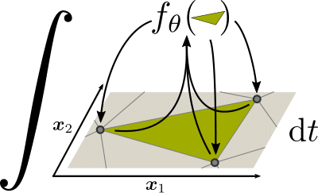
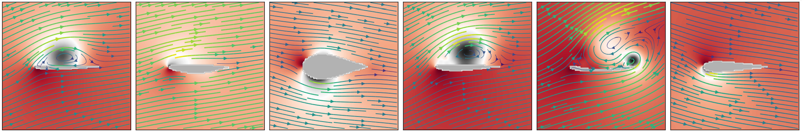
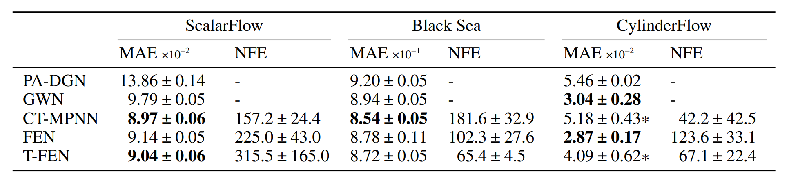
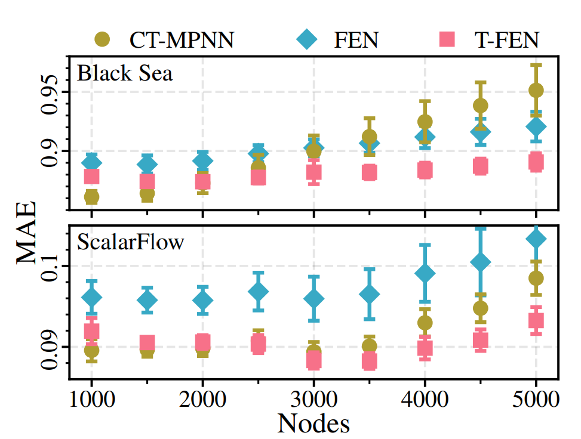
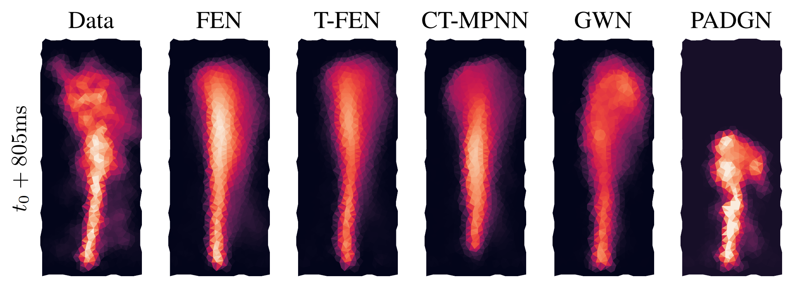
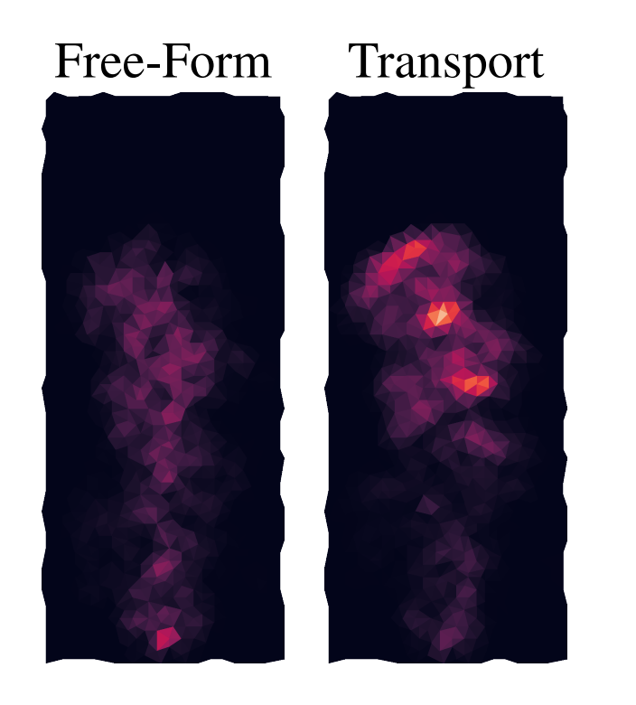

# Learning the Dynamics of Physical Systems from Sparse Observations with Finite Element Networks

We will present a blog post on [_"Learning the Dynamics of Physical Systems from Sparse Observations with Finite Element Networks"_](https://arxiv.org/abs/2203.08852) from Marten Lienen and Stephan Günnemann [1], which has been accepted as a Spotlight presentation in [ICLR 2022](https://iclr.cc/). 

## **1. Problem Definition**  

We will firstly introduce the problem in a brief, yet somewhat lengthy, necessary background about differential equations and the finite element method that constitutes a backbone of the paper.

### Modeling Complex Systems with Differential Equations
Differential Equations are regarded by many as the _language of nature_. Many complex systems can be modeled by describing each single variable as a relation with others in both _space_ and _time_: Partial Differential Equations (PDEs) describe such processes. A quite general formulation can be written as following:

$$
\partial_t u  = F (t, x, u, \partial_x u, \partial_{x^2} u, \dots)
$$

where $u$ is a solution of the equation and $$F$$ are the _dynamics_ which can be a function of time, space, $$u$$ itself and its derivatives. PDEs are generally either very expensive to compute if not intractable altogether. For these reason, multiple algorithms have been developed over the centuries to try and solve this extremely complex endeavor. In particular, computers are very capable of handling _discretized_ data, in the form of digital bits instead of their continuous, analog counterparts. Can we apply some algorithm which is well suitable to computers?

### The Finite Element Method

The Finite Element Method (FEM) is a way to _divide and conquer_ the realm of PDEs.

  

<figcaption align = "center">Figure 1.<i> An example of Finite Element Method (FEM) applied to a magnetical shield. </i></figcaption>

In particular, the domain with set of points $$\mathcal{X}$$ is divided into a set of simplices (i.e., $$n$$ -dimensional triangles) which is called _triangulation_. Triangulations, such as the Delaunay triangulation, are also referred to as _meshes_ and are frequently used in many other areas such as movie CGI, gaming and most 3D graphics. This can be seen on the left of Figure 1. Then, operations are performed on this discretized domain to obtain a solution, as shown on the right of Figure 1.

#### Basis Functions

In general, the solution $$u$$ would lie in an infinite-dimensional space $$\mathcal{U}$$. What if, however, we cannot have infinite dimensions? Then, we need to approximate $u$ with a finite-dimensional subspace $$\mathcal{\tilde{U}}$$. To do so we employ _basis functions_ $\varphi$, which map points from $$\mathcal{U}$$ to $$\mathcal{\tilde{U}}$$. The simplest choice, which the authors use, is the P1 piecewise linear functions which map

$$  
\varphi^{(j)} (x^{(i)}) = \begin{cases}
  1 & \text{if }x^{(i)} = x^{(j)}\\
  0 & \text{otherwise}
  \end{cases} \quad \forall x^{(i)} \in \mathcal{X}.
$$
that is basically to simply map each point in $$\mathcal{U}$$ to the same values in $$\mathcal{\tilde{U}}$$ as in Figure 2 left.

Moreover, another property of expanding $$u \in \mathcal{\tilde{U}}$$ is that the following holds:

$$
u(x^{(i)}) = \sum_{j=1}^N c_j \varphi^{(j)}(x^{(i)}) = c_i
$$

i.e., the value of $$u$$ at the $$i$$-th node is just its $$i$$-th coefficient.

#### Galerkin Method

The piecewise linear approximation above is not differentiable everywhere. However, we can constrain the residual $$R$$, i.e. the difference between $$\partial_t u$$ and $$F$$ to be orthogonal to the approximation space:

$$
\langle R(u), \varphi^{(i)} \rangle_\Omega = 0 \quad \forall i \in 1, \dots, N
$$

where $$\Omega$$ represents the spatial domain. In simpler terms, we are asking for the _best possible_ approximation of the equations. Given this, we can now reconstruct the equation as following

$$
\langle \partial_t u, \varphi^{(i)}\rangle_\Omega =  \langle F (t, x, u, \partial_x u, \partial_{x^2} u, \dots), \varphi^{(i)}\rangle_\Omega, \quad \forall i \in 1, \dots, N
$$

By stacking the equations above we obtain the following linear system
$$
A \partial_t c = m
$$

where $$A$$ with $$A_{ij} = \langle \varphi^{(i)}, \varphi^{(j)} \rangle_\Omega$$ is the so-called mass matrix, $$c$$ is the vector of basis coefficients of $$u$$ and $$m$$ with $$m_i = \langle F(t, x, u, \dots), \varphi^{(i)} \rangle_\Omega$$ captures the effects of dynamics $$F$$.

  

<figcaption align = "center">Figure 2.<i> Solving a PDE with the Galerkin method and method of lines consists of three steps. </i></figcaption>

#### Method of Lines

If we can evaluate the right hand side $$m$$, then the equations are easily solvable with time derivatives. In particular, we can consider a _stacked_ version of multiple scalar fields instead of vector ones as

$$
\begin{equation}
  A \partial_t C = M
\end{equation} \tag{1}
$$

where $$M$$ are $$m$$-dimensional matrices due to $$m$$-scalar fields. In practice, we have transformed a PDE into a matrix ODE (ordinary differential equation) by discretizing in space; we managed to obtain a much simpler way of solving our problem by only needing to _integrate_ over time: a much simpler task! 

## **2. Motivation**  

PDEs are the _language of nature_ and as such they are incredibly important for the scientific community. However, many hand-crafted models either take too long to compute solutions or do not have enough expressibility. Therefore, it is necessary to include at least partial, _data-driven_ terms that can learn from past experiences.

Machine and Deep Learning have proven incredibly powerful tools for solving real-world complex phenomena: they can accelerate simulations by orders of magnitude enabling faster predictions, design and control and even describe previously unknown dynamics which cannot be derived by equations.

There are mainly two lines of research in the area of PDEs and Deep Learning: either constraining PDE solution learning with a cost function, or learning directly from data to obtain a simulator via inductive biases.

In this work, the authors follow the second path and derive a model which sprouts from research on numerical methods for differential equations and can incorporate knowledge of dynamics (such as transport terms).

## **3. Method: Finite Element Networks**  

#### From the Finite Element Equation to Learnable Models
We would like to find solutions to a PDE process via a data-driven simulator. Given the Finite Element [Equation 1](#method-of-lines), we can rewrite its terms as following: 

$$
A \partial_t Y^{(t)} = M
$$
where $$A$$ is the mass matrix and $$Y$$ is the feature matrix - in other words, this part represents the _feature update_ in time that we need to obtain the dynamics evolution in time. The problem at inference time then becomes:

1. Evaluate matrix $$A$$ and inverting it
2. Evaluating matrix $$M$$

We can readily obtain $$A$$ by _mass lumping_ [2] which allows for a good performance of the matrix inversion necessary to obtain $$\partial_t Y^{(t)}$$. The right-hand term describing the _dynamics_ as we have seen before requires an evaluation of the contribution of dynamics of adjacent cells:

$$
M_{ik} = \langle F(t, x, u, \dots)_k, \varphi^{(i)} \rangle_\Omega = \sum_{\Delta} \langle F(t, x, u, \dots)_k, \varphi^{(i)} \rangle_{{CH(\Delta)}}
$$

where $\Delta$ is the set of mesh cells adjacent to $$x^{(i)}$$ and $$CH(\Delta)$$ is the _convex hull_ (i.e., smallest convex set of $\Delta$ that contains it). As we can see, evaluating $M$ (which we call the **message matrix**) is actually the same as operating **message passing** between adjacent cells. This means that we can represent these dynamics with a Message Passing Neural Network!

  

<figcaption align = "center">Figure .<i> Finite Element Networks: we can evaluate dynamics by message passing over adjacent cells and integrating this value to obtain the future values. </i></figcaption>

Moreover, by factoring the inner product on the right side of the previous equation as

$$
 \langle F(t, x, u, \dots)_k, \varphi^{(i)} \rangle_{{CH(\Delta)}} = F_{\Delta, k}^{(i)} \cdot \langle 1, \varphi^{(i)} \rangle_{{CH(\Delta)}} \tag{2}
$$

we can avoid numerical instabilities and learn spatial derivatives as well. This means that we can learn a model $$f_\theta \approx F_\Delta^{(i)}$$!

#### Model
We have seen from [Equation 2](#from-the-finite-element-equation-to-learnable-models) that we can learn a model by performing message passing over adjacent cells. In particular, the learned model $$f_\theta$$ can be written as:

$$
f_{\theta, \Delta}^{(t, i)} =  f_\theta \left( t, \mu_\Delta, x_\Delta, y_\Delta^{(t)} \right)^{(i)} \approx F_\Delta^{(i)}
$$

where $$\mu_\Delta$$ is the center of cell $$\Delta$$, $$x_\Delta$$ are the coordinates of cell vertices w.r.t. $$\mu$$ and $$y^{(t)}$$ are the features at the vertices at time $$t$$. We have written the equations for a single message passing step, which is the update at each single time step. To obtain a whole trajectory, we need to solve the associated ODE given an initial condition $$y^{(t_0)}$$ and times $$t \in 0, 1, \dots, T$$:

$$
y^{(t_0, t_1, \dots, t_N)} =  \text{ODESolve}(y^{(t_0)}, \partial_t y , t)
$$

This ODE can be solved in a variety of ways. In particular, the authors employ the $$\tt dopri5$$ adaptive-step solver, i.e., an solver that iterative computes the solution by calling the function multiple times. We resulting model **FEN**: Finite Element Network.

#### Modeling the Transport Term

What if we have some extra knowledge about the domain? For example, an assumption on the dynamics $$F$$ could be that our solution would be at least in part governed by a _convective component_ (i.e. describing fluid motion):

$$
F(t, x, u, \dots)_k= \underbrace{ - \nabla \cdot (v^{(k)} (t, x, u, \dots) u_k)}_{convection~term} + \underbrace{F'(t, x, u, \dots)_k}_{remainder~dynamics}
$$

where $$v$$ is the divergence-free velocity term.

  

<figcaption align = "center">Figure .<i> Example flow field around airfoils present convective components.</i></figcaption>

We can model $$F'$$ as in the previous case while we can model the convection term by message passing with the following network $$g_\vartheta$$:

$$
f^v_{msg} (\Delta)_{x^{(i)}} = \sum_{x^{(j)} \in \Delta} y^{(t, j)} \odot \left( g_{\vartheta,\Delta}^{(t, i)}  \cdot \langle \nabla \varphi^{(j)}, \varphi^{(i)} \rangle_{CH(\Delta)} \right) 
$$

The final model, which is called **T-FEN**: Trasport-FEN, is the sum of the message passing of the above convection term and $$F'$$ and is thus designed to capture both a velocity field and remainder dynamics.

## **4. Experiments**

### Baselines
The authors consider the following baselines:

- **Graph WaveNet (GWN)**: combines temporal and graph convolutions [3] 
- **Physics-aware Difference Graph Network (PA-DGN)**: estimates spatial derivatives as additional features for a recurrent graph network [4]
- **Continuous-time MPNN (CT-MPNN)** model in uses a general MPNN to learn the continuous-time dynamics of the data [5]

### Datasets
#### Cylinder Flow
The following dataset consists of simulated flow fields around a cylinder as collected by [6]. The dataset includes velocities and pressures along with marked mesh cells representing boundary walls, inlets, outlets and cylindrical obstacles of varying sizes. The sequences contain $$600$$ frames and are divided in $$1000-100-100$$ for train, validation and test. The time resolution $$\Delta t$$ is of $$0.01~s$$. 

  

<figcaption align = "center">Figure .<i> CylinderFlow snapshot. </i></figcaption>

#### Black Sea 
This dataset is composed data on daily mean sea surface temperature and water velocities on the Black Sea over several years. The training data is made of frames from 2012 to 2017, validation is on frames from 2018 and testing is done with frames from the year 2019. The time resolution $$\Delta t$$ is of 1 day. 

  

<figcaption align = "center">Figure .<i> Learned flow fields of water velocities on the Black Sea dataset: T-FEN recognized the relationships between features. </i></figcaption>

#### ScalarFlow
This dataset consists of 3D reconstructions generated by multiple camera views of rising hot smoke plumes in a real environment. The sequences contain $$150$$ frames and are divided in $$64-20-20$$ for train, validation and test. The time resolution $$\Delta t$$ is of $$0.0167~s$$ (recording was done at 60 fps)[7].

  

<figcaption align = "center">Figure .<i> Long-range extrapolations on the ScalarFlow dataset (60 time steps). FEN models perform better than the strongest baseline by also better modeling of sources and sinks. </i></figcaption>

### Model Parameters
Both networks $f_\theta$ and $g_\vartheta$ are _multi-layer perceptrons_ (MLPs) with $\tt tanh$ nonlinearities. The number of parameters of each network was kept similar between FEN and T-FEN models and lower than baseline to demonstrate their capabilities.

### Results

#### Multi-step Forecasting

  

<figcaption align = "center">Figure .<i> Multi-step Forecasting. </i></figcaption>

This experiments aims at predicting $$10$$ steps in the future. We can see that FEN models either outperform or achieve similar, competitive results with the baselines.

#### Super-resolution

  

<figcaption align = "center">Figure .<i> Errors with super-resolution in the number of nodes. </i></figcaption>

This experiments aims at predicting $$10$$ steps in the future as before but with varying number of nodes, i.e. more nodes than those seen during training. FEN models outperform baselines in super-resolution: T-FEN models always perform better than FEN counterparts since they can better represent transport terms.

#### Extrapolation

  

<figcaption align = "center">Figure .<i> Extrapolation over 60 steps. </i></figcaption>

This experiments aims at predicting $$60$$ steps in the future with models trained on $$10$$ steps. FEN models outperform baselines since they can correctly represent sources and sinks.

#### Interpretability

  

<figcaption align = "center">Figure .<i> T-FEN model providing an interpretable splitting between free-form and transport term. </i></figcaption>

This experiments aims at providing interpretability and a justification for the T-FEN model. Plotting the free-form and transport term separately provides an interesting view into the learning process which is interpretable - the transport represents the differences in flow field.

## **5. Conclusion**  

We have reviewed _Learning the Dynamics of Physical Systems from Sparse Observations with Finite Element Networks_, a novel graph paradigm for learning dynamics on graphs based on inductive biases from differential equations. The authors provided a detailed analysis of the method from the ground up - starting from the theory of Finite Element analysis - and then devised two main models variations. While the first one learns directly the solution derivative in time of the physical system, the second separates learning with a _transport term_ which is shown to improve learning under many conditions. The experiments were conducted in one syntethic and two real-world high-dimensional datasets. Results demonstrated that the proposed models either perform competitively or outperform state-of-the-art baselines. This work represents and important contribution to the scientific machine learning community by tightly integrating the theory of Finite Element Method and Graph Neural Networks.

#### Limitations
The proposed model uses a simple basis - namely, linear piecewise basis function. If higher order derivatives were used, such as second order, these basis functions would evaluate to $$0$$, which is thus a current limitation of the model. Another limitation is the number of function evaluations: it is shown that the models can take more than 300 evaluations, while other non-continuous models may require just one. This is due to the adaptive ODE solvers used. Although the model can theoretically describe continuous dynamics, this practically makes it way slower than _one-step-prediction_ counterparts that do not need to evaluate an ODE.

---
## **Author Information**  

**Federico Berto**
[Personal Website](https://fedebotu.github.io/)

Affiliation: KAIST, Industrial & Systems Engineering Department
MSc students at [SILAB](http://silab.kaist.ac.kr/)
Member of the open research group [DiffEqML](https://github.com/DiffEqML)

## **6. Reference & Additional materials**  

### Github Implementation
[https://github.com/martenlienen/finite-element-networks](https://github.com/martenlienen/finite-element-networks).

### References

[1] Lienen, Marten, and Stephan Günnemann. "Learning the Dynamics of Physical Systems from Sparse Observations with Finite Element Networks." ICLR (2022).

[2] Lapidus, Leon, and George F. Pinder. "Numerical solution of partial differential equations in science and engineering". John Wiley & Sons (2011).

[3] Wu, Zonghan, et al. "Graph wavenet for deep spatial-temporal graph modeling." CoRR (2019).

[4] Seo, Sungyong, Chuizheng Meng, and Yan Liu. "Physics-aware difference graph networks for sparsely-observed dynamics." ICLR (2019).

[5] Iakovlev, Valerii, Markus Heinonen, and Harri Lähdesmäki. "Learning continuous-time PDEs from sparse data with graph neural networks." ICLR (2021).

[6] Pfaff, Tobias, et al. "Learning mesh-based simulation with graph networks. ICLR (2021).

[7] Eckert, Marie-Lena, Kiwon Um, and Nils Thuerey. "ScalarFlow: a large-scale volumetric data set of real-world scalar transport flows for computer animation and machine learning." ACM Transactions on Graphics (TOG) (2019)

