# **Title** 

Self-Supervised Learning from a Multi-View Perspective.   

## **1. Problem Definition**  
* 본  논문에서는 Vision 분야에서 Self-supervised Learning 의 성공을 Multi-view perspective 와 information theory 로 설명하고자 했습니다.
* 그리고 그 이론적 분석을 바탕으로, 어떤 방식으로 학습을 진행해야 최적의 representation 을 학습할 수 있는지에 대해 제시하였습니다.

## **2. Motivation**  
* Self-Supervised Learning (SSL) 은 label 이 없는 상황에서 input 과 self-supervised signal 간의 관계에 대한 objective 를 정의하여, general한 representation을 학습하는 방법입니다. 
* supervision 이 전혀 없이 학습했음에도 SSL 다양한 downstream task 에서 매우 좋은 성능을 보이며 각광을 받고 있습니다.
    - 대표적인 예로 SimCLR [1] 가 있습니다. SimCLR 는 하나의 input 이미지에 서로 다른 augmentation 를 적용한 후, 그들 간의 contrastive loss 를 정의하여 학습합니다.
* 하지만 이러한 SSL 이 왜 잘 되는지에 대한 이론적 연구는 상당히 적은 상황입니다. 
* 그래서 본 논문의 목적은 Information Theory 와 Multi-view 관점에서 SSL 의 성공에 대한 이론적 분석을 하는 것입니다.

## **3. Method**  
**Notation**
$$
X : \mathbf{input} \newline
S : \mathbf{self~supervised~signal} \newline
T : \mathbf{Task}~(Y) \newline
F(\cdot) : \mathbf{Encoder} \newline
F(X)=Z_X ~(\mathbf{Representation~of~X})  \newline
F(S)=Z_S~(\mathbf{Representation~of~S})
$$

**Theoretical Analysis**

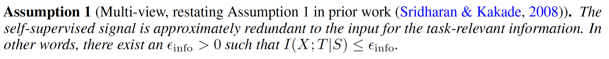
  
* 우선 이 연구에서는 X 와 S 가 multi-view assumption 을 따른다고 가정합니다.
* multi-view assumption 을 따른 다는 것은 위의 Assumption 1에 따라사, X와 S 는 task T 에 대해 가지고 있는 정보의 차이가 epsilon_info 만큼만 있고, 거의 똑같다는 것을 의미합니다.
* Image augmentation 을 통해 multi-view 를 만들 때를 생각해보면, augmentation 은 image 의 style 만 바꿀 뿐이지, 그 content (T) 는 바꾸지 않습니다. 예를 들어, 강아지 이미지를 crop 하거나 blur 처리를 하게 되면 이미지의 style 은 바뀌겠지만, 그 사진이 강아지라는 것은 알아볼 수 있기 때문입니다. 
* 그렇기 때문에, style 만 바꿔주고 content 는 건드리지 않은 augmentation 으로 만들어진 multi-view 는 epsilon_info 가 작을 것이고, 반대로 augmentation 이 강하게 들어가서 content 가 변하게 되는 경우에는 값이 커질 것이라 생각할 수 있습니다.

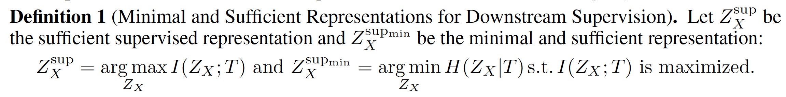
   
* SSL 에서 어떤 representation 이 최적인지 이야기하기 전에, 먼저 supervised 에서 어떤 representation 이 최적인지 알아보도록 하겠습니다.
* $Z_X^{sup}$ 은 sufficient representation 을 의미하고, $Z_X^{sup_{min}}$ 은 minimal sufficient representation 을 의미합니다.
* Definition 1 에서 말하고자 하는 것은, $H(Z_X|T)$ 를 최소화하는 것이 task irrelevant info 를 버리기 때문에 더 압축된 정보를 학습할 수 있게 해준다는 것입니다 (minimal sufficient representation). 아래 그림에서 이를 더 명확히 알 수 있습니다

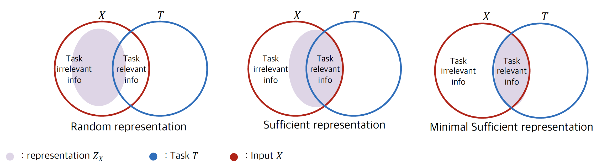
   
* 위 그림에서 가장 왼쪽에 위치한 벤 다이어그램은 random initialized representation 이고 중간은 sufficient representation, 오른쪽은 minimal sufficient representation 입니다
* 랜덤 representation 은 무작위로 형성이 되었기 때문에, Task T 에 대한 정보를 거의 가지지 못합니다.
* sufficient representation 은 Task T 에 대한 정보를 많이 가지게끔 학습이 되기 때문에, 관련 정보를 많이 가지고 있지만, task 와 관련없는 task irrelevant 정보도 많이 가지고 있습니다. 그 정보가 $H(Z_X|T)$ 에 해당하게 됩니다.
* 오른쪽의 minimal sufficient representation 은 sufficient representation 을 가지는 조건하에서 $H(Z_X|T)$ 를 최소화하는 objective 를 가지기 때문에 오직 task 와 관련있는 정보만을 가질 수 있게 됩니다.

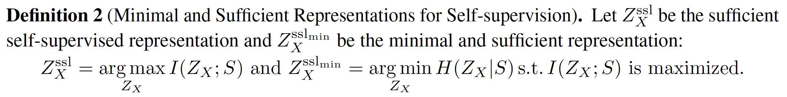
   
* 이번에는 SSL 에서의 minimal sufficient representation 은 어떻게 형성되는지 알아보겠습니다.
* $Z_X^{ssl}$ 은 sufficient representation 을 의미하고, $Z_X^{ssl_{min}}$ 은 minimal sufficient representation 을 의미합니다.
* Definition 2에서 말하고자 하는 것은, Task T 대신 self-supervision S 를 Task 로 생각하여 self-supervised learning 을 수행할 수 있는데, 이 때 Z_X 와 S 간의 mutual information 을 최대화 (sufficient representation) 하면서 H(Z_X|S) 를 최소화하게 되면 SSL 에서의 minimal sufficient representation 이 된다는 것입니다. 
* 마찬가지로 아래 그림을 통해 이를 더 자세히 알 수 있습니다.

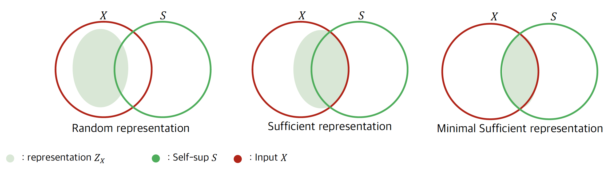
   

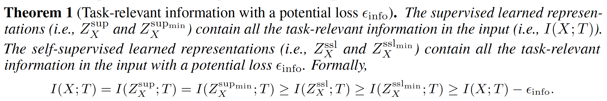
   
* 앞선 definition 들을 이용하여 theorem 1 을 정의할 수 있습니다.
* 여기서 말하고자하는 것은 $Z_X^{sup}$ 은 $I(X;T)$ 를 모두 가지고 있고, $Z_X^{ssl}$ 은 $I(X;T)$ 에서 약간의 loss $\epsilon_{info}$ 를 뺀만큼을 가질 수 있다는 것입니다.
    * 즉, $\epsilon_{info}$ 가 작으면, $Z_X^{ssl}$ 의 $T$ 에 대한 정보량이 $Z_X^{sup}$ 의 $T$ 에 대한 정보량에 거의 근접하게 된다는 것입니다.
* 여기서 알 수 있는 것은, 우리는 multi-view assumption 을 가정하였기 때문에 $epsilon_{info}$ 가 충분히 작고, 그래서 SSL 로도 supervised learning 만큼이나 task-relevant information 을 가질 수 있다는 것입니다.

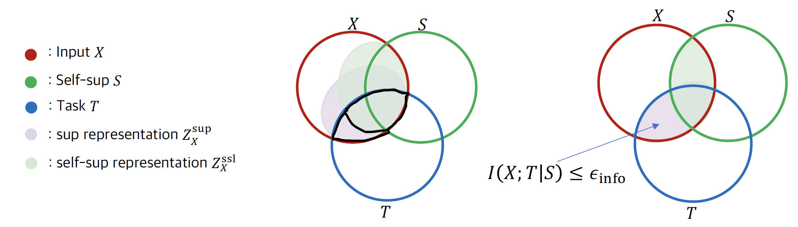
   

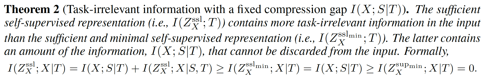
   

* Theorem 2에서 말하고자 하는 것은 minimal sufficient SSL representation 은 sufficient SSL representation 보다 task-irrelevant info 가 적고, 어떻게 해도 제거할 수 없는 task-irrelevant information 인 compression gap 이 존재한다는 것입니다.
* 아래 그림에서 2번 영역이 task irrelevant information 이고, minimal sufficient representation 을 학습하게 되면 2번 영역을 줄일 수가 있지만, 1번 영역은 compression gap 으로 지울 수 없습니다.

   

**Model design**
- 앞선 이론적 분석들을 통해 SSL 로 최적의 representation 을 학습하는 loss function 을 제시합니다.
- Contrastive Learning (is extracting task-relevant information)
    * *Theorem 1. SSL 로도 task-relevant info 를 supervised learning 만큼이나 가질 수 있다* 
        * 1번식은 theorem 1에서 말하고자하는 것이었고, 2번식은 어떻게 $Z_X^{ssl}$ 를 학습할 수 있는지에 대한 objective 입니다.
        $$I(X;T)=I(Z_X^{sup};T)=I(Z_X{sup_{min}};T) \geq I(_X^{ssl};T) \geq I(X;T)-\epsilon_{info}$$
        $$Z_X^{ssl}= argmax_{Z_X}I(Z_X;S)$$
        

    * 2번식의 $I(X;S)$ 는 lower bound인 InfoNCE maximize 를 통해 maximize 할 수 있다는 것이 잘 알려져 있습니다 [2]. 그래서 다음과 같은 objective 를 통해 representation 을 학습할 수 있습니다.
    $$
    L_{CL}=\max_{Z_S, Z_X} \mathbb{E}_{z_{s_1}, z_{x_1}, ..., z_{s_n}, z_{x_n}\sim P^n(Z_S, Z_X} [\frac{1}{n}\sum_{i=1}^n \log \frac{e^{<G(Z_{x_i}), G(Z_{s_i})>}}{\frac{1}{n}\sum_{j=1}^n e^{<G(Z_{x_j}), G(Z_{s_j})>}}]
    $$
    

    * 이 loss function 을 통해서, ssl representation 은 거의 모든 task-relevant info 를 가질 수 있게 됩니다.
    
* Forward Predictive Learning (is extracting task-irrelevant information)
    * Forward predictive Learning 은 representation $Z_X$ 가 self-sup signal S 를 reconstruction 하게 하는 것입니다
        - $$\max \mathbb{E}_{P_{S, Z_X}}[\log P(S|Z_X)]$$
        
    * [conditional entropy 의 정의](https://en.wikipedia.org/wiki/Conditional_entropy)에 따라서 
        $$\max I(Z_X;S) \mathbf{~is~equivalent~to~} \max -H(S|Z_x)=\mathbb{E}_{P_{S, Z_X}}[\log P(S|Z_X)$$
    * 이는 결국 $$I(Z_X;S)$$ 를 maximizing 하는 것과 같아지며, 이는 theorem 1에 의해서 task-relevant info 를 얻게 되는 것이 됩니다.
    * $P(S|Z_X)$ 를 variational distribution $Q_{\phi}(S|Z_X)$ 라 가정하면 다음과 같은 loss function 을 얻을 수 있습니다
        $$L_{FP}=\max_{Z_X} \mathbb{E}_{s, z_x \sim P_{S, Z_X}} [- ||s-R(z_x)||^2_2]$$
    
* Inverse Predictive Learning (is discarding task-irrelevant information)
    * inverse predictive learning 은 self-sup signal S 가 Z_X 를 reconstruction 하는 것입니다
         $$\max \mathbb{E}_{P_{S, Z_X}}[\log P(Z_X|S)]$$
    * conditional entropy 의 정의에 의해서, 
        $$\max \mathbb{E}_{P_{S, Z_X}}[\log P(Z_X|S)] = \max -H(Z_X|S)=\min H(Z_X|S)$$ 
        
    * Theorem 2 의 결과에 따라 S 가 Z_X 를 완벽히 reconstruct 하게 되면 Z_X 는 task-irrelevant information 을 버릴 수 있습니다.
        * 단, contraint $\max I(Z_X;S)$ 가 지켜지는 조건 하에서
    
    * Forward predictive learning 과 마찬가지로 $P(Z_X|S)$ 를 variational distribution $Q_{\phi}(Z_X|S)$ 라 가정하면 다음과 같은 loss function 을 얻을 수 있습니다
        $$L_{IP}=\max_{Z_X, Z_X} \mathbb{E}_{z_s, z_x \sim P_{Z_S, Z_X}} [- ||z_x-z_s||^2_2]$$
        
* Suggesting SSL objective
    * $$L_{SSL}=\lambda_{CL}L_{CL}+\lambda_{FP}L_{FP}+\lambda_{IP}L_{IP}$$
    * 이 objective 를 최소화하여 우리는, task-relevant info 는 최대한 뽑아내며 동시에 task-irrelevant info 는 버리는 representation 을 학습할 수 있습니다. 결과적으로는 minimal sufficient representation 을 학습하게 됩니다
    
**Theoretical justification**
* 위 loss function 으로 학습하는 것이 왜 ssl 에서 최적인지를 실험적으로 증명하기 전에 이론적으로 증명을 하였습니다

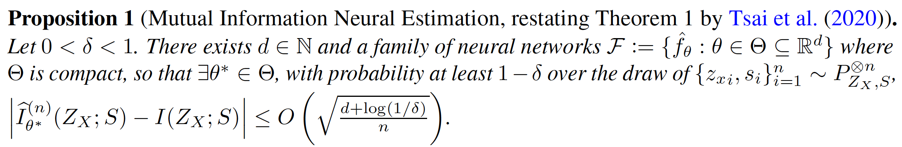
   

* 위 proposition 에서 말하는 것은 neural network $\theta^*$ 를 가지고 I(Z_X;S) 를 근사할 수 있다는 것입니다.
    $$\mathbf{The~estimated~mutual~information:~ }\hat I_{\theta^*}^{(n)}$$

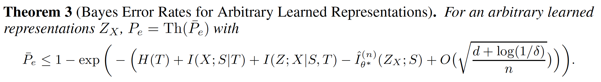
   
* Theorem 3 의 식에서 알 수 있듯이 어떤 아무 representation 이 있을 때, Bayes error rate $\bar P_e$ 는 다음의 상황에 작아질 수 있습니다
    * 1 $$\hat I_{\theta^*}^{(n)} \mathbf{~가~클~때}$$
    * 2 $$I(X;S|T),~I(Z;X|S,T) \mathbf{~가~작을~때}$$
    * 1번 식은 $I(Z_X;S)$ 를 최대화하는 것이 downstream task 에 도움이 된다는 주장을 뒷받침해줄 수 있습니다
    * 2번 식은 task irrelevant info 가 적으면 downstream task 에 도움이 된다는 주장을 뒷받침해 줄 수 있습니다

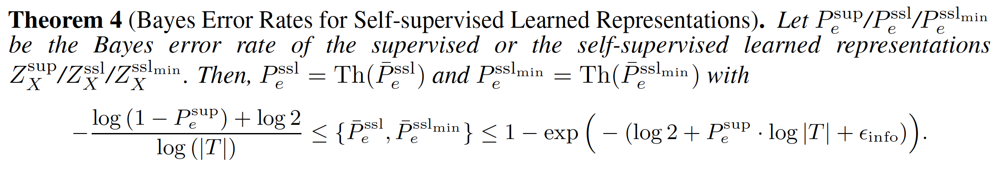
   
* 이번에는 ssl representation 의 bayes error rate 가 언제 작아지는지 알아보겠습니다
* 위 theorem 4의 식에서 우리가 $\bar P_e^{ssl}$ 의 upper bound 가 작아지면 bayes error rate 도 줄어들 것이라는 것을 알 수 있습니다
    * $\bar P_e^{ssl}$ 의 upper bound 는 $epsilon_{info}$ 가 작으면 작아지게 되는데
    * 그렇게 되면, $Z_X^{ssl}$ 이 X 가 T 에 대해 가지고 있는 거의 모든 정보를 다 가지게 됩니다. (by Theorem 1)
    * 이는 downstream task 에 도움이 되기 때문에, upper bound 가 작아질 수 있습니다.
    
        
## **4. Experiment**  
* 이번 섹션에서는 제안된 모델이 실험적으로도 잘 작동하는지를 알아보겠습니다
* 특히, 실험에서 중점적으로 보는 것은 각 loss term 의 효과를 알아보는 것으로, 다른 sota 모델과의 비교는 없습니다

### **Experiment setup**  
* Dataset  
    * Omniglot (Visual Representation Learning)
    * MS COCO dataset (Visual-Textual Representation Learning)
* Evaluation Metric  
    * Accuracy

### **Result**  

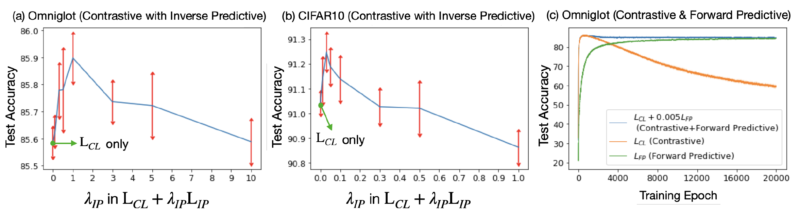
   
* Inverse predictive learning objective $L_{IP}$ 가 약간의 sensitivity 가 있긴 하지만 $L_{CL}$ 과 함께 쓰일 때, 좋은 성능을 보이는 것을 알 수 있습니다. 이는 Theorem 2 를 뒷받침할 수 있는 결과입니다.
* Forward predictive learning 의 경우 $L_{CL}$ 과 동일한 역할을 합니다 (task relevant info extract). 그래서 이 둘을 비교해봤을 때, $L_{CL}$ 가 더 높은 accuracy 를 보이며 더 더 빨리 수렴하는 모습을 보여줍니다만, 너무 오래 학습할 경우 overfitting 이 일어나는 것으로 보입니다. 
* 그래서 $L_{CL}+0.005L_{FP}$ 로 같이 썼을 때 더 나은 모습을 보여줍니다.

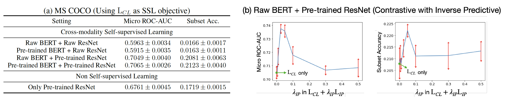
   
* 그림 (a)에서는 SSL 이 다른 modality 에 있는 self-supervised signal 에도 잘 작동한다는 것을 보여줍니다
* 그림 (b) 에서는 $L_{CL}$과 $L_{IP}$ 를 합쳤을 때 더 좋은 성능을 보여주고, 이는 task-irrelevant information 을 없애면서 학습하기 때문입니다.

## **5. Conclusion**  
* Supervised Learning 에서는 task T 가 있기 때문에, 어떤 representation 이 downstream task 에 좋을 지 명확합니다
* 하지만 unsupervised learning 에서는 그 부분이 open question 으로 다양한 접근들이 나오고 있습니다
* 이 논문에서는 어떤 representation 이 downstream task 에 도움이 되는지를 information theory 측면에서 설명하였습니다
* 제안한 loss term 을 이용해 task relevant info 를 뽑아내고, task irrelevant info 는 버리면서 minimal sufficient representation 을 학습해 냈습니다.
* 또한 이 representation 이 왜 downstream task 에 좋은지를 실험적으로 뿐만 아니라 이론적으로도 보여주는 아주 좋은 접근방식을 취하였습니다.
* 모델의 방법론만 보면 매우 간단하지만, 어떻게 이런 결과에 도달하는지를 이론적으로 증명해내는 과정이 매우 흥미로웠고 배울점이 많았습니다.

---  
## **Author Information**  

* Author name: Yeonjun In
    * Affiliation: KAIST ISysE DSAIL
    * Research Topic: Graph Represenntation Learning, Adversarial Defense on GNN

## **6. Reference & Additional materials**  

Please write the reference. If paper provides the public code or other materials, refer them.  

* Github Implementation  
    1. https://github.com/yaohungt/Self_Supervised_Learning_Multiview
* Reference  
    1. Chen, T., Kornblith, S., Norouzi, M., & Hinton, G. (2020, November). A simple framework for contrastive learning of visual representations. In International conference on machine learning (pp. 1597-1607). PMLR.

    2. Oord, A. V. D., Li, Y., & Vinyals, O. (2018). Representation learning with contrastive predictive coding. arXiv preprint arXiv:1807.0
