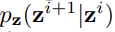
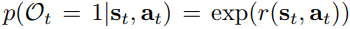

# **Deep Reinforcement Learning amidst Lifelong Non-Stationarity** 

## **1. Problem Definition**  

일반적인 강화학습(Reinforcement Learning) 실험 환경에서는 decision process가 모든 episode에 대해서 고정(stationary)되어 있는 경우가 잦다.
하지만 이와 같은 가정은(모든 episode에 걸쳐서 decision process가 stationary하다는) 현실세계에서는 옳지 않다.
(로봇이 걷는 과정을 학습한다고 하면, 바닥이 대리석인지 진흙인지 아스팔트인지, 계절이 겨울인지 여름인지 등에 따라 다른 dynamic이 제공되고 있다고 볼 수 있다.)

on-policy algorithm의 경우에는 이러한 변화(non-stationary한 환경)를 학습하는 것이 가능하다고 주장할 수 있다.
반면, off-policy algorithm의 경우에는 이를 바로 주장하기에는 어렵다. 
이러한 한계에 대해 off-policy algorithm 또한 해결할 수 있도록 한다.
past와 current experiences로 부터 새로운 representation을 배워, 새로운 loss function과 실험 방법을 제시한다.

## **2. Motivation**  

일반적인 Reinforcement Learning(RL)의 set-up에서는 stationary 한 환경을 다룬다.(고정된 dyanmic과 고정된 reward를 의미)
하지만 이는 현실과 비교하면 드문 setting이라고 볼 수 있다. 특히나, 시간에 따라서 환경의 dynamic과 reward는 계속적으로 바뀔 수 밖에 없다.

하지만 이러한 바뀌는 환경의 dynamic, reward를 항상 알고 있다는 것 또한 불가능하다. 즉 time에 따라 바뀌는 dynamic과 reward가 unknown하다. 
이 문제를 풀기 위해서 저자는 현재  unobserved dynamic한 환경을 표현할 수 있는 latent paramter가 필요하다고 주장한다.
그리고 이러한 환경을 dynamic parameter Markov decision process(DP-MDP)라고 정의한다. 

앞서 on-policy algorithm의 경우에는 non-stationary한 환경이라도 학습이 가능하다고 했다. 하지만, 환경과의 interaction이 제한적이라면
(simulation cost가 높다던가 등의 제한) 샘플 효율성이 떨어져 학습이 어렵다고 주장한다. 이에 대응하기 위해 off-policy를 사용해야하고, 
off-policy를 사용하는 경우에 latent variable 을 어떻게 정의하여 DP-MDP환경에서 non-stationary한 환경을 represetation할 수 있는
parameter를 배우고, maximum entropy policy를 통해 이 latent variable을 학습한다.

이들은 이 방식을 Lifelong Latent Acotr-Critic (LILAC)라고 명명했다.

> **DP-MDP**

DP-MDP는 새로운 MDP가 매 epsidoe마다 제공된다. 그리고 real-world 환경의 non-stationary함을 실험에 제공하기 위해서
각각의 과제들은 sequentially related 되어 있다고 본다.

이전에는 DP-MDP를 정의하기 위해서 state space S, action space A를 사용했다. Hidden Parameter MDP(HiP-MDP)에서는 dynamic을 표현하기 위해서
unobservaed task parameter **z** \in Z 통하여 dynamic과 reward function을 다음과 같이 정의했다.

, 

DP-MDP에서의 차이점은 parameter **z**가 i.i.d 하지 않고  하다는 것이다.
**z**를 알고 있다면 augmented state space  를 통하여 fully observable한 MDP를 정의할 수 있고, 기존의 RL algorithm을 사용할 수 있는 환경이 된다.

즉, 저자들은 hidden task parameter를 잘 추론할 수 있고, transition function을 학습하여 기존 RL algorithm을 통해서도 non-stationary한 환경의
문제를 풀 수 있는 방법을 제시한다.

## **3. Method**  

> **A Probabilistic Graphical Model for RL**

위의 그림처럼 제시된 모델은 state **s**_t, action **a**_{t}, per-timestep optimality variable O_t로 구성되어 있다.
O_t는  같이 reward와 연관되어 있다.(이는 O_t=1이면 state **s**_t에서 action **a**_t가 optimal임을 의미한다, 그리고
reward가 bounded 되도록 한다.)

trajectory가 과 같다고 할 때, posterior distribution 을 추론할 수 있도록 한다.
(여기서 O_t가 1이므로, trajectory distribution이 항상 optimal이라고 할 수 있다) 

> **Variational-Inference**

앞서 정의된 trajectory distribution과 variational inference를 통해서 variational lower bound를 찾아내려고 한다.
우선 식을 근사하게 되면 다음과 같이 표현할 수 있다.

distribution p에 근사할 variational distribution을 q라 하자. 그리고 그 q의 형태를 로 고른다.
(주어진 환경에 대해서 p(s_1), p(s_{t+1}|s_t, a_t)는 고정이다) 그리고 q(s_t|a_t) 를 policy형태로 바꾸기 위해서 \pi(s_t|a_t)로 이름을 바꾸면

variational lower bound for the evidence O_{1:T}를

과 같이 설정할 수 있다. 이 objective에는 reward와 policy term이 모두 존재한다.(즉, entropy, return을 모두 최대화시키기 때문에
exploration, robustness stability를 모두 제공할 수 있다.
이러한 기존의 obejctive에 뒤에 이어지는 method에서 언급할 **z**를 통해 non-stationary한 환경에서도 작동할 수 있는 objective를 제시한다)

> **Non-stationarity as a Probabilistic Model**

현재 논문에서 다루는 DP-MDP 환경은 episodic level에서 non-stationary한 환경이다. 즉, 각각의 episode 내에서는 stationary한 MDP이다.
그래서 저자는 two-tiered model을 제시한다. First level에서는 latent variable **z**를 얻어내고, 두 번째 level에서는 **z**에 따르는 MDP를 구현한다.
즉 위의 그림, figure 2를 참고하면 된다.

각각의 trajectory(from each episode)는 individual하게 모델링 되므로 joint probability function을 다음과 같이 정의할 수 있다.
(\tau 는 각각의 trajectory를 의미한다)

위의 joint probability function에서 action에 대해 uniform prior을 가정하면 식을 다음과 같이 재구성할 수 있다.

즉, 위의 factoization에 따라, non-stationary element를 latent variable **z**로 포착할 수 있고, 
**z**를 통해서 dynamic과 reward function을 stationary하게 조정할 수 있다.
(다음 section에서 어떻게 **z**를 approximate할지 제시한다. )

> **Joint Representation and Reinforcement Learning via Variational Inference**

현재가 i번째 episode라고 하자. posterior distribution을 주어진 evidence O^i_{1:T}와 이전 episode \tau^{1:i-1}을 통해서 추론해야 한다.
즉 log-probability로 표현하면, 로 된다. 또한 이 식은 와 같이 분해할 수 있다.
log 성질에 따라 식을 나눈 후 각 term의 bound를 구하고 이를 더하여 single objective로 설정한다.

### First Term(log P(\tau^{1:i-1}))

### Second Term(log P(O^i_{1:T}=1| \tau^{1:i-1}))

첫 번째 term은 여태까지 모든 episode에 대해서 transition function과 reward를 optimize한다. 
두 번째 term은 policy entropy와 return을 최대화하도록 optimize한다.
이 두 term의 합은 model의 variational lower bound가 되고 이 값을 최적화함으로써 모델을 학습한다.

## **4. Experiment**  

four continuous control environments with varying sources of change in the reward and/or dynamics.

1. derived from the simulated Sawyer reaching task in the Meta-World benchmark,
in which the target position is not observed and moves between episodes
2. based on Half-Cheetah from OpenAI Gym, we consider changes in the direction and magnitude of wind forces on the agent,
and changes in the target velocity
3. the 8-DoF minitaur environment and vary the mass of the agent between episodes, representative of a varying payload.
4. a 2D navigation task in an infinite, non-episodic environment with non-stationary dynamics which we call 2D Open World.
The agent’s goal is to collect food pellets and to avoid other objects and obstacles, whilst subjected to unknown
perturbations that vary on an episodic schedule.

### **Experiment setup**  
* baseline
  * Soft Actor-Critic (SAC)
  * Stochastic Latent Actor-Critic (SLAC)
  * Proximal Policy Optimization (PPO)
  * oracle by training a goal-conditioned SAC policy
* Evaluation Metric 
  * average reward

### **Result**  

on-policy algorithm의 sample inefficincy 때문에 PPO의 경우, 10 million steps를 진행하였다.

모든 domain에서 LILAC가 SAC, SLAC, PPO보다 높은 reward와 stable한 return을 보여준다.
LILAC의 non-stationary한 환경의 context를 잘 추론하고 있다고 볼 수 있다.

## **5. Conclusion** 

latent variable를 off-policy환경에서 어떻게 학습할 수 있는지 좋은 model을 제시하였다.
특히나 non-stationary 환경에서 non-stationary함을 context를 통해서 표현할 수 있음을 입증하였다. 

여전히 episode내에서는 항상 stationary함이 보장된다는 가정이 앞으로 개선될 수 있는 부분이 존재한다.
앞으로도 추가 연구를 진행할 수 있는 부분으로 판단된다.
동시에 4개의 환경에서만 실험했다는 점이 (무척이나 다른 환경이지만) 조금 non-stationary함을 과연 보장할 수 있는지에 대한 의문부호가 붙는다.

---  
## **Author Information**  

* Annie Xie
    * Affiliation: third-year PhD student in CS at Stanford University
    * Research Topic: reinforcement learning, meta-learning, latent representation

* James Harrison
    * Affiliation:  Ph.D. candidate in the Autonomous Systems Lab
    * Research Topic:  few-shot, incremental, and adaptive learning algorithms, model-based and model-free reinforcement learning, and safe learning control

* Chelsea Finn
    * Affiliation: Assistant Professor in Computer Science and Electrical Engineering at Stanford University
    * Research Topic: intelligence through robotic interaction at scale

## **6. Reference & Additional materials**  

* [experiment video](https://sites.google.com/stanford.edu/lilac/)
* [explain video](https://slideslive.com/38933723/deep-reinforcement-learning-amidst-lifelong-nonstationarity?ref=recommended)
* [variational inference](https://arxiv.org/pdf/1601.00670.pdf)
