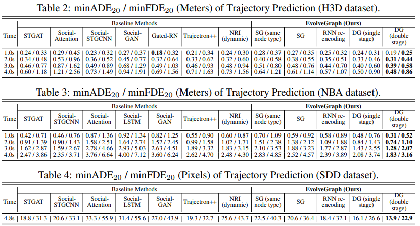

# EvolveGraph: Multi-Agent Trajectory Prediction with Dynamic Relational Reasoning

## **1. Problem Definition**  

A **multi-agent system** (MAS or "self-organized system") is a computerized system composed of multiple interacting intelligent agents. Multi-agent systems can solve problems that are difficult or impossible for an individual agent or a monolithic system to solve. For example, basketball palyers moving in the court is a kind of multi-agent system. 

To formulize this problem, we can drive the following notations: We assume that, without loss of generality, there are $$N$$ homogeneous or heterogeneous agents in the scene, which belongs to $$M\geq 1$$ categories (e.g. cars, cyclists, pedestrians). The number of agents may vary in different cases. We denote a set of state sequences covering the historical and forecasting horizons $$T_h, T_f$$ as 

$$\mathbf{X}_{1:T}=\{ \mathbf{x}^i_{1:T}, T=T_h+T_f, i=1, \cdots, N \}$$

and the historical context information as $$\mathbf{C}_{1:T_h}=\{ \mathbf{c}_{1:T_h} \}$$. The target of multi-agent trajectory prediction is based on the historical context information and state to predict the future state, i.e.

$$p(\mathbf{X}_{T_h+1:T_h+T_f}|\mathbf{X}_{1:T_h}, \mathbf{C}_{1:T_h})$$

## **2. Motivation**  

Multi-agent interaction systems are critical in many real-world applications, such as autonomous driving, mobile robot navigation and other areas where a group of entities interact with each other, giving rise to complicated behavior patterns at the level of both individuals and the multi-agent system as a whole.

However, in many real-world scenarios, the **underlying interactions** are inherently varying even with abrupt changes (e.g. basketball players). And there may be heterogeneous **types** of agents (e.g. cars, pedestrians, cyclists, etc.) involved in the system. So many methods now can only have a poor performance. 

The author provide a new method that can capturing the **dynamics** of interaction graph evolution for dynamic relational reasoning and consider the multi-modality explicitly in future system behaviors, to make the model have  a better performance and capability. 

## **3. Method**  

### Overall 

An illustrative graphical about the essential procedures of the prediction framework with explicit dynamic relational reasoning is shown in the following figure:

We can understan the framework by deviding the figure to two parts: *static interaction graph* and *dynamic interaction graph*. The previous one is similar with other multi-agent system simulation model that has a static graph framework in the model and do the update with recurrent neural network to predict the future stage, while the dynamic framework will have an extra layer that make the graph dynamic change during the prediction process. This dynamic changing is learnable, which is called evlve in the original paper. Let's start to introduce with more simple one: the static interaction graph. 

### Static Interaction Graph Learning

For a static interaction graph learning, there are in total four steps:

1. Observation Graph;
2. Interaction Graph; 
3. Encoding; 
4. Decoding; 

Here I'm going to go through them one by one. However, I would not like to display all details from the original paper, since that will not help us to get the high level understanding of this method. So I would use my word to briefly tell you what this step does and why they use this part in the model. 

**Observation Graph**: As a start up step, we should assign an init graph, the most simple and straight forward way is a fully connected graph. So in this step we will create a fully connected graph and use **Graph Attention (GAT)** way to attribute features from the original node informations (as we mentioned states and context information). 

If you are familar with **Graph Neural Network** models, you may already quite farmilar with the following process: 

Note that in this process, a bit different with traditional GAT process, there are two kinds of aggration: self-attribute and social-attribute, where the social-attribute will consider more interaction information. 

**Interaction Graph** The interaction graph represents interaction patterns with a distribution of edge types for each edge, which is built on top of the observation graph. This is a core part in the EvolveGraph. To simple, we will consider that each edge has multi types. For each type, we will have a gaussian distribution for this types hidden feature's distribution. 

In the original paper, note that they mentioned that there exict **"no edge"** type. This is used for increasing the smoothness of the graph dynamic in the dynmaic section later. 

**Encoding and Decoding** These are widely used common encoder and decoder without too many changes. Except in the decoder part, there is a burn-in stage:

The burn-in stage will do the decode in the history info, to aggregate a better hidden feature for each node. This is another intersting point. 

### Dynamic Interaction Graph Learning 

A single static interaction graph is neither sufficiently flexible to model dynamically changing situations (especially those with abrupt changes), nor to capture all the modalities. Therefore, we introduce an effective dynamic mechanism to evolve the interaction graph.

The only different is we will update the graph for each step prediction: 

This will significnatly implove the capatibily of dynamic agents information. 

### Other Setups

Another interesting point of this framework is the training loss, which is **Gaussian Mixture Strategy**. The overall view of the loss function is: 

The key idea is that we will use multi gaussian core to do the prediction, in reality, each core will reflect an intention of the agent moving. Each gaussian core will have a matched weight of the probabilty. 

## **4. Experiment** 

This paper forcus more on the method, this experiment is used to support the model design. So I prefer to briefly show some results and simple discussion. 

### Experiment Setup

- Dataset: there are three dataset used in this paper: 
	- H3D dataset: traffic scenarios;
	- NBA dataset: sports games;
	- SDD dataset: university campus;
- Baselines: 
	- STGAT
	- Social-STGAT
	- Social-Attention
	- Social-LSTM
	- Social-GAN
	- Trajectorn++
	- NRI
- Evaluation Metrix:
	- Minimum Average Displacement Error (minADE)
	- Minimum Final Displacement Error (minFDE)
	
This is the overall result tabel: 

The method is able to capture the multi-modality of future behaviors. The framework is validated by synthetic physics simulations and multiple trajectory forecasting benchmarks for different applications, which achieves **state-of-the-art performance** in terms of prediction accuracy. The result is quite attractive to readers. 

Some visualizations would be like this:

## **5. Conclusion**  

This paper presents a generic trajectory forecasting framework with explicit relational reasoning among multiple heterogeneous, interactive agents with a graph representation. Multiple types of context information (e.g. static / dynamic, scene images / point cloud density maps) can be incorporated in the framework together with the trajectory information. In order to capture the underlying dynamics of the evolution of relational structures, they propose a dynamic mechanism to evolve the interaction graph, which is trained in two consecutive stages.

I have the following opinions about this paper: 

1. Frankly speaking, I like this paper alot, the EvolveGraph is powerful and interesting. But it's quite hard for us to reimplement the model itself. There are many details about gaussian mixture and multi edge-to-node, node-to-edge layers. So if you are going to use this model, I would recommend you to use NRI's code and do some modifications. 

---
## **Author Information**  

* Name: Chuanbo Hua
* Affiliation: KAIST ISysE SILab

## **6. Reference & Additional materials**  

Please write the reference. If paper provides the public code or other materials, refer them.  

* Github Implementation: **NOTE**: there is no open source code for the EvolveGraph so far.  
* Reference  

[1] Vineet Kosaraju, Amir Sadeghian, Roberto Martín-Martín, Ian Reid, Hamid Rezatofighi, and Silvio
Savarese. Social-bigat: Multimodal trajectory forecasting using bicycle-gan and graph attention networks.
In Advances in Neural Information Processing Systems, pages 137–146, 2019.

[2] Namhoon Lee, Wongun Choi, Paul Vernaza, Christopher B Choy, Philip HS Torr, and Manmohan Chandraker. Desire: Distant future prediction in dynamic scenes with interacting agents. In Proceedings of the
IEEE Conference on Computer Vision and Pattern Recognition, pages 336–345, 2017.

[3] Hang Zhao, Yujing Wang, Juanyong Duan, Congrui Huang, Defu Cao, Yunhai Tong, Bixiong Xu, Jing Bai,
Jie Tong, and Qi Zhang. Multivariate time-series anomaly detection via graph attention network. arXiv
preprint arXiv:2009.02040, 2020.

[4] Anirudh Vemula, Katharina Muelling, and Jean Oh. Social attention: Modeling attention in human crowds.
In 2018 IEEE International Conference on Robotics and Automation (ICRA), pages 1–7. IEEE, 2018..
