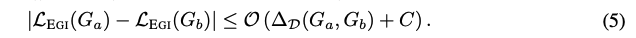
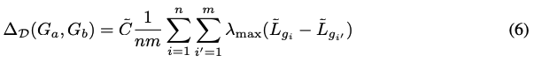

# EGI

본 논문은 GNN에서의 전이학습을 이론적으로 분석하고 실용적인 프레임워크를 제안하는 논문입니다. 많은 다른 딥러닝 분야에서 전이학습이 연구되어 왔으나 GNN에 관련해서는 아직 활성화되지 않은 부분이라 생각되어 본 논문에 대한 리뷰를 진행하였습니다. 전이학습은 기존에 학습된 모델을 활용할 수 있다는 점에서 BERT 와 같이 다양한 테스크에 활용될 수 있는 가능성을 지니고 있다고 생각합니다. 더불어 전이학습 연구를 통해 GNN 이 본질적으로 학습하는 정보에대한 이해를 높일 수 있습니다.

논문 링크 : [https://openreview.net/pdf?id=CzVPfeqPOBu](https://openreview.net/pdf?id=CzVPfeqPOBu)

## **1. Problem Definition**

GNN은 다양한 어플리케이션에서 우수한 성능을 달성했지만 특정 테스크를 위해 GNN을 훈련하는 것은 대규모 그래프의 경우 비용이 증가하는 문제가 있습니다. GNN pre-training 에 대한 연구되기 시작했으나 프레임워크 설계에 대한 이론적 분석, transferability 등에 대한 보장을 제공하지 못한다는 문제가 있었습니다.

이번 연구에서는 GNN 전이학습을 위한 이론적 기반과 프레임워크를 제안합니다. 연구는 아래 두가지 내용을 중점적으로 다룹니다.

1. 필수적인 그래프 정보를 전이할 수 있는 방법을 제안 : Ego-Graph Information maximization 설계
2. 노드 피쳐가 그래프 구조와 관련된 경우, 로컬 그래프의 라플라시안의 차이가 EGI 로 전달 될 수 있는지 분석

두개의 실제 네트워크 데이터 세트에 대해 실험을 진행 하였으며 대형 지식그래프에대한 실험은 fine-tuning을 통한 전이 가능성을 확인하였습니다. 저자는 본 연구를 통해 EGI 라는 모델을 제안합니다.

**EGI** : GNN training objective based on ego-graph information maximization

## **2. Motivation**

GNN은 다양한 테스크에 활용되고 있습니다. 대부분 아키텍쳐는 복잡하지 않으나 대규모 그래프에서 메모리 및 계산 리소스가 많이 요구된다는 특징이 있습니다. Few-shot learning 과 같이 다른 그래프, 도메인간의 구조적인 정보를 전이 할 수 있다는 것은 흥미로운 사실입니다. 최근에 GNN transferability 관련 연구가 진행되고 있으나, pre-train / fine-tuning task가 다른 경우, 전이학습이 효과가 있을지에 대해서는 불분명합니다. GNN transferability 를 분석하기 위해 domain adaptation 과 유사한 이종 그래프 간의 전이 방식에 대한 연구를 진행 하였습니다.

본 연구의 목적은 아래와 같습니다.

💡 GNN의 전이 학습을 위한 이론기반 프레임워크를 설정하고, 전이학습이 가능한 GNN 모델을 설계.

그래프 정보와 유사도는 k-hop ego-graph 의 구조 및 node feature를 공유하는 분포의 샘플로 정의됩니다. 이러한 그래프 정보에 대한 정의를 바탕으로 그래프 정보 추출에 효과적인 ego-graph information maximization 방식을 활용하는 EGI 모델을 제안합니다. 전이 가능한 node feature의 요구사항을 확인하고, 로컬 그래프 라플라시안과 함께 활용하여 transferability를 분석합니다.

이론적인 분석을 위해 다양한 개념이 introduction 에서 소개가 되는데, 여기에 대해서는 추후 자세한 설명이 나오게 됩니다.

## **3. Method**

## 3. Transferable Graph Neural Networks

본 연구에서는 EGI라는 모델을 제안하고 해당 모델이 전이학습이 가능하도록 training object를 설정합니다. 로컬 그래프 라플라시안을 기반으로 하는 소스그래프, 타겟그래프를 모델링하는 능력 차이를 통해 전이학습 가능성을 분석하였습니다. GNN의 아웃풋은 node feature, 고정 그래프 라플라시안, 학습가능한 그래프 필터로 정의 됩니다. 다운스트림 테스크를 모르는 경우, GNN의 일반적인 유용성을 위해 최적화하고 정량화 해야 합니다. GNN의 일반적인 transferability는 소스 그래프와 대상 그래프를 모델링하는 성능 차이로 정량화 됩니다.

## 3.1 Transferable GNN via Ego-graph Information Maximization

이 파트에서는 IM 기반의 전이학습을 위한 GNN의 원리와 구조에 대해 설명합니다.

소스 그래프 $G\_a$에 대해서 unsupervised pre-training 을 진행한 후, 타겟 그래프 $G\_b$ 에 대해 fine-tuning 없이 전이가 되는지를 확인합니다. 두 그래프의 노드피쳐 및 구조가 유사하여 호환 되는 경우만 전이가 될 것입니다.그래프 커널은 그래프 간의 유사성을 측정합니다. k-hop ego graph 샘플을 GNN을 통해 인코딩 하기 때문에 구조적 정보에 대한 정의를 제공하고 그래프간의 유사성 측정에 용이합니다. 그러나 현재 GNN training objective 중에는 ego graph 의 distributional signal 을 복구 할 수 있는게 없습니다. 이러한 문제를 해결하기 위해 EGI 를 제안합니다.

> **Definition 3.1 : K-hop ego-graph** 그래프 $g\_i$ 는 node $v\_i$ 를 중심으로하는 최대 hop이 k 인 k-layer 확장 그래프.

> **Definition 3.2** : Structural information $G$ 를 sub-graph 들의 토폴로지 공간이라고 했을때, 그래프 $g$ 를 $G$ 에서 $\mu$ 의 확률로 추출한 k-hop ego-graph 샘플 이라고 볼 수 있다. $g$ 의 structural information 은 k-hop ego-graph set 과 그들의 empirical distribution 으로 볼 수 있다.

논문에서 제안하는 프레임워크는 ego-graph 를 통해 그래프 간의 구조적 유사성을 측정 하고, joint distribution P \~ (g\_i, x\_i) 를 통해 노드 임베딩을 얻습니다.

Figure 1 을 보면 $G\_0, G\_1, G\_2$ 세 그래프는 1-hop ego-graph set 과 empirical distribution 으로 특정됩니다. 이러한 정보들을 통해 그래프간의 구조적 유사성을 정량화 할 수 있습니다. ( $G\_0$ 은 $G\_1$ 에 보다 유사합니다.) 실제로, 그래프 내부의 노드들은 k-hop ego-graph 구조 뿐만 아니라 node feature 와의 상호작용을 통해 정의됩니다. 그래프는 그래프 구조와, node feature 의 joint distribution 으로부터 얻을 수 있습니다.

direct-transfering setting 은 소스 그래프 $G\_a$ 에 대해서 unsupervised 로 pre-train 을 진행하고 타겟그래프 $G\_b$ 에 대해 fine-tuning 없이 적용하는 방식입니다. k-hop subgraph 커널은 k-hop ego-graph 구조와 node feature 의 joint distribution 에서 샘플을 얻습니다.

### Ego-Graph Information Maximization

Empirical joint distribution $\mathbb{P}$ 에서 얻어진 ego-graph set 에서 mutual information 을 최대화 하도록 GNN encoder 를 학습합니다. 이것은 k-hop ego-graph $g\_i$ 와 node embedding $z\_i = \Psi(g\_i,x\_i)$ 둘 사이의 MI가 최대가 되도록 하는 과정입니다. 이 과정을 통해 최대한 관계가 있도록… MI 를 최대화 하도록 또다른 discriminator $D(g\_i,z\_i) : E(g\_i)×z\_i \rightarrow \mathbb{R}^+$ 가 제안 되는데, 이것은 주어진 ego-graph $g\_i$ 에서의 edge e 의 확률을 계산합니다. 저자는 EGI 목적함수에 Jenson-Shannon MI estimator 를 사용합니다.

💡 \*\*Jensen-Shannon MI estimator\*\* KLD 는 symmetric 하지 않아 distance 라고 할수 없기 때문에 이를 대체하기 위해 사용됩니다.

Equation 1. 에서 SP 는 softplus function 으로 수식은 $sp(x) = log(1+e^x)$ 이고 sigmoid 와 비교하면 아래와 같습니다.

$(g\_i, z\_i^{\prime})$ 은 marginal distribution 의 product 로 부터 랜덤하게 추출된다. 수식으로 표현하면 다음과 같다. $z\_i^{\prime}=\Psi(g\_{i^{\prime\}}, x\_{i^{\prime\}}), (g\_{i^{\prime\}}, x\_{i^{\prime\}})$ \~ $\mathbb{P}$. 일반적으로 negative 한 그래프를 추출할때, 모든 그래프를 추출한다면 계산량이 많습니다.

Eq. 1 에서 계산은 노드 순서에따라 이루어집니다. 일반적인 그래프 생성 방법론을 따르면 decision process D 는 고정된 순서의 그래프들로 이루어집니다 ( ex. BFS). D는 $D = f◦\Phi$ 로 엣지 시퀀스에 대한 스코어링 함수와 GNN 인코더의 결합으로 이루어집니다.

중심 노드 인코더 $\Psi$ 와 이웃노드 인코더 $\Phi$ 는 그래프와, 노드피쳐 쌍을 입력으로 받는 GNN 으로 구성됩니다. 중심노드 인코더는 중심노드의 임베딩 (n_1 벡터) 을 리턴하고, 이웃노드 인코더는 이웃노드 임베딩 벡터의 집합(n_노드개수) 을 리턴합니다. (하기 수식을 참고해주세요. A 는 각각의 그래프의 adjacency matrix 를 의미합니다.)

노드 임베딩을 얻은 후, 이것을 활용하는 스코어링 함수 $f$ 를 설명하겠습니다. 각각의 노드쌍 (p,q)에 대해서 스코어링 함수는 아래와 같은 수식으로 정의 됩니다.

node pair (p,q) $h\_p$ : source node representation from $\Phi$ $x\_q$ : destination node feature $z\_i$ : center node embedding, output from $\Psi$ $\tau$ : ReLU function $\sigma$ : Sigmoid function

Discriminator $D$ 는 그래프 내부의 각각의 edge 에 대해 positive, negative 여부를 구별합니다.

여기서는 아래와같은 두가지 종류의 엣지쌍이 존재합니다.

a) type-a : 각각의 노드가 중심 노드로부터 다른 hop 수를 가지는 경우 b) type-b : 두 노드가 같은 hop 수를 가지는 경우

앞서 언급한 BFS 기반 노드순서는 위 수식이 type-a edge 순서에 영향을 받고, type-b edge 순서와는 무관합니다. k-layer GNN의 결과물이 그래프 g\_i 에만 의존하기 때문에 EGI 는 g\_i 배치를 통해 병렬로 학습이 가능합니다.

### Connection with existing work

EGI object 에 대해 좀더 인사이트를 제공하기 위해 저자들은 ego-graph 재구성을 dual problem 관점에서 분석하였습니다.

EGI가 mutual information 을 최대화 하면 upper error bound 는 최소화됩니다. VGAE 와의 차이는 그래프 내부의 엣지가 reconstruction 에서 독립적으로 구성된다는 것입니다. EGI에서는 decoding 중에 독립적으로 엣지 관찰됩니다. DGI, GMI 와 같은 MI 기반 GNN 에서는 명시적으로 노드 피쳐와 GNN output의 MI를 비교합니다. 이러한 기법들은 그래프 구조대신 노드피쳐에 주목하는 경향이 강하다고 합니다.

### Use case of EGI framework

논문에서는 타겟으로 하는 도메인 라벨이 없는 경우에 적용하는 경우를 다루고 있어 fine-tuning을 하지 않았을 경우의 성능차이를 통해 전이 가능성을 평가하였습니다. 이러한 direct-transfer 는 airport 데이터셋에 대해 검증을 진행하였습니다. YAGO 데이터셋에 대해서는 fine-tuning을 활용한 보다 일반적인 전이학습 효과를 확인하였습니다.

### Supportive observation

Table 1 은 유사한 그래프 (F-F) 간의 전이학습과 유사하지 않은 그래프 (B-F) 간의 전의 학습의 효과를 보여주고 있습니다. node degree 를 one-hot 으로 활용한 transferable node feature 를 사용했을 경우, EGI 모델이 다른 기법들 대비 높은 성능을 보여줍니다. untrained-GIN 과 비교했을때 성능이 얼마나 향상 되었는지를 통해 전이학습의 효과를 확인하였습니다.

**Table 1**

F-F : between similar graphs B-F : dissimilar graph

## 3.2 Transferability analysis based on local graph Laplacians

이번 파트에서는 EGI 를 통해 구조정보 전이 가능성을 분석하는 과정에 대해 다루고 있습니다. GNN 을 통해 노드 피쳐와 graph laplacian 을 결합하게 됩니다. 따라서 노드피쳐가 구조적인 정보를 반영 (structure-respecting) 해야만 목표로 하는 것을 달성 할 수 있습니다. structure-respecting 에 대한 정의는 아래와 같습니다.

> Definition 3.3 : **Structure-respecting node features $v\_i$** : center of ego-graph g\_i \*\*\*\*V\_p(g\_i) 가 g\_i 의 p-th hop 의 노드 집합일때,\
> 노드피쳐가 모든노드 $v\_q \in V\_p(g\_i)$ 에 대해 다음을 만족 —> $x\_{p,q}^i = \[f(g\_i)]\_{p,q} \in \mathbb{R}^d$\
> $f$ should be injective

위 정의에 대해 다시 생각해 본다면, 노드 피쳐는 그래프 구조에 따라 달라지는 값이어야 합니다. 이것은 그래프의 구조 정보에만 의존하는 전이학습 가능성 분석에도 필수적입니다. 그래프 구조를 반영하는 노드 피쳐는 node degrees, PageRank scores, spectral embedding 를 비롯한 pre-comuted unsupervised network embedding 등을 통해 얻을 수 있습니다. 이러한 피쳐는 모두 structure-respecting 하다고 할 수 있습니다.

그러나, random vector, uniform vector 는 non-transferable 합니다. raw node attributes 가 사용 가능한 경우, homophily 컨셉을 적용하여 전이학습을 진행 할수 있습니다.

이것은 실험을 통해 확인 되었는데, Table 1을 보면 non-transferable feature 를 사용한경우 대부분 전이가 잘 안되는 것을 확인 할 수 있습니다.

> Theorem 3.1 : G\_a, G\_b 두 그래프가 있고, 노드피쳐가 structure-relevant 할 경우, GCN $\Psi$ 와 1-hop polynomianl filter $\Phi$ 가 있을때. G\_a, G-b 의 로컬 스펙트럼 에 대한 가정은 다음을 만족한다. 우항의 C 는 그래프 인코더와 노드피쳐에만 의존한다.
>
> 
>
> ∆D(Ga, Gb) 는 아래와 같은 방식으로 두 그래프 사이의 구조적 차이를 측정한다. L 은 normalized graph Laplacian을 의미한다.
>
> 

위 이론을 통해 G\_a 에 대해 EGI 를 트레인한 후, G\_b 에 대해서 얼마나 잘 작동할 지에 대해 G\_a, G\_b 의 로컬 그래프 라플라시안 만을 사용하여 확인 할 수 있습니다. EGI gap 은 ∆\_D 로 정의되는데 이것은 두 그래프 로스의 차이를 통해 전이 가능성을 계산하기 위해 사용됩니다.

**Remark 1** k-hop ego-graph 샘플을 통해 노드별로 특성을 얻을 수 있음. k-hop 의 특성으로 GNN 레이어수 k 와 동일하게 설정할 수 있음.

**Remark 2** 노드 임베딩은 항상 샘플링된 그래프의 영향을 받는다. G에서 균일하게 샘플링된 것으로 대상 축소. 따라서, 그래프의 구조적 정보에만 의존함.

### **Supportive observation**

Table 1에서 F-F, B-F 의 average structural difference 를 확인할 수 있습니다. Eq.5 우변에 따르면 이 결과는 랜덤그래프 모델로부터 얻은 두 그래프의 topological difference 를 통해 ego-graph 샘플의 구조적 특성을 검증하게 됩니다. 다른 그래프 간의 차이를 acc 컬럼을 통해 표시하였고, 비슷한 그래프간의 성능이 더 높을 것이라 저자들은 예상하였습니다. 이는 유사한 그래프 간에 보다 많은 정보가 전이 되었다고 볼수 있습니다. 실험결과를 통해 EGI가 예상한 대로 동작하며 이를 통해 이론적 분석이 유용하다는 것을 확인하였습니다.

### Use case of Theorem 3.1

여기서는 앞서 설명한 내용을 실제로 활용할 수 있는 두가지 케이스에 대해 제안하고있습니다.

1. point-wise pre-judge 라벨이 충분치 않은 그래프 G\_b가 존재할때, 다른 그래프 G\_a를 pre-trian 하여 적용할 수 있습니다. 이때, 두 그래프 간의 EGI gap 을 계산함으로써 전이학습이 가능한지 파악할 수 있습니다. (EGI gap 이 1.0 보다 작으면 가능하다고 볼 수 있습니다.)
2. pair-wise pre-selection pre-train을 위한 2개 이상의 그래프가 있는경우, 어떤 그래프를 사용하는 것이 가장 효율적일지 선택하는데 활용할 수 있습니다.

그래프가 큰 경우 모든 ego-graph 쌍을 비교할 필요는 없습니다. 대신 무작위로 그래프 쌍을 샘플링하고 평균적인 차이를 업데이트 하는식으로 적용할 수 있습니다. (이것을 값이 수렴할때까지 진행합니다)

두개의 큰 그래프를 비교하기 위해 M 개의 쌍을 샘플링할때, 평균적인 ego-graph 크기를 L 이라 가정하면 계산 복잡도는 O(ML2) 이며, 여기서 M은 1k 미만, L은 50 미만이 일반적입니다. 샘플링 주파수가 다르고 실제로 더 작은 샘플 주파수에서도 실제값에 매우 가깝기 때문에 샘플링을 통해 보다 효율적으로 적용할 수 있습니다.

### Limitations

두 그래프에서 이루어지는 테스크가 서로 다른 구조적인 신호에 의존하는 경우 효과가 제한될 수 있습니다. Eq.6 은 local ego-graph 의 그래프 라플라시안 사이의 평균적인 pairwise distance 를 계산하고 있으며 ∆D 는 connected componets 같은 global 한 속성을 포착하는데 덜 효과적일 수 있습니다. CCs, community detection 과 같은 특정 작업에서 전이 가능성을 예측하지 못할 수 있습니다.

## **4. Experiment**

이번 파트에서는 앞서 설명한 이론을 바탕으로 실제 데이터셋에서 진행한 실험에 대해 설명합니다.

본 실험에 앞서 두가지 방식으로 생성한 그래프를 통해 앞서 설명한 이론들을 검증하기 위한 합성 실험을 진행하였습니다. F,B 는 각각 다른 방식을 사용하여 생성한 40개의 그래프입니다. F-F 는 유사한 그래프에 대한 결과를 보여주며, B-F 는 서로 다른 그래프 간의 전이 학습을 보여줍니다. 실험 결과는 아래와 같습니다.

### Baselines

실험에서 저자는 제안하는 모델을 self-supervised, pre-training GNN 과 비교합니다. GNN encoder 의 영향을 제외하기 위해 같은 인코더를 사용합니다. GIN : 직접 전이학습 실험할때 GCN : fine-tuning 으로 전이할때

self-supervised : GVAE, DGI, GMI, MVC

pre-training: MaskGNN, ContextPredGNN (two node-level pretraining models), Structural Pre-train (unsupervised node-level pre-training with structural features like node degree and clustering coefficients.)

### Experimental Settings

실험 세팅을 아래와 같습니다. k = 2

Adam, lr = 0.01

default node features : node degree one-hot encoding (transferable feature) other node features : spectral, pre-computed node embeddings

다운스트림 테스크는 지정되지 않았으나 구조와 관련이 있다고 가정을 하고 진행하였습니다. 평가 측면에서 두가지 현실적인 실험 설계를 하였습니다.

1. 노드 피쳐 없이 전이 가능성을 평가 하기위한 structure-relevant task of role identification
2. 일반화 성능 평가를 위한 task-specific 노드 피쳐 기반의 관계예측, Few-shot learning

## 4.1 Direct-transfering on role identification

첫번째 direct-transfering 실험은 노드피쳐가 없는 상태로 노드의 역할을 판별하는 테스크를 진행합니다. 네트워크 내에서의 노드의 역할은 구조적인 정보를 기반으로 정의됩니다 (ex. clique members, hub, bridge). 동일 도메인에서 노드 역할의 정의가 일관적이라 가정하면 노드역할 식별은 구조와 가능성이 높을 것이라 가정하였습니다. 실험은 모델을 pre-train 후 대상 그래프에 적용시 MLP를 추가하여 학습을 진행하였습니다 (GNN 파라미터는 고정). GNN 레이어에 대한 fine-tuning 이 없기 때문에 이 전략을 direct-transfering 이라고 이름지었습니다.

실험에는 두가지 노드라벨이 있는 데이터셋 사용하였습니다. Airport 데이터셋은 브라질, 미국, 유럽 세가지 네트워크를 포함하며 노드는 공항, 링크는 공항간 비행, 공항의 인기도에 따른 라벨이 부여되어 있습니다. Gene데이터셋은 50가지 암 유전자 간의 상호작용 정보를 포함하며, 전사 인자를 나타내는 바이너리 레벨의 라벨을 가지고 있습니다.

아래 표는 Airport 데이터셋에 대한 실험결과를 보여줍니다. Untrained 모델 제외하고 모든 모델을 Europe 데이터에 대해 학습하고, 전체 3가지 지역(Europe, USA, Brazil)에 대해 테스트를 진행하였습니다.

node degree feature 로 MLP를 학습시킨 모델이 3가지 네트워크에대해 적절한 성능을 보여주었고, 인기도 기반의 공항 role 레이블이 node degree 와 유사하기 때문으로 분석하였습니다. GNN 인코더는 구조정보를 node feature과 함께 학습하기 때문에 학습되지 않은 GIN 인코더도 node feature 만 사용한 모델에 대해 성능이 향상되었습니다.

DGI 학습은 소스 그래프의 성능은 향샹되었으나 다른 두 그래프에서는 뚜렷한 성능향상이 나타나진 않았습니다. EGI 는 structure-relevant node degree features 로 가장높은 성능을 보여주었습니다. 이러한 결과를 통해 필수 그래프 정보 ( k-hop ego-graph 를 복구하기 위한) 를 잘 포착한다고 볼 수 있습니다.

다른 그래프로 전이학습을 할때 EGI가 모든 베이스라인 대비 가장 높은 성능을 달성하였습니다 (structure-relevant node feature 사용). 흥미롭게도, k-hop 그래프를 공동으로 포착하지 않는 MVC, GVAE, DGI 는 학습되지 않은 GIN 대비 제한되거나 부정적인 결과를 얻었습니다.

최근 제안된 MaskGNN 및 Structural Pre-train 과 같은 GNN 전이학습 프레임워크는 부정적인 결과를 완화할 수 있으나, 여전히 EGI보다 낮은 성능을 보였습니다. 저자는 이것이 해당 모델이 전송가능성이 낮은 그래프 관련 정보를 학습하는 경향이 있기때문으로 분석합니다. GMI는 그래프 구조와 node feature를 학습하는 것으로 알려져 있으며, EGI 다음으로 좋은 결과를 얻습니다.

Figure3 에서는 네트워크 간의 구조적 차이를 EGI gap 으로 분석한 결과를 보여주고 있습니다. 그래프의 구조적 차이는 유럽-미국 0.869, 유럽-브라질 0.851 로 유사합니다. 결과적으로 학습되지 않은 GIN 에 대한 성능 향상과 관련된 전이 가능성은 미국 4.8%, 브라질 4.4% 로 나타납니다. 이러한 결과는 EGI 전이 가능성이 소스 및 대상 그래프간의 구조적 차이와 밀접하게 관련 있다는 것을 보여줍니다. (Theorem 3.1)

EGI gap 과 performance gap (micro-F1) 을 고려하여 Gene 데이터셋에서 Equation.5 의 유용성을 추가 검증하고자 하였습니다. 성능 차이를 제거하는 몇가지 불균형한 레이블이 있는데, 우리는 레이블 밸런스가 잘 잡힌 오직 7가지 뇌 암 네트워크만을 사용합니다.

Figure3 에서 보이듯 우리는 EGI를 특정 그래프에서 학습하고 다른 그래프들에서 테스트 합니다. x축은 EGI ap 을 보여주고 y축은 untrained GIN 대비 micro-F1 성능 향상을 보여줍니다. x, y 축 사이의 음의 상관관계가 분명하게 보입니다. 구조적인 차이가 1보다 작으면 전이도니 EGI 성능이 더 우수하여 전이로 인한 성능향상이 관찰되고 (좌측 상단) 구조적인 차이가 1보다 크면 전이로 인한 부정적인 효과가 관찰된다. 또한 소스 그래프와 대상 그래프 G2 사이에 유사한 패턴 —> 단일 밀집 클러스터가 관찰 됩니다.

## 4.2 Few-shot learning on relation prediction

이 파트에서는 EGI를 보다 일반적으로 평가하기 위해 few-shot learning 기반의 실험을 진행합니다. 그래프 구조와 관계가 적은 관계예측 테스크를 통해 평가를 진행하였습니다. 소스 그래프는 579k 의 엔티티를 포함한 YAGO 데이터를 사용하며, 20-shot relation prediction 을 타겟 그래프에서 24가지 relation type 에 대해 수행합니다. fine-tuning은 같은 그래프에서 추출된 115K 개의 엔티티의 sub-graph 에 대해 수행합니다. post-fine-tuning 에서 모델은 source 그래프에서 unsupervised loss 로 pre-trained 되고 target graph 에서 task-specific loss 로 fine-tuned 됩니다. joint-finetuning 에서는 같은 pre-trained 모델들이 타겟 그래프에 대한 unsupervised pre-training loss 와 task-specific fine-tuning loss 로 jointly optimized 됩니다.

Table3 에서 우리는 대부분의 기존 모델이 joint-fine-tuning 에 대해 pre-training, fine-tuning task 를 통한 전이에 실패하는 것을 관찰하였습니다. 특히 Mask-GIN 과 ContextPred-GIN은 task-specific fine-tuning 에 많이 의존하는 반면, EGI 는 그래프간에 전이할 수 잇는 유사한 ego-graph 구조 포착에 중점을 둡니다. MI 기반의 방식인 GMI 역시 전이가능성을 보여주며 그래프 구조를 포착하는 것이 핵심임을 알 수 있습니다. 결과적으로 EGI 는 두가지 setting 모두에서 베이스라인 대비 높은 성능을 보여줍니다.

## **5. Conclusion**

본연구는 GNN 에서의 전이학습을 이론적으로 분석하기 위한 첫 시도라고합니다. GNN 기반의 전이학습 설계 및 수행을 위한 실용적인 기법들을 가이드하였습니다. 후속 연구로 덜 제한된 설정에서도 전이학습이 가능하도록 다양한 시나리오 및 데이터셋에 대해 프레임워크를 제안하고 있습니다. 또한 사회적 영향을 고려하여, pre-train 데이터에서 개인정보를 보호하는 것도 중요하다고 언급하고 있습니다.

## **Author Information**

* Han, Donghee
  * Knowledge Service Engineering, KAIST, Daejeon, Korea
  * GNN, Recsys, Deep learning
