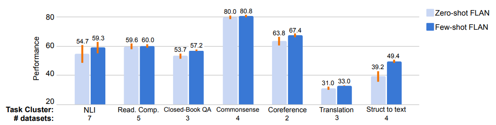

# **Finetuning Language Models are Zero-shot Learners** 

## **1. Problem Definition**  

해당 논문이 풀고자 하는 문제는, Language Model (LM)의 zero-shot inference task 이다. 즉, training 과정에서 보지 못했던 task와 data를 inference 과정에서, 추가적인 학습 없이 모델의 성능을 테스트 한다.

Zero-shot learning 은 본래 인간이 언어적인 사고를 할 때, 추가적인 학습 없이도, 다양한 언어처리를 할 수 있다는 것에 기인하여, LM 또한, 언어에서 인간의 지능을 모방할 수 있는 가를 평가하는 중요한 요소이다. 해당 논문은 새로운 Finetuning 방법론을 제안하여 기존 Large Scale LM 들의 Zero-shot 성능을 크게 개선시키는 데 집중한다. 

## **2. Motivation**  

"Language Models are Few-shot Learners" (이하 GPT-3) 는 그 논문 제목 처럼, LM이 Task에 대한 적은 추가적 학습 (Few shot) 혹은 example 나열 만으로도 좋은 성능이 나올 수 있음을 시사하면서, LM의 일반 인공지능 (Artificial General Integlligent) 로의 방향성을 제시하였다. GPT-3는 기존 BERT 기반 LM 들의 연구 방향이 큰 Dataset 에서 Self-supervised learning을 통해 학습 한 후, 각 task에 decoder를 finetuning 한 흐름을 지적하였다. GPT-3는 BERT 기반 LM 들과는 다르게, Decoder finetuning 없이, large scale pre-train 및 few shot learning 을 통해 좀 더 일반적인 LM을 탄생시켰다. 

하지만, GPT-3 조차 Zero-shot 성능은 좋지 못했고, 이 점이 큰 한계로 지적되었다. GPT-3가 LM을 "Few-shot learner" 로 이끌었다면, 이 논문은 그것을 넘어 "Zero-shot learner"로 이끌 수 있는 Novel 한 방법을 제시한다. 

## **3. Method**  

### Instruction Tuning

해당 논문은 Instruction Tuning 이라는 굉장히 간단한 아이디어로 Large Scale LM의 Zero-shot performance를 크게 증가시킨다. 

  

위의 figure 에서 볼 수 있듯이, 모든 language task는 instruction form 으로 나타낼 수 있다. 예를들어, translation task 같은 경우, "중국어로 번역하라!" 등의 명령 형태로 task를 전처리 해 줄 수 있다. 

LM은 이러한 instruction form 하에 task를 학습하게 되고, 새루은 instruction 에 대한 generalizability 를 키우기 위해 학습하게 된다. 

이는 매우 간단하게 수행 할 수 있는데, 저자들은 기존에 LM 모델 학습을 위해 쓰인 dataset 들을 12가지 cluster의 task로 나눈 후, 각 task에 맞는 instruction form으로 데이터를 변환한다 (위 그림 참고).

추가적으로, 저자들은 instruction form의 다양성을 높히기 위해 같은 task 라도 위의 그림처럼 다양한 형태의 instruction form 으로 변환 할 수 있게 제안하였다. 즉, cluster 개수 (task 개수) 보다 많은 instruction form 에서 학습을 가능하게 할 수 있다. 결국 총 60가지의 NLP instruction form 으로 학습하게 된다 (12 (cluster 개수) * 5 (각 cluster 마다 instruction 개수) 로 추정됨).   

## **4. Experiment**  

### **Experiment setup**  
* Dataset  

Tensorflow NLP dataset (62개 데이터 셋, 12개로 cluster, 각 cluseter 마다 5개의 multiple instruction form; 위 그림 참조)

* Pretrained Model

 LaMDA-PT (137B parameters) 

* Baseline

GPT-3 Zero-shot (some of task, few-shot)

* Evaluation Metric  

Zero-shot performance of each task. 

### **Result**  

### **Main Result**  

메인 결과는 위에 그림과 같이 GPT-3의 zero-shot performance를 파라미터가 더 적은 pretrained LM (즉 LaMDA-PT) 를 가지고 outperformed 하였다. 

### **Ablation Studies**  

* Number of Clusters  

클러스터의 개수가 많아질 수록 성능이 높아지는 것을 보였다. 

* Parameter Scale of LM

논문의 아이디어가 충분이 큰 크기의 LM에서만 효과적으로 작동한 다는 것을 확인할 수 있었다. 

* Few shot learning

해당 아이디어는 zero-shot task를 타겠했지만, few-shot task의 성능이 역시 올라감을 알 수 있다. 

## **5. Conclusion**  

해당 논문은 굉장히 간단한 데이터 전처리 (instruction form) 아이디어를 통해 Large scale LM의 Zero-shot 성능을 크게 증가시켰다. GPT-3가 few-shot learning 에 대한 LM의 장을 열었다면, 해당 논문은 이를 zero-shot learning 까지 확장 시켰다. 

Deep Learning 연구에는 다양한 아이디어들이 난무 하지만, 실질적으로 판도를 바꾸는 연구들은 대부분 아이디어가 굉장히 간단한 경우가 많다. 그것은 Deep Learning 분야 특성상 복잡한 feature engineering 보다는, massive neural parameter 를 통한 자동화된 표현 학습에 의존하기 때문에, 간단하고 간결한 메세지가 때로는 큰 힘을 발휘할 때가 많다 (Resnet의 skip connection, transformer의 attention 등). 

해당 논문의 간단한 아이디어를 통해 zero-shot performance의 큰 향상은 Deep Learning Researcher 들의 귀감이 된다고 보여진다. Simple Idea for Advanced Performance is better than Advanced Idea for Simple Performance.  

---  
## **Author Information**  

* Jason Wei∗
, Maarten Bosma∗
, Vincent Y. Zhao∗
, Kelvin Guu∗
, Adams Wei Yu,
Brian Lester, Nan Du, Andrew M. Dai, and Quoc V. Le
    * Four Lead Authors (*)
    * Google Research  
    * Deep Learning

## **6. Reference & Additional materials**  

@article{wei2021finetuned,
  title={Finetuned language models are zero-shot learners},
  author={Wei, Jason and Bosma, Maarten and Zhao, Vincent Y and Guu, Kelvin and Yu, Adams Wei and Lester, Brian and Du, Nan and Dai, Andrew M and Le, Quoc V},
  journal={arXiv preprint arXiv:2109.01652},
  year={2021}
}

https://github.com/google-research/flan.

