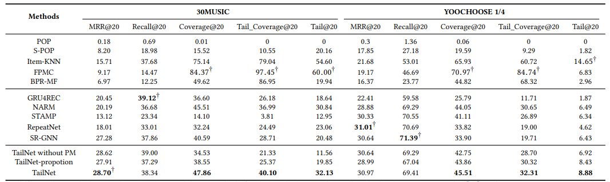
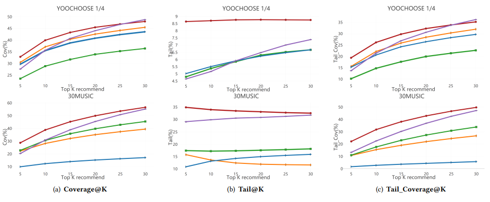

# **Long-tail Session-based Recommendation** 

## **1. Problem Definition**  

Session Recommendation은 Sequential Recommendation과 유사하지만 User Information이 따로 존재하지 않는 차이점이 존재한다.  
즉, Sequential Recommendation과 유사하게 Item Interaction을 시간 순서대로 정렬한 후, 다음에 Interaction이 생길 Item을 예측하는 것이다.
예를 들어, 한 쇼핑몰에서 Login 정보 없이 Item을 click했을 때 다음으로 click할 Item을 예측하게 되는 것이다.

Session Recommendation도 Long-Tail 문제가 존재한다. 

  

위 사진에서 y축을 popularity 즉, 많이 item을 click한 횟수로 생각하고, x축을 item id라고 생각했을 때, 인기가 별로 없는 long-tail item들은 별로 Session에서 추천되지 않을 것이다. 하지만, popular한 item만 session에서 추천하는 것이 아니라 적합한 tail item을 추천하는 것은 user에게 serendipity를 주는 이점이 있다. 연관되어 있는 새롭고 특색 있는 long-tail item을 추천하는 것도 추천시스템에서 중요한 문제도 대두된다.

## **2. Motivation**  

이 논문의 주된 동기는 Session Recommendation에서 Long-tail문제를 완화하는 것이다. 일반 추천시스템에서는 많이 다루어지는 문제이지만, Session Recommendation에서 Long-Tail이 다루어지는 첫 연구이다. Session Recommendation에서도 많이 클릭된 Item들이 더 자주 추천되는 반면에 Head item과 연관되어 있음에도 불구하고 잘 클릭되지 않아 추천되지 않은 문제점이 존재한다. Tail Item임에도 불구하고 Sequential Pattern에 맞게 추천이 된다면 Session에 참가하고 있는 User에게 큰 Serendipity를 제공할 수 있다.

큰 Serendipity를 제공한다는 것은 User에게 더 다양하고 새로운 Item을 추천할 수 있다는 의미이다.
 

## **3. Method**  

이 논문에서는 Head Item과 Tail Item을 Pareto 법칙[1]에 따라서 나누었다. 즉, 가장 Interaction이 많은 상위 20%의 Item을 Head Item, 그 이외의 80% Item을 Tail Item으로 구분한다.

  

그리고 전체적인 프레임워크는 위 그림과 같다.

### **Session Encoder**  

위 프레임워크에서 GRU Encoder에 해당하는 부분이다.

Session에서 Item들이  시간 순서대로 나열되어 있다고 하자. 그럼 이 Item들의 Sequential Pattern에 따라서 encode해야되는데 이 때 GRU를 사용한다. 즉, 수식으로 나타내면 아래와 같다.

]))  

]))  

]))

\odot&space;v_{t-1}&plus;z_t\odot&space;\hat{v}_t)

)는 item embedding을 나타내며 는 t까지의 session represention을 나타낸다. 즉, t까지에서의 GRU Output을 나타낸다. 는 학습가능한 파라미터를 나타낸다.

### **Preference Mechanism**  

우선 해당 Session이 Head Preference를 갖고 있는지, Tail Preference를 갖고 있는지 Adaptively하게 조절하는 Factor를 생성한다. 즉, Session이 Head item들을 위주로 보는지, Tail Item을 위주로 보는지 판단해주는 factor이다. 

우선 모델에게 Interacted Item이 Head인지 Tail인지 알려준다. 즉, 

=\begin{cases}&v_i&plus;\{1,1,1,...\}\text{&space;if&space;}\tau(v_i)\in&space;I^H\\&v_i&plus;\{0,0,0,...\}\text{&space;if&space;}\tau(v_i)\in&space;I^T&space;\end{cases})  

여기에서는 가 GRU Encoder를 통해서 나온 Item i에 대한 Output이다. 그리고 는 item 의 mapping function으로 보면 된다. 즉, 해당 Item이 head에 속하고 있으면   를 의미한다.  

만약 Item이 Head에 속하면 Item embedding에 1을 더해줘서 head item이라는 것을 모델에게 알려주는 것이다.   

그 다음은 아래와 같은 Attention Mechanism을 통해서 Session Preference 를 얻는다.

&plus;W_2^mTE(v_i)&plus;b^m))  

)  

) 

)는 위의 head이면 1을 더하고 tail이면 0을 더하는 수식을 지난 session에서 마지막 click된 item의 embedding이고,)는 item 의 embedding이다. 맨 첫 줄을 통해서 마지막 click item과의 attention을 구하는 식이고 은 attention score를 더한 representation이다.  

이를 통해서 는 Scalar값을 갖으며 Session preference를 지니게 된다.

)  

 

그리고 위와 같은 sigmoid를 통해서 해당 session이 head에 preference가 강한지, tail에 강한지 판별하는 **Rectification factor**를 갖는다.

### **Session Pooling**  

위와 같은 Attention Mechanism과 동일한 방식으로 어떤 Item이 더 중요한지를 반영하여 Pooling한다.  

)  

  

 

위의 식에서 첫 번째 줄은 Session에서 마지막 Item과 그 중간에 있는 item i와의 attention score를 구하는 것이다. 그리고 세 번째 줄의 식이 attention score를 통해서 합치는 과정이다.

그리고 마지막 줄은 마지막 item이 session에서의 current interest를 나타내기 때문에 마지막 item과 global interest를 나타내는 를 linear transformation하는 과정이다.  의 크기는 전체 item 크기의 size이므로 다음 item이 일어날 score를 나타낸다.   

)  

따라서 Preference Mechanism에서 구한 rectification factor를 각 Item마다 곱하여 만약 해당 session이 head쪽의 preference를 갖고 있다면 head item의 score가 높아지게 될 것이고, tail prefrence를 갖고 있다면 tail item의 score가 높아지게 될 것이다.

## **Summary**

정리하자면, preference Mechanism을 통해서 해당 session이 head 또는 tail preference를 갖는지 rectification factor를 얻어낸 다음에 마지막 prediction item score에 곱해줘서 tail preference를 갖는 session인 경우에는 tail item이 더 추천되게 한다.  

## **4. Experiment**  

### **Experiment setup**  
* Dataset  
**30Music** : Real world dataset으로 플레이리스트에서 노래를 들었던 기록 데이터이다.
**Yoochoose1/4** : Recsys에서 2015년도에 있던 challenge로 상품 click 데이터이다.

* baseline  
**POP**, **S-POP**: Frequency기반으로 추천하는 모델
**GRU4REC,NARM** : GRU기반의 모델  
**Item-KNN,** : Item의 Neighboring기반의 모델
**RepeatNet** : Repeat Explore기반의 방법 
**STAMP** : Attention기반의 방법 
**FPMC,BPR-MF** : Marokov chin의 모델의 방법론과 전통적인 matrix factorization의 모델 
**SR-GNN**: GNN기반의 Sequential Modeling 방법론이다.
* Evaluation Metric    
**Coverage@k** : 해당 metric은 전체 item 중에 얼마나 많은 item이 추천되었는지, cover되었는지의 metric이다.  
**Tail Coverage@K** : tail item중에서 얼마나 추천되었는지, cover되었는지의 지표이다.
**Tail@K**: Tail item이 Top K에 들었는지의 지표이다.
**Recall@K**: Next Item이 Top K에 포함되어있는지의 지표이다.
### **Result**  

  

Experiment Result
  

이 논문에서 보면 알 수 있듯이 Preference Mechanism(PM)을 사용했을 때, tail item의 coverage가 올라간 것을 확인할 수 있었다. 그리고 Tail@K에서도 볼 수 있듯이, Long-Tail Item이 많이 추천되어 Tail Coverage@K의 지표가 많이 올라갔고, 이에 따라서 Tail@K의 성능도 많이 올라갔다. 하지만, 전반적인 성능인 Recall@K의 성능은 아직 GRU4Rec 또는 SR-GNN의 성능보다 낮음을 확인할 수 있었다. 이는 Head의 성능을 희생하고 Tail Item의 성능을 향상시킨 것을 볼 수 있었다.

이 논문에서는 PM을 강한 Contribution으로 내새우고 있고 이에 대해서 Tail에서의 성능 향상이 있음을 알 수 있다.

### **Performance Comparison in Graph**  

  

위는 Top K의 변화에 따라서 다른 baseline과의 성능 비교를 나타낸 것이다. 맨 왼쪽부터 해서, Coverage, Tail@K, Tail Coverage@K으로 순서대로 성능을 나타낸 것이다. 그래프에서 볼 수 있듯이 Tail-Net이 다른 Baseline보다 성능에서 우위에 있음을 알 수 있다.

## **5. Conclusion**  

General Recommendation에서 Long-Tail문제를 많이 다루지만, Session 또는 Sequential Recommendation에서는 Long-Tail 문제가 잘 다루어지지 않고 있다. 만약, 추천과 Long-Tail 문제에 동시에 관심을 갖고 있다면 이쪽 분야로 연구하는 것도 좋은 방향이라고 생각한다.

이 논문은 Short paper이지만 처음으로 session에서 long-tail문제를 풀고자 했다는 점에서 의미있다고 생각한다. 그리고 PM으로 간단하지만 Tail에서 효과를 밝혔기 때문에 accept이 되었다고 생각한다. 하지만 head item에는 1을 더하고 tail에는 0을 더하는 것이 정말로 효과가 있는지의 ablation study가 추가적으로 있었으면 좋았다고 생각한다.

---  
## **Author Information**  

* Kim Kibum(김기범)  
    * Kaist, ISysE, DSAIL Labs 
    * GNN, Recommendation System, Scene Graph  

## **6. Reference & Additional materials**  

* Reference  

1. Chris Anderson. 2006. The long tail: Why the future of business is selling less of
more. Hachette Books.  
2. Balázs Hidasi, Alexandros Karatzoglou, Linas Baltrunas, and Domonkos Tikk. Session-based recommendations with recurrent neural networks. arXiv
preprint arXiv:1511.06939 (2015).
3.  Shu Wu, Yuyuan Tang, Yanqiao Zhu, Liang Wang, Xing Xie, and Tieniu Tan. 2019.
Session-based Recommendation with Graph Neural Networks. AAAI (2019).
4. Qiao Liu, Yifu Zeng, Refuoe Mokhosi, and Haibin Zhang. 2018. STAMP: Shortterm attention/memory priority model for session-based recommendation. In KDD.  
....

