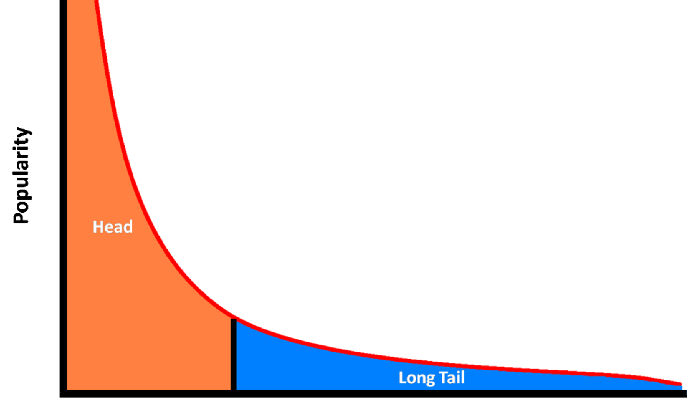
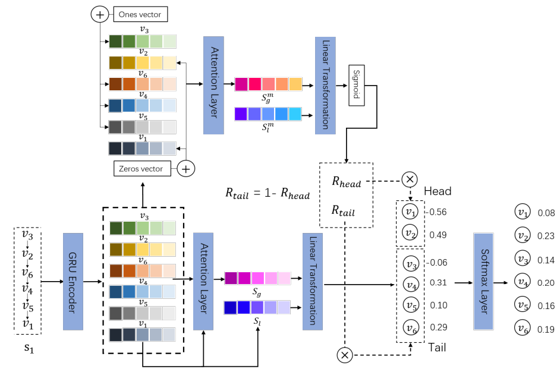
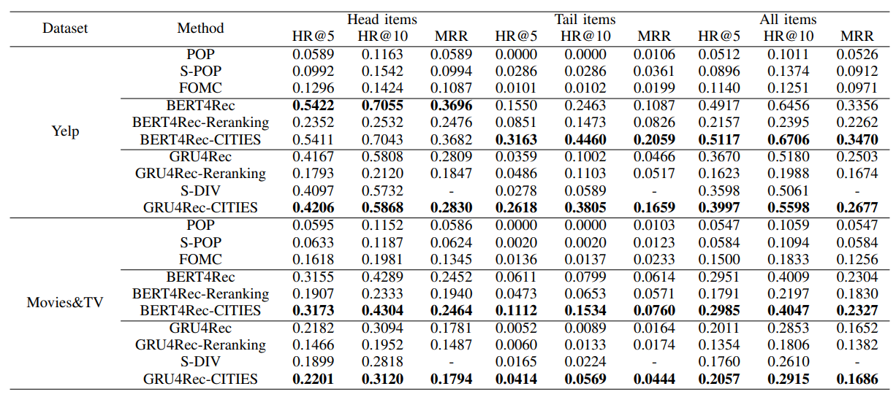
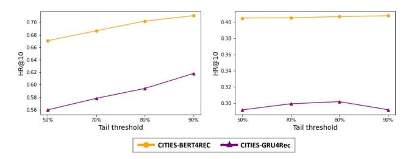
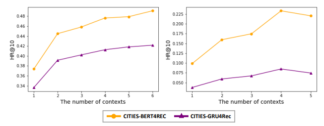

# **Long-tail Session-based Recommendation** 

## **1. Problem Definition**  

Session Recommendation은 Sequential Recommendation과 유사하지만 User Information이 따로 존재하지 않는 차이점이 존재한다.  
즉, Sequential Recommendation과 유사하게 Item Interaction을 시간 순서대로 정렬한 후, 다음에 Interaction이 생길 Item을 예측하는 것이다.
예를 들어, 한 쇼핑몰에서 Login 정보 없이 Item을 click했을 때 다음으로 click할 Item을 예측하게 되는 것이다.

Session Recommendation도 Long-Tail 문제가 존재한다. 

  

위 사진에서 y축을 popularity 즉, 많이 item을 click한 횟수로 생각하고, x축을 item id라고 생각했을 때, 인기가 별로 없는 long-tail item들은 별로 Session에서 추천되지 않을 것이다. 하지만, popular한 item만 session에서 추천하는 것이 아니라 적합한 tail item을 추천하는 것은 user에게 serendipity를 주는 이점이 있다. 연관되어 있는 새롭고 특색 있는 long-tail item을 추천하는 것도 추천시스템에서 중요한 문제도 대두된다.

## **2. Motivation**  

이 논문의 주된 동기는 Session Recommendation에서 Long-tail문제를 완화하는 것이다. 일반 추천시스템에서는 많이 다루어지는 문제이지만, Session Recommendation에서 Long-Tail이 다루어지는 첫 연구이다. Session Recommendation에서도 많이 클릭된 Item들이 더 자주 추천되는 반면에 Head item과 연관되어 있음에도 불구하고 잘 클릭되지 않아 추천되지 않은 문제점이 존재한다. Tail Item임에도 불구하고 Sequential Pattern에 맞게 추천이 된다면 Session에 참가하고 있는 User에게 큰 Serendipity를 제공할 수 있다.

큰 Serendipity를 제공한다는 것은 User에게 더 다양하고 새로운 Item을 추천할 수 있다는 의미이다.
 

## **3. Method**  

이 논문에서는 Head Item과 Tail Item을 Pareto 법칙[1]에 따라서 나누었다. 즉, 가장 Interaction이 많은 상위 20%의 Item을 Head Item, 그 이외의 80% Item을 Tail Item으로 구분한다.

  

그리고 전체적인 프레임워크는 위 그림과 같다.

### **Session Encoder**  

위 프레임워크에서 GRU Encoder에 해당하는 부분이다.

Session에서 Item들이  시간 순서대로 나열되어 있다고 하자. 그럼 이 Item들의 Sequential Pattern에 따라서 encode해야되는데 이 때 GRU를 사용한다. 즉, 수식으로 나타내면 아래와 같다.

$$
r_t = \sigma(W_r\cdot[v_{t-1},emb(i_t)])\\
z_t=\sigma(W_z\cdot[v_{t-1},emb(i_t)])\\
\hat{v}_t=tanh(W_h\cdot[r_t\odot v_{t-1},emb(i_t)])\\
v_t=(1-z_t)\odot v_{t-1}+z_t\odot \hat{v}_t\\
$$

]))  

]))  

]))

\odot&space;v_{t-1}&plus;z_t\odot&space;\hat{v}_t)

)는 item embedding을 나타내며 는 t까지의 session represention을 나타낸다. 즉, t까지에서의 GRU Output을 나타낸다. 는 학습가능한 파라미터를 나타낸다.

### **Preference Mechanism**  

우선 해당 Session이 Head Preference를 갖고 있는지, Tail Preference를 갖고 있는지 Adaptively하게 조절하는 Factor를 생성한다. 즉, Session이 Head item들을 위주로 보는지, Tail Item을 위주로 보는지 판단해주는 factor이다. 

우선 모델에게 Interacted Item이 Head인지 Tail인지 알려준다. 즉, 

$$
TE(v_i)=
\begin{cases}
 & v_i + \{1,1,1,....\} \text{ if } \tau(v_i)\in I^T\\
 & v_i + \{0,0,0,....\} \text{ if } \tau(v_i) \in I^H 
\end{cases}
$$

여기에서는 가 GRU Encoder를 통해서 나온 Item i에 대한 Output이다. 그리고 는 item 의 mapping function으로 보면 된다. 즉, 해당 Item이 head에 속하고 있으면   를 의미한다.  

만약 Item이 Head에 속하면 Item embedding에 1을 더해줘서 head item이라는 것을 모델에게 알려주는 것이다.   

그 다음은 아래와 같은 Attention Mechanism을 통해서 Session Preference 를 얻는다.
$$
a_i^m=W_o^mtanh(W_1^mTE(v_t)+W_2^mTE(v_i)+b^m)\\
S_l^m=TE(v_t)\\
S_g^m=\sum^t_{i=1}a_i^m TE(v_i)\\
S_p=[S_l^m;S_g^m]W_3
$$

)는 위의 head이면 1을 더하고 tail이면 0을 더하는 수식을 지난 session에서 마지막 click된 item의 embedding이고,)는 item 의 embedding이다. 맨 첫 줄을 통해서 마지막 click item과의 attention을 구하는 식이고 은 attention score를 더한 representation이다.  

이를 통해서 는 Scalar값을 갖으며 Session preference를 지니게 된다.

$$
R_{head}=1/(1+e^{-S_p})\\
R_tail=1-R_{head}
$$

그리고 위와 같은 sigmoid를 통해서 해당 session이 head에 preference가 강한지, tail에 강한지 판별하는 **Rectification factor**를 갖는다.

### **Session Pooling**  

위와 같은 Me

## **4. Experiment**  

### **Experiment setup**  
* Dataset  
**Yelp** : Local Business에 대한 user의 review이다. 예를 들어, 레스토랑, 바와 같은 곳을 들렀을 때의 review를 남긴 dataset이다.   
**Movies&TV** : Amazon dataset에서 movies 카테고리의 상품에 대해서 review와 rating을 남긴 dataset이다.

* baseline  
**POP** : Item을 training set에서의 popularity에 따라서 re-rank하여 추천한다.  
**S-POP** : Target User의 Sequence에서 Popularity에 따라서 item을 re-rank하여 추천한다.  
**FOMC** : Markov 가정을 이용하여, transition probability에 따라서 item을 re-rank한다.  
**Bert4Rec** : Sequence Modeling할 때 Transformer를 활용하여 User의 Sequence를 모델링한다.  
**GRU4Rec** : Sequence Modeling할 때 GRU를 활용하여 User의 Sequence를 모델링한다.  
**S-Div** : Content Feature를 활용하여 Tail item을 Clustering하여 tail item에 pseudo ground truth를 준다. pseudo ground truth를 이용하여 ranking loss로 학습한다.  
* Evaluation Metric    
**HR@k(Hit Ratio)** : Top K 추천 item list안에 ground truth item이 있는지 확인하는 protocol이다.  
**MRR(Mean Reciprocal Rank)** : Top K 추천 Item list안에서 순서까지 고려한 protocol이다.  

### **Result**  

  

Experiment Result
  

이 논문은 Model Agnostic하기 때문에 Bert4Rec과 GRU4Rec에 실험을 한다. 실험 결과에서는 Yelp에서 Head Item에서 Ber4Rec은 약간의 성능 저하가 있었지만, Tail Item에서 성능이 크게 향상되어 전반적인 성능이 올라간 것을 확인 할 수 있다. GRU4Rec에서는 Head, Tail Item에서 모두 성능 향상이 존재하여 Long-Tail 문제를 완화시켰다.  

Movies&TV에서는 Bert4Rec, GRU4Rec에서 head와 tail item에서 모두 성능을 향상시켜 전반적인 성능을 가져왔다. 

### **Ablation Study**  

  
  

Left: Tail Threshold에 따른 성능 변화, Right: Context 반영 개수에 따른 성능 변화
  
  
#### **Tail Item 비중**  

Head와 Tail Item을 나눌 때 Pareto 법칙에 따라서 2:8 비율로 나눈다. 하지만, 이 논문에서는 head와 tail기준에 따른 성능 변화를 관찰한다. 왼쪽이 Yelp, 오른쪽이 Movies&TV 성능 변화를 나타낸다. Yelp에서는 Tail Item의 비중이 높아질수록 성능 변화를 얻는 것을 관찰 할 수 있다. 이는 Head Item을 통해 좋은 Quality의 embedding 추론할 때 소수의 Item만이 중요하다는 것을 알 수 있다. 반면, Movies&TV에서는 반드시 Tail 비중을 올린다고 해서 성능 향상이 있는 것은 아니다.  

#### **Context 반영 수에 따른 성능 변화**  

Few shot task setting을 이용하면서 head item의 context를 모두 이용하는 것이 아니라 일부만을 이용한다. 반영 context 수에 따른 성능 변화를 나타낸다. 왼쪽이 Yelp, 오른쪽이 Movies&TV 성능 변화를 나타낸다. Movies&TV에서는 Context 수가 많아졌을 때 성능 저하를 가져오는 것을 볼 수 있다. 이는 few shot task 설정이 중요함을 알려준다.  

## **5. Conclusion**  

General Recommendation에서는 long-tail item 문제를 많이 다루지만, sequential recommendation에서는 많이 다루어지지 않고 있다. 이 논문에서는 Sequential Recommendation에서 long-tail item의 성능 향상을 크게 가져오면서 전체적은 성능 향상을 가져왔다. 

이 논문은 자연어 처리에서 문장에 별로 등장하지 않은 단어의 embedding quality를 높이는 방법론을 가져와서 적용시킨 논문이다. 이와 같은 방법으로 다른 도메인의 방법론을 자신이 연구하고 있는 도메인으로 가져와서 해결을 하는 것이 좋은 연구임을 알게 되었다.  

---  
## **Author Information**  

* Kim Kibum(김기범)  
    * Kaist, ISysE, DSAIL Labs 
    * GNN, Recommendation System, Scene Graph  

## **6. Reference & Additional materials**  

* Github Implementation  
[Implementation](https://github.com/swonj90/CITIES)

* Reference  

1. Chris Anderson. 2006. The long tail: Why the future of business is selling less of
more. Hachette Books.  
2. Sun, F., Liu, J., Wu, J., Pei, C., Lin, X., Ou, W., & Jiang, P. (2019, November). BERT4Rec: Sequential recommendation with bidirectional encoder representations from transformer. In Proceedings of the 28th ACM international conference on information and knowledge management (pp. 1441-1450).
3. Hidasi, B., Karatzoglou, A., Baltrunas, L., & Tikk, D. (2015). Session-based recommendations with recurrent neural networks. arXiv preprint arXiv:1511.06939.
4. Kim, Y., Kim, K., Park, C., & Yu, H. (2019, August). Sequential and Diverse Recommendation with Long Tail. In IJCAI (Vol. 19, pp. 2740-2746).
5. Rendle, S., Freudenthaler, C., & Schmidt-Thieme, L. (2010, April). Factorizing personalized markov chains for next-basket recommendation. In Proceedings of the 19th international conference on World wide web (pp. 811-820).  
....

