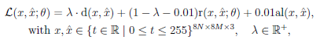

# Neural JPEG

***

### description: Ankur Mali / Neural JPEG- End-to-End Image Compression Leveraging a Standard JPEG Encoder-Decoder / 2022(DCC)

## **Review paper Neural JPEG**

Neural JPEG: End-to-End Image Compression Leveraging a Standard JPEG Encoder-Decoder

### **1. Problem Definition**

The usage of the internet has been increasing over the years resulting in a need for improvement in compressing visual data. Current methods use either use additional post-processing blocks on the decoder end to improve compression or propose an end-to-end compression scheme based on heuristics. For most of these methods the trained deep neural networks (DNNs) are not compatible with standard encoders which makes it difficult to extend these methods to personal computers (PC) and smartphones. Later in the related works the shortcomings and problems of the current works will be mentioned.

### **2. Motivation**

In this paper, the authors want to create a system that learns to improve the encoding performance by enhancing the internal neural representations on both encoder and decoder ends. This approach is a Neural JPEG. The authors propose frequency domain pre-editing and post-editing methods to optimize the distribution of the DCT coefficients at both encoder and decoder ends to improve the standard compression (JPEG) method.

#### **Existing works**

The works related to this paper are mostly about end-to-end image compression systems using deep neural networks (DNN), hybrid decoders and hybrid encoders that enhance encoder signals resulting in an improvement of compression even at low bit rates.

* Deep neural networks (DNNs): this is an approach that seems to improve the rate-distortion performance of image compression frameworks. However, this method requires a specifically trained decoder during the post-processing stage or a complex DNN-based decoder. This makes it hard to apply this method for images that have to be compressed on the PC and smartphones. Besides that, there is no guarantee that the uncovered results would hold when the input data distribution shifts, e.g., images of a completely different kind are presented to the system.
* Hybrid decoders: this approach gives good results but it does not operate well at the lowest bit rate. This is because the quantized signals that are used to reconstruct the original input signal are extremely sparse.
* Hybrid encoders: these encoders enhance encoder signals resulting in an improvement of compression even at low bit rates. But these types of methods fail to remove artifacts at the decoder end, thus compromising compression quality in various situations.

#### **Significance**

The related works as mentioned before are still lacking some features, which this paper will make up for. The main contributions of this paper are as followed:

* The authors extend their prior work and improve system rate-distortion performance by optimizing the JPEG encoder in the frequency domain.
* The authors facilitate better coefficient construction at the decoder end by optimizing the JPEG decoder.
* The neural JPEG is adapted to learn how to edit the discrete cosine transform (DCT) coefficients at both decoder and encoder ends.
* A learnable quantization table that is optimized jointly with the sparse recurrent encoder/decoder to improve rate-distortion performance, yielding an end-to-end, differentiable JPEG compression system.

### **3. Method**

In this method, the authors construct a system that leverages an encoder and decoder that are each driven by sparse recurrent neural networks (SMRNNs) trained within the effective framework of neural iterative refinement while the recurrent decoder learns to reduce artifacts in the reconstructed image.

The following sub paragraphs will be explained how each part of the architecture and the loss are formulated and changed.

#### **JPEG algorithm & architecture**

Standard JPEG algorithm:

Standard JPEG architecture:

And standard JPEG architecture summarized:

Modifications:

* Recurrent neural networks (RNN):
  1. Reduce channel dimension from 256 to 128
  2. Reshape channels to an 8x8x2 tensor for each block which will be split into two matrices of 8x8 afterward.
*   The sparse multiplicative RNN (SM-RNN) component will be used to process both Hl and Hc for K steps. So the activation map in the case of Hl would look like this:

    

    The same algorithm can be used replacing Hc with Hl. A final set of sparse 'edit' values is conducted as followed:

    

    Each discrete cosine transform (DCT) coefficient is multiplied by the original JPEG encoder with a corresponding edit score as retrieved in the previously mentioned process.
* Decoding method: utilize an SM-RNN similar to the encoder is utilized to process described above but tie its weights to those of the SM-RNN encoder module.
*   Quantization table: After applying the inverse DCT transform to the outputs of the quantization table and rounding modules, the SM-RNN decoder takes this in, processes it K times and produces the reconstructed image. This overall process is visualized as followed:

    

    Here you can see that the authors use the differentiable JPEG pipeline to learn the quantization tables. They replace the attention mechanism with sparse RNN to better capture the importance of each representation associated with each channel. You can see that they use Q0 to the power of L and Q0 to the power of C as optimization variables for luminance and chrominance. The range of quantization table values is clipped to \[1; 255] which should help optimize the process.
* Rounding module: the authors removed the entropy encoding that is being used in JPEG and replaced the hard rounding operation with a differentiable third-order approximation as shown below:

#### **Loss formulation**

General loss formulation:

Where the ideal value for Lamba is obtained based on the validation performance.

* Distortion loss:

The distortion loss is responsible for measuring the similarity between compressed and original images. To achieve this, as shown above, the combination of the MSE and LPIPS metrics.

* Rate loss:

The authors use the rate loss formulation proposed by one of the related works and replace the attention map with sparse map obtained from a SMRNN that is represented as shown above.

* Alignment loss:

The alignment loss should ensure that signals are robust at the decoder end. To achieve this the authors use a combination of MSE and Mean Absolute Error (MAE) as shown above.

### **4. Experiment**

The overall experiment results show that the approach of the authors successfully improves the rate-distortion performance over JPEG across various quality metrics, such as PSNR and MS-SSIM, and generates visually appealing images with better color retention quality.

#### **Experiment setup**

The modifications of the theories as mentioned before are the baseline for these experiments. However, there are 2 more things to consider for doing the experiments. These are the evaluation metrics, the datasets to be used and the training procedure.

* Evaluation metrics: For the evaluation of the models' success the authors chose a standard compression optimization metric for measuring image similarity the Mean Squared Error (MSE) and the Peak Signal to Noise Ratio (PSNR). This can be visualized in the picture below:

To improve the measuring of the visual appeal of images the author also uses the Multi-Scale Structural Similarity (MS-SSIM) \[30], converted to a logarithmic scale as shown below:

* Datasets and training procedure: The Neural JPEG network is trained on the dataset provided in the works of other authors. It consists of 3640 HDR images. As for the training, the authors chose to use the merged HDR images and extract image patches of size 256 obtained from random cropping. Here they follow the same extraction process and experimental protocol as done by the authors of their related works. They use the Kodak dataset to evaluate their model. In addition to this, they validate the model on a validation set from DIV2K containing 100 high-quality images with 2040 pixels. The model is optimized by using Adam with an initial learning rate 1:0 reduced to 10 to the power of -8 using polynomial decay. A batch size of 32 was used for all experiments and performed grid search to find optimal hidden sizes for SMRNN, sparsity level k, and lambda. A pre-trained VGG-19 model (trained on ImageNet) was used and these layers were fine-tuned while training. The 1 x 1 convolutional layer is initialized using orthogonal matrices.

#### **Results**

The results of the previously mentioned procedure can be seen in figure 1, table 1 and table 2 below.

|                        |
| :---------------------------------------------------------------------------------: |
| _Figure 1, performance of various compression model with various bit rate setting._ |

|                                |
| :-----------------------------------------------------------------------------------------: |
| _Table 1, test results for Kodak (bpp 0.38), 8-bit compression benchmark (CB, bpp, 0.371)._ |

|                               |
| :----------------------------------------------------------------------------------------: |
| _Table 2, test results for Kodak (bpp 0.37), 8-bit compression benchmark (CB, bpp, 0.341)_ |

The results of the previously mentioned procedure can be seen in Table 2 {you can see that all models perform stably, however, when the bit rates are reduced (see Table 1) all hybrid models start struggling, whereas neural-based models stay consistent. This suggests that the performance of these hybrid models is limited due to the fixed map used by JPEG. This supports the hypothesis (as mentioned before by the authors) that at lower bit rates enhancing JPEG signals further improves performance and that Neural JPEG does this efficiently.

### **5. Conclusion**

The experiments show that the proposed approach, Neural JPEG, improves JPEG encoding and decoding through sparse RNN smoothing and learned quantization tables that are trained end-to-end in a differentiable framework. The proposed model leads to better compression/reconstruction at the lowest bit rates when evaluated using metrics such as MSE, PSNR and also using perceptual metrics (LPIPS, MS-SSIM) that are known to be much closer to human perception. Not to forget the most important contribution, the improved encoder-decoder remains entirely compatible with any standard JPEG algorithm but produces significantly better colors than standard JPEG. The authors show that they can achieve improvement without directly estimating the entropy of the DCT coefficients, by only regularizing the sparse maps and quantization tables.

A view ideas on this paper:

* The authors later mention that their model struggles due to some artifacts. They mention that they can be removed with JPEG artifact removal and note that the overall model ensures the structure/content of the image is kept intact. It does not seem to affect the work much, but maybe in the future, this can be improved too.
* As the authors explain in their method section that each discrete cosine transform (DCT) coefficient is multiplied by the original JPEG encoder with the corresponding edit score as retrieved by the process mentioned in part 3. They did not do any experimenting with this encoder, maybe future works can do more experiments regarding this.
* They also do not really mention anything thing of why they specifically chose these datasets so I wonder what results would be like using more complicated datasets.

***

### **Author Information**

* Esmée Henrieke Anne de Haas (20214798)
  * Master student researcher ARM lab KAIST
  * Research topics: Human Computer Interaction, Metaverse, Augmented Reality, Dark Patterns

### **6. Reference & Additional materials**

* Reference of paper: Mali, A., Ororbia, A., Kifer, D., & Giles, L. (2022). Neural JPEG: End-to-End Image Compression Leveraging a Standard JPEG Encoder-Decoder. arXiv preprint arXiv:2201.11795.
* Reference of the authors' previous works:
  1. Mali, A., Ororbia, A. G., & Giles, C. L. (2020, March). The sibling neural estimator: Improving iterative image decoding with gradient communication. In 2020 Data Compression Conference (DCC) (pp. 23-32). IEEE.
  2. Mali, A., Ororbia, A., Kifer, D., & Giles, L. (2022). An empirical analysis of recurrent learning algorithms in neural lossy image compression systems. arXiv preprint arXiv:2201.11782.
* No public materials on this work were found.
