# Robust SSL 

# 1. Problem Definition

본 논문은 semi-supervised learning을 target으로 한다. semi-supervised learning은 clean labeled dataset이 작을 때, 다소 얻기 쉬운 많은 양의 unlabeled dataset을 함께 사용하는 방법론을 고안하는 연구 분야이다.  

예를 들어, 아래와 같이 두 개의 2-dimension gaussian distribution에서 100개씩 data를 sampling하고, 각각 하나씩만 label을 알고 있다고 하자. 작은 labeled dataset으로 학습한 실선의 decision boundary는 점선의 optimal decision boundary와 비교해 bias가 있음을 알 수 있다. 따라서 unlabeled data를 통해 얻을 수 있는 data distribution 정보를 활용해 optimal decision boundary에 보다 가까워지고자 하는 것이 semi-supervised learning의 목표이다[1].  

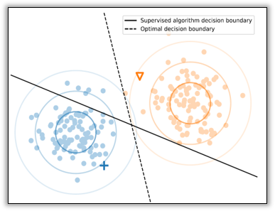

unlabeled dataset을 어떻게 학습에 활용할지 문제 상황을 수식적으로 formulation 해보면 다음과 같다. 

> Problem formulation

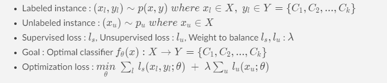

일반적으로 semi-supervised learning에서 supervised loss는 cross entropy loss이며, unsupervised loss의 desing에 따라 방법론들이 달라진다. 

# 2. Motivation

> Semi-supervised learning assumption

Semi-supervised learning은 아래와 같이 unlabeled dataset distribution에 몇 가지 가정을 기반으로 한다[1].

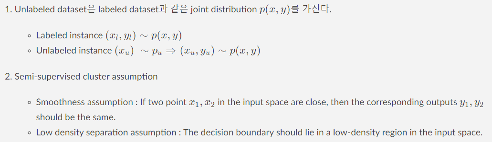

> Motivation

위의 가정을 요약하자면 unlabeled data와 labeled data가 같은 distribution이라는 가정 아래 같은 cluster에 속하는 data들은 같은 class로 분류할 수 있다는 것이다. 기존에 나온 대표적인 방법론들은 이 가정을 만족한다는 조건 아래 unsupervised loss를 design한다. 하지만 Semi-supervised learning은 labeled dataset이 작다는 가정 하에 있다. 이러한 특수성은 unlabeled dataset의 pseudo label을 잘못 추정하게 만들며, 잘못 추정된 noise label이 학습 과정에 그대로 반영되면서 labeled set과 unlabeled set이 같은 distribution을 가진다는 underlying assumption을 깨지게 만든다.

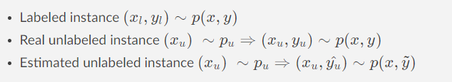

> Proposed idea

따라서 Uunlabeled instance에 따라 달라지는 pseudo label quality를 고려하지 않는 기존 방법론들은 성능 저하가 일어난다. 본 연구는 논문의 제목에서 직관적으로 알 수 있듯이 모든 unlabeled instance를 동일한  weight로 학습에 반영하지 않고,
  
$$
{\underset {\theta }{min} \; \sum_l \, l_s(x_l,y_l;\theta) \; + \; \lambda  \sum_u \, l_u(x_u;\theta)} 
$$

각각의 unlabeled instance가 학습에 반영되는 정도를 개별적으로 다루자는 idea를 제안한다. 

$$
{\underset {\theta }{min} \; \sum_l \, l_s(x_l,y_l;\theta) \; + \; \sum_u \lambda _u \, l_u(x_u;\theta)} 
$$

즉, hyperparameter로 manually 조절되던 것을 trainable parameter로 optimization 하여 모델의 성능을 저하시키는 instance는 weight가 낮아지고, 그렇지 않은 instance는 weight가 높아지도록 automatically 조절하는 방법론을 제안한다. 

# 3. Method 

Hyperparameter optimization 관점에서 문제를 다시 보면, 우리는 train loss를 최소화하는 model prameter에 대해 validation loss를 최소화하는 hyperparameter를 찾고 싶은 것이다. 이를 bi-level optimization을 통한 gradient based optimization 문제로 풀 수 있는데 그 objective를 아래와 같이 정의할 수 있다.

 > Notation
 
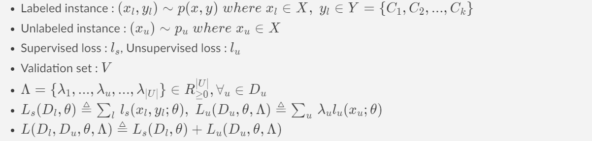
- Optimization loss 
$$
{\underset {\Lambda= \{ \lambda_1,...,\lambda_{|U|} \} }{min} \; L_s(V,\theta^*(\Lambda)) \; s.t. \; \theta^* (\Lambda)={\underset {\theta}{argmin}} \sum_l \, l_s(x_l,y_l;\theta) \; + \; \sum_u \lambda _u \, l_u(x_u;\theta)} 
$$

 > Naive approach
 
위의 objective를 기반으로 model parameter와 unlabeled data weight의 optimized value를 서로의 optimization process의 input value로 쓰면서 iteratively optimize해간다. 이 과정을 naive하게 풀어나가면 중첩된 optimization loop로 인해 TxT iteration의 큰 time complexity가 발생한다.

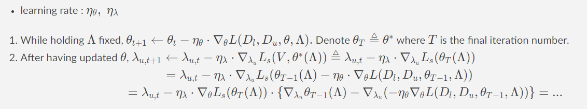

> Influence function

따라서 논문에서는 위의 gradient를 approximation하기 위해 influence function 기반의 방법론을 제안한다. influence function에 대해 간단히 설명하자면, 예를 들어 하나의 data instance x가 model parameter에 끼치는 influence를 계산하고 싶다고 하자. 직관적으로 x가 포함되었을 때와 포함되지 않았을 때의 optimized model parameter값의 차이로 이를 정의할 수 있을 것이다. 

하지만 모든 궁금한 data instance에 대해 매번 model을 retraining해서 위의 값을 얻는다는 것은 역시 매우 비효율적이다. 따라서, influence function에 대해 새롭게 정의를 하는데, x를 아주 조금 upweight 했을 때 parameter가 얼마나 변하는지를 계산하는 것이다. 

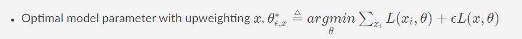

이때 L이 twice-differentiable, strictly convex라는 가정 아래 upweighting x의 model parameter 대한 influence는 다음과 같다. 자세한 증명은 [2]을 참고하면 된다.
 
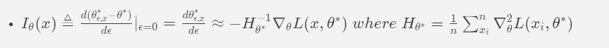

> Approximation approach

본래 문제로 돌아와 influence function을 아래와 같이 적용해 gradient를 approximation 한다. 

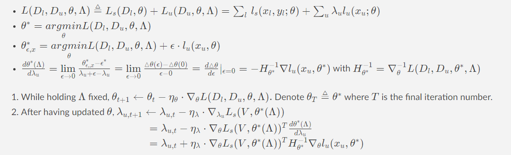

influence function으로 approximation 되면서 gradient는 training instance Xu를 upweighting했을 때 validation loss가 변하는 정도를 measure하는 것으로 해석이 가능하다. 

> Computation bottleneck

Approximation 과정에서 모든 unlabled data에 대해 per-example gradient 계산과 inverse hessain 계산 문제가 발생한다. 이를 아래와 같이 해결한다. 

- Computation of per-example gradients

우리가 계산에 사용하는 framework는 deep network의 layer마다 각 instance Xu의 layer activation hu에 대한 gradient를 저장하고 있다. 따라서 model parameter에 대한 per-example gradient는 아래 식을 통해 효율적으로 계산될 수 있다. 

$$\frac{\partial L_u}{\partial h_u} \frac {\partial h_u}{\partial \theta} = {\underset{u'\in U}{\sum} \frac {\partial l_{u'}}{\partial h_u} \frac {\partial h_u}{\partial \theta} = \frac {\partial l_u}{\partial h_u} \frac {\partial h_u}{\partial \theta}} \;\;\;\;(l_{u'} \; and \; u \; are \; independent, \;unless \; u' \ne u)$$

- Computation of the inverse Hessian

inverse Hessian 계산을 위해서는 (자주 쓰이는 trick 중 하나로) model의 마지막 layer parameter만으로 inverse Hessian을 계산하여 approximation한다.  따라서 per-example gradient 또한 마지막 layer parameter에 대해서만 계산하면 된다. 

> Algorithm

전체  algorithm은 아래와 같다. 

Eq.6 : 

$$\frac {\partial L_s(V, \theta^*(\Lambda))}{\partial \lambda_u} = -\nabla_\theta L_s(V,\theta^*)^T H^{-1}_{\theta^*} \nabla_\theta l_u(u,\theta^*)$$

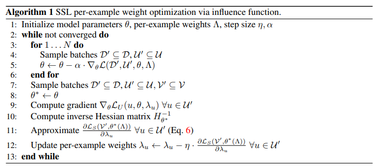

# 4. Experiment

### **Experiment setup**  

> baseline
 
$$
{\underset {\Lambda= \{ \lambda_1,...,\lambda_{|U|} \} }{min} \; L_s(V,\theta^*(\Lambda)) \; s.t. \; \theta^* (\Lambda)={\underset {\theta}{argmin}} \sum_l \, l_s(x_l,y_l;\theta) \; + \; \sum_u \lambda _u \, l_u(x_u;\theta)} 
$$

위의 objective에서 unsupervised loss로 두 가지를 선택하여 실험한다. 각각에 대해 아래에 간단히 소개한다. 자세한 모델 설명은 reference를 참고하면 된다.

1) FixMatch [3]

$$l_u(x_u;\theta)=\Bbb{I}(max(p(\hat{y_u}|x_u^1))>\tau)CrossEntropy(onehot(p(\hat{y}|x_u^1))||p(\hat{y}|x_u^2))$$

2) UDA [4]

$$l_u(x_u;\theta)=\Bbb{I}(max(p(\hat{y_u}|x_u^1))>\tau)D_{KL}(sharpening(p(\hat{y}|x_u^1))||p(\hat{y}|x_u^2))$$

Semi-supervised learning cluster assumption에 기반한 model들이다.  Xu1와 Xu2는 각각 original instance Xu에 augmentation을 약하게(e.g., horizontal flip, random translation, ...), 강하게(e.g., RandAugment[5], CTAugment[6], ...) 준 것이다.  
모델의 골자만 말하자면 Xu1의 estimated label confidence가 threshold보다 클 때만 reliable data라 판단하고 학습에 쓰는데(본 논문의 motivation을 간단하게 다루는 부분이라고 할 수 있다), loss는 Xu1과 Xu2의 model prediction이 같아지도록 하는 것이다.

> Dataset 

* Synthetic dataset 
	- The moon dataset's decision boundary has the shape of two half moons.
	- It consists of 10 labeled samples, 30 validation examples and 1000 unlabeled examples. 
	- Labeled samples are shown in orange. Unlabeled data in black/pink(shading depicts weight of each unlabeled point).

* Benchmark dataset 
	- Cifar10, SVHN

> Evaluation Metric 

* Test error rate

### **Result**  

> Synthetic dataset result

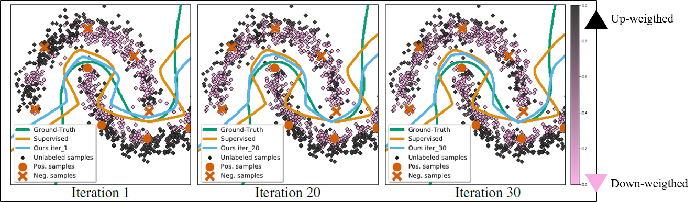

Unalbeled data가 검정색/분홍색에 가까울 때 각각 높은 weight/낮은 weight로 학습된 것이다. Decision boundary 근처 data는 model prediction이 틀릴 가능성이 높으므로 낮은 weight로 학습됨을 알 수 있다. 

> Benchmark dataset result

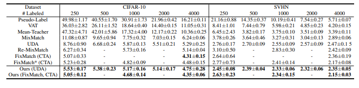

Baseline model들보다 performance가 일괄적으로 높아짐(Test error rate가 낮아짐)을 알 수 있다. 

> Ablation study

* Comparison of influence function approximation
	- Luketina et al [7] : using identity matrix
	- Lorraine et al [8] : approximation to all the model parameters 

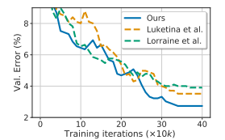

inverse Hessian의 approximation을 제시한 기존 연구들과 비교했을 때 본 연구에서 제시한 방법이 baseline들보다 작은 validation loss를 가진다.

- Tuning a single weight 

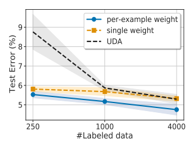

모든 unlabeled data가 동일한 weight를 가질 때와, 개별 weight를 가질 때를 비교한 결과다. 아예 학습에 쓰지 않은 baseline model (UDA)이 가장 높은 test error를 가진다. 

# 5. Conclusion

본 연구는 학습에 사용하는 unlabeled data의 per-example weight를 통해 기존 semi-supervised learning방법론을 개선 시켰다. influence function을 통해 per-example weight를 automatically 조절하는 알고리즘을 제시했고, 그 과정에서의 computational bottleneck을 다루는 solution을 제공했다. 

> My opinion

1. semi-supervised learning의 특수성(작은 clean labeled set)으로 인해 가질 수 밖에 없는 문제(disribution mismatch)를 motivation으로 제시하고 온전히 그것을 타겟으로 해서 나온 (아마도 최초의) 논문이라는 점에서 의의가 있다고 생각한다.  다만 computation cost를 고려헀을 때 performance gain이 유의해 보이진 않는다. 이 이후에 같은 문제를 다루는 연구들이 나왔는데 [9], 같이 비교해보면 좋을 것 같다. 
2. Decision boundary 근처에 있는 sample들은 그 class를 판단하기 어려운 feature를 가진 data로 model 입장에서는 어려운 sample이기 때문에 학습에 반영하는 weight를 낮추는 쪽으로 조절되었다. 하지만 쉬운 sample들을 대량으로 학습시키는 것보다 어려운 sample들을 잘 학습시켰을 때의 성능 개선을 더 기대해볼 수 있다는 점에서 무작정 그 sample의 weight를 낮추는 것이 능사는 아닐 것이라 생각한다. (예를 들어, active learning 관점에서는 모델의 entropy가 높은 sample들을 우선적으로 학습에 추가시킨다. labeling이 가능한 oracle이 존재한다는 점에서 큰 차이가 존재하긴 하지만..) clean label이 적은 semi-supervised learning에서 어떻게 이 어려운 sample들을 학습에 이용할 수 있을지 고민해볼만 하다. 
3. 본 연구에서는 model의 estimated label이 틀렸을 경우를 가정해서 semi-supervised learning의 underlying assumption이 깨지는 상황을 제시했다. 하지만 실제로 많은 양의 unlabeled dataset을 가져다 쓸 때, 이 dataset이 labeled dataset과 같은 distribution을 가질 것이라는 가정은 매우 쎈 가정이라고 생각한다. 즉, 애초에 unlabeled dataset 자체에 labeled dataset과는 다른 class의 sample들이 존재할 수도 있을 것이고, 그 class distribution이 다를 수도 있다. 이렇게 Unlabeled dataset distribution에 실제 문제가 될 수 있는 상황들을 가정해 푸는 방법을 제시한 연구들이 최근 계속 나오고 있다[10-13].  outlier detection, class imbalance, noisy problem 등 다른 연구 분야들과 적절히 결합할 수 있으나, 역시 작은 labeled set인 상황을 더욱 고려한 방법론들의 제시가 필요하다고 생각한다. 

# Author Information

* Author name : Sungeun Kim 
    * Affiliation  
    	- Course of Master's Degree in AAILab, Knowledge Service Engineering

    * Research Topic 
    	- GNN based Recomendation system 
    	- Semi-supervised learning 

	
# 6. Reference & Additional materials 

* Github Implementation  
https://github.com/jason718/semi-sup

* Reference 

[1] Jesper E. van Engelen, Holger H. Hoos. "A survey on semi-supervised learning" Mach. Learn., vol. 109, (2020)
	
[2] P.W.Koh, P.Liang. "Understanding black-box predictions via influence functions". ICML (2017)
	
[3] Kihyuk Sohn, David Berthelot, Chun-Liang Li, Zizhao Zhang, Nicholas Carlini, Ekin D. Cubuk, Alex Kurakin, Han Zhang, Colin Raffel. "FixMatch: Simplifying Semi-Supervised Learning with Consistency and Confidence" NeurIPS (2020) 
	
[4] Qizhe Xie, Zihang Dai, Eduard Hovy, Minh-Thang Luong, Quoc V. Le. "Unsupervised data augmentation for consistency training" NeurIPS (2020)
	
[5] E. D. Cubuk, B. Zoph, J. Shlens, Q. V. Le. "Randaugment: Practical automated data augmentation with a reduced search space" NeurIPS (2020) 

[6] D. Berthelot, N. Carlini, E. D. Cubuk, A. Kurakin, K. Sohn, H. Zhang, C. Raffel. "Remixmatch: Semi-supervised learning with distribution matching and augmentation anchoring". ICLR (2020)

[7] J. Luketina, M. Berglund, K. Greff, T. Raiko. "Scalable gradient-based duning of continuous regularization hyperaparameters". ICML (2016)
	
[8] J. Lorraine, P. Vicol, D. Duvenaud. "Optimizing millions of hyperparameters by implicit differentiation". AISTATS (2020)
	
[9] Yi Xu, Lei Shang, Jinxing Ye, Qi Qian, Yufeng Li, Baigui Sun, Hao Li, rong jin. "Dash: Semi-Supervised Learning with Dynamic Thresholding". ICML (2021)
	
[10]  Yanbei Chen, Xiatian Zhu, Wei Li, Shaogang Gong. "Semi-supervised learning under class distribution mismatch". AAAI (2020)
	
[11] Lan-Zhe Guo, Zhen-Yu Zhang, Yuan Jiang, Yu-Feng Li, Zhi-Hua Zhou. "Safe deep semi-supervised learning for unseen-class unlabeled data". ICML (2020)
	
[12] Qing Yu, Daiki Ikami, Go Irie, Kiyoharu Aizawa. "Multi-task curriculum framework for open-set semi-supervised learning". ECCV (2020)
	
[13] Kuniaki Saito, Donghyun Kim, Kate Saenko. "OpenMatch: Open-set consistency regularization for semi-supervised learning with outliers". NeurIPS (2021)
