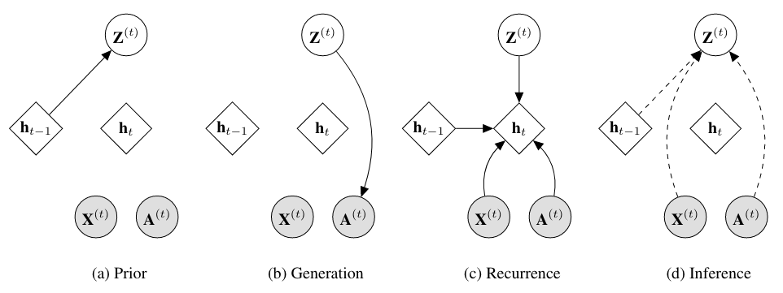
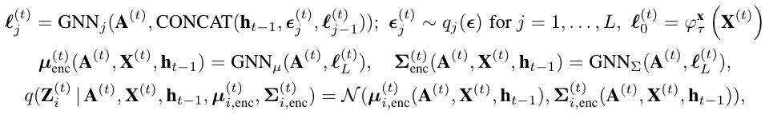
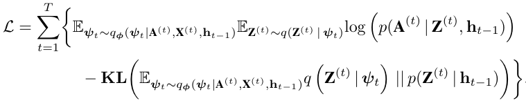
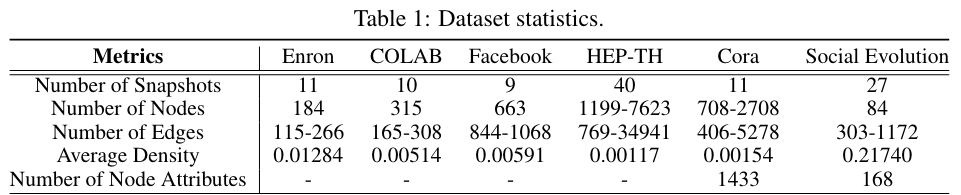
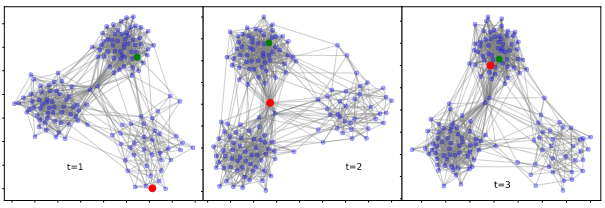
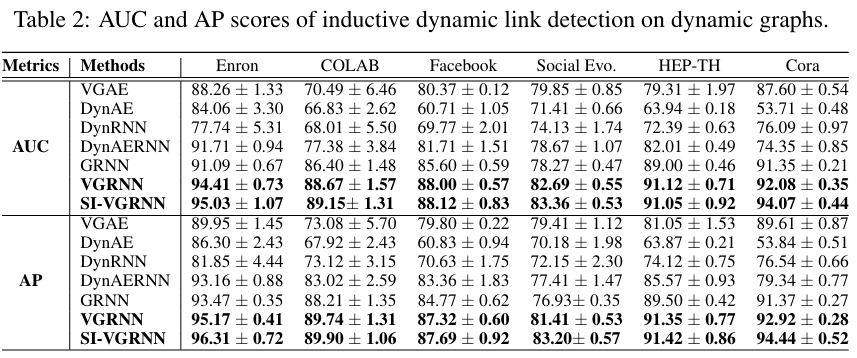
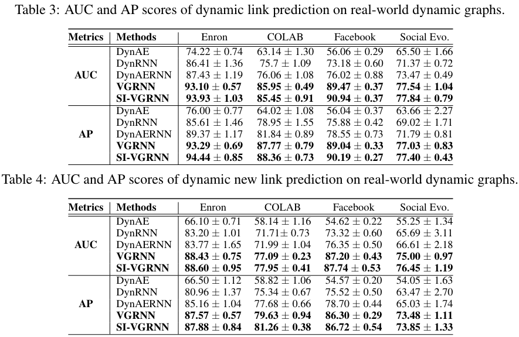
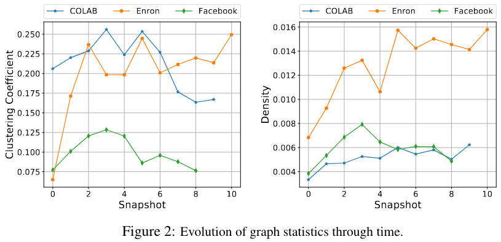

# Varitional Graph Recurrent Neural Network

## **1. Problem Definition**  

**Node embedding** maps each node in a graph to a vector in a *low-dimensional* latent space, in
which classical feature vector-based machine learing formulations can be adopted. This technology
is widely used in social networks, citation networks and financial transaction networks. 

More precise, we consider a dynamic graph 

$$\mathcal{G} = \{G^{(1)}, \cdots, G^{(T)}\}, G^{(t)} = (\mathcal{V}^{(t)}, \mathcal{E}^{(t)})$$

where $$V^{(t)}$$ and $$E^{(t)}$$ corresponds node and edge set at time $$t$$. In particular, the cardinality of node and edge can change across time. So, we will have a **variable-length node attribute sequence** and a **variable-length adjacency matrix sequence** from the graph

$$
\mathcal{A} = \{\mathbf{A}^{(1)}, \cdots, \mathbf{A}^{(T)}\}, \mathcal{X} = \{\mathbf{X}^{(1)}, \cdots, \mathbf{X}^{(T)}\}
$$

We aim to develop a model that is *universally compatible* with potential changes in both node and edge sets along time, i.e. predict future $$A^{(t)}$$ and $$X^{(t)}$$ status. 

## **2. Motivation**  

Most of the existing node embedding techniques assume that the graph is ***static*** and that learning 
tasks are performed on ***fixed*** sets of nodes and edges. However, many real-world
problems are modeled by ***dynamic*** graphs, where graphs are constantly evolving over time.

All of the existing dynamic graph embedding approaches represent each node by a ***deterministic*** 
vector in a low-dimensional space. Such deterministic representations lack the capability of 
modeling uncertainty of node embedding.

## **3. Method**  

**Overall:** This paper shows a hierarchical variational model that introduces additional latent random variables
to jointly model the hidden states of a *graph recurrent neural network* **(GRNN)** to capture both topology 
and node attribute changes in dynamic graphs. And the overall process of this method is

Let's follow the original paper's introduction process: 4 steps intotal, step by step. 

### Step 1. Prior

If you are familar with *maximum likelihood estimation* (**MLE**), it would be quite easy for you to understand this step. If not, don't worry, let's start by declear the notations, which will be used during all the rest steps. 

- $$h$$: hidden state of node from *recurrent neural networks* (**RNN**);
- $$Z$$: hidden features of node, follows normal distribution; 
- $$A$$: adjacency matrix;
- $$X$$: node attributes;

So the first step would be only use previous time step's $$h$$ to generate a prior hidden feature. What we do is 

$$
\mathbf{Z}_i^{(t)}\sim \mathcal{N}(\mu_{i,\mathrm{prior}}^{(t)}, \mathrm{diag}((\sigma_{i, \mathrm{prior}}^{(t)})^2)), \{\mu_{\mathrm{prior}}^{(t)}, \sigma_{\mathrm{prior}}^{(t)}\}=\phi^{\mathrm{prior}}(\mathbf{h}_{t-1})
$$

Here the $$\phi$$ can be any flexible functions/neural networks. Now we based on previous hidden status get a prior gaussian simulation to this step's hidden featrues. 

### Step 2. Generation

In this step, we will infer the new adjacency matrix based on our prior infer

$$
\mathbf{A}^{(t)}|\mathbf{Z}^{(t)}\sim\mathrm{Bernoulli}(\pi^{(t)}), \pi^{(t)} = \phi^{\mathrm{dec}}(\mathbf{Z}^{(t)})
$$

Here the $$\phi$$ can also be any flexible functions/neural networks.

### Step 3. Recurrence

We use the features get in Step 1 and Step 2 to update the RNN by the recurrent equation

$$
\mathbf{h}_t=f(\mathbf{A}^{(t)}, \phi^{\mathbf{x}}(\mathbf{X}^{(t)}), \phi^{\mathbf{z}}(\mathbf{Z}^{(t)}), \mathbf{h}_{t-1})
$$

Here the $$f$$ is originally the recurrent neural network, $$\phi^x$$ and $$phi^z$$ are deep neural networks which operate on each node independently. 

### Step 4. Inference

Now it's time for us to consider this time step's input, to get the posterior simulation. 

$$
\mathbf{Z}_i^{(t)}\sim \mathcal{N}(\mu_{i,\mathrm{post}}^{(t)}, \mathrm{diag}((\sigma_{i, \mathrm{post}}^{(t)})^2)), \mu_{i,\mathrm{post}}^{(t)} = \mathrm{GNN}_{\mu}(\mathbf{A}^{(t)}, \phi^{\mathbf{x}}(\mathbf{X}^{(t)})||\mathbf{h}_{t-1}), \sigma_{i,\mathrm{post}}^{(t)} = \mathrm{GNN}_{\sigma}(\mathbf{A}^{(t)}, \phi^{\mathbf{x}}(\mathbf{X}^{(t)})||\mathbf{h}_{t-1})
$$

Here two GNNs are applied, which are encoder functions, can be any of various types of graph neural networks, such as *GCN*, *CGN* with *Chebyshev filter*, or *GraphSAGE*. 

Till now we get all prior predictions and post predictions, then let's construct the loss function of this model. Follow MLE's framework, we can drive the loss function as following

$$
\mathcal{L} = \sum_{t=1}^T\{\mathbb{E}_{\mathbf{Z}^{(t)}\sim q\{\mathbf{Z}^{(t)}|\mathbf{A}^{(\leq t)}, \mathbf{X}^{(\leq t)}, \mathbf{Z}^{(< t)}\}}\mathrm{log}\ p(\mathbf{A}^{(t)}|\mathbf{Z}^{(t)}-\mathbf{\mathrm{KL}}(q(\mathbf{Z}^{(t)}|\mathbf{A}^{(\leq t)}, \mathbf{X}^{(\leq t)}, \mathbf{Z}^{(<t)}) ||  p(\mathbf{Z}^{(t)}|\mathbf{A}^{(< t)}, \mathbf{X}^{(< t)}, \mathbf{Z}^{(<t)}) )\}
$$

The first part is the **representation loss**, and the second part is the **prior-post distribution loss**.

So far, we have went through all the model process, from previous status to predicted adjacency matrix and node attributes. And learned how to train it. Except the above **explice** framework, this paper also shows a **semi-implicit** framework as following

This would be too mathemacial and hard to understand. So we use more oral language to explain the difference between this semi-implicit framework and the previous one. 

The key point of this model is that they use a **mixing distribution** on variational distribution paramters and a **semi-implicit hierarchical construction** way to model the posterior features.  These methods can increase the expressive power of the varitional posterior. 

At this time the loss function has a minor change: 

## **4. Experiment**  

### **Experiment setup**  
* Dataset : this paper uses six real-world dynamic graphs dataset: 

Visualization of part of the dataset:

* baseline
  * VGAE [1]
  * DynAE [2]
  * DynRNN [3]
  * DynAERNN [3]
  * GRNN [4]
* Evaluation Metric: 
  * AUC: area under ROC curve
  * AP: average precision

### **Result**  

Here I pick several key points from each experiment.

- Compare with GRNN and DynAERNN, VGRNN shows that latent random variables carry more information than deterministic hidden states specially for dynamic graphs with complex temporal changes;
- Comparing between SI-VGRNN and VGAE shows that the improvement of the proposed methods is not only because of introducing **stochastic latent variables**, but also successful modelling of **temporal dependencies**;
- Compare with SI-VGRNN, VGRNN shows that the **Gaussian latent distribution** may not always be the best choice for latent node representations. SI-VGRNN with flexible variational inference can learn more complex latent structures. And more flexible posteriors **do not** enhance the performance significantly.

- Comperasion between VGRNN, SI-VGRNN with other models shows that this paper's method have better generalization, which is the result of including **random latent variables** in VGRNN. 
- VGRNN improve new link prediction more substantially which shows that they can capture temporal trends better than the competing methods;
- The prediction results are almost **the same** for all datasets. The reason is that although the posterior is more flexible in SI-VGRNN, the **prior** on which our predictions are based, is still **Gaussian**, hence the improvement is marginal.

This figure shows the temporal evolution of density and clustering coefficients of COLAB, Enron, and Facebook datasets.

- The improvement margin diminishes when the graph has more clusters and is more dense. Predicting the evolution very **sparse graphs** with no clusters is indeed a very difficult task;
- The **stochastic latent variables** in VGRNN and SI-VGRNN can capture the temporal trend while other methods tend to overfit very few observed links.

## **5. Conclusion**  

This paper proposed two models: **VGRNN** and **SI-VGRNN**, which are node embedding methods for dynamic graphs that embed each node to a random vector in the latent space. These model can increases its expressiveness to better model the complex dynamics of graphs, and generates interpretable random latent representation for nodes.

I have the following opinions about this paper: 

1. I would say the learnable prior is hard to train and may not influence the result a lot. This is a random guess, but if you want to apply this model to your project, I recommend you to use more simple fixed prior distribution;
2. I checked their source code (you can find in from the following GitHub link), I found that in the implement level, this model doesn't consider too much about the node attribute update. Insteadly, experiments and discussions are more about the graph topology changes. This makes sence, but I also want to know if the node attribute prediction also works for this model. 

---
## **Author Information**  

* Name: Chuanbo Hua
* Affiliation: KAIST ISysE SILab

## **6. Reference & Additional materials**  

Please write the reference. If paper provides the public code or other materials, refer them.  

* Github Implementation: https://github.com/VGraphRNN/VGRNN.
* Reference  

[1] Kipf, Thomas N., and Max Welling. "Variational graph auto-encoders." *arXiv preprint arXiv:1611.07308* (2016).

[2] Ong, Bun Theang, Komei Sugiura, and Koji Zettsu. "Dynamic pre-training of deep recurrent neural networks for predicting environmental monitoring data." *2014 IEEE International Conference on Big Data (Big Data)*. IEEE, 2014.

[3] Palash Goyal, Sujit Rokka Chhetri, and Arquimedes Canedo. dyngraph2vec: Capturing network dynamics using dynamic graph representation learning. Knowledge-Based Systems, 2019.

[4] Thomas N Kipf and Max Welling. Variational graph auto-encoders. arXiv preprint arXiv:1611.07308, 2016.
