---
Weiqi Chen, et al./ Multi-Range Attentive Bicomponent Graph Convolutional Network for Traffic Forecasting / AAAI-2020
---

# **Multi-Range Attentive Bicomponent Graph Convolutional Network for Traffic Forecasting** 

[논문링크](https://arxiv.org/ftp/arxiv/papers/1911/1911.12093.pdf)

## **1. Problem Definition**  

Traffic Forecasting 은 ITS에서 가장 도전적인 과제 중 하나이며, 교통관리 및 공공안전에 있어서도 매우 중요합니다. 이는 과거의 traffic data를 기반으로 미래의 도로 교통을 예측하는 것인데, 복잡한 spatial dependency와 도로 및 교통 상황의 불확실성으로 인해 어려워지게 특히나 어려워지는 경향이 있습니다. 이를 구체적으로 명시하면 아래와 같습니다.

- **규칙적인 격자형 구조가 아닌 비격자형 구조에 따른 도로사이의 상관관계의 어려움**
- **기본적으로 내재하는 교통 데이터의 불확실성**

이전의 시도들은 낮은 차원의 machine learning을 이용하여 signle 노드, 혹은 few nodes를 예측하는 것이 전부였는데, 이는 traffic data 가 가지는 비선형적인 특성을 포착하기 어렵다는 단점을 가지고 있었고, 따라서 제대로 된 spatial dependency(공간의존도)를 담지 못하였습니다. 

시간이 흐르고 발전된 deep learning 을 통해 점차 sapatial dependency 를 구현하기 시작하였는데, 이를 위해 CNN과 RNN 등의 기법들이 시도 되었습니다. 그러나 CNN은 비정형적인 도로 체계가 가지는 non-Euclidean 한 상관관계에 한계를 가지고 있었다. 이러한 문제를 해결하기 위해 GCNs에 RNNs 과 CNNs 를 적용하였고, 여기에 사전에 알고 있는 도로 네트워크 정보를 삽입하여 nodes 끼리의 상관관계를 담아낼 수 있었다. 하지만 이 역시 두가지 문제점을 가지고 있었습니다.

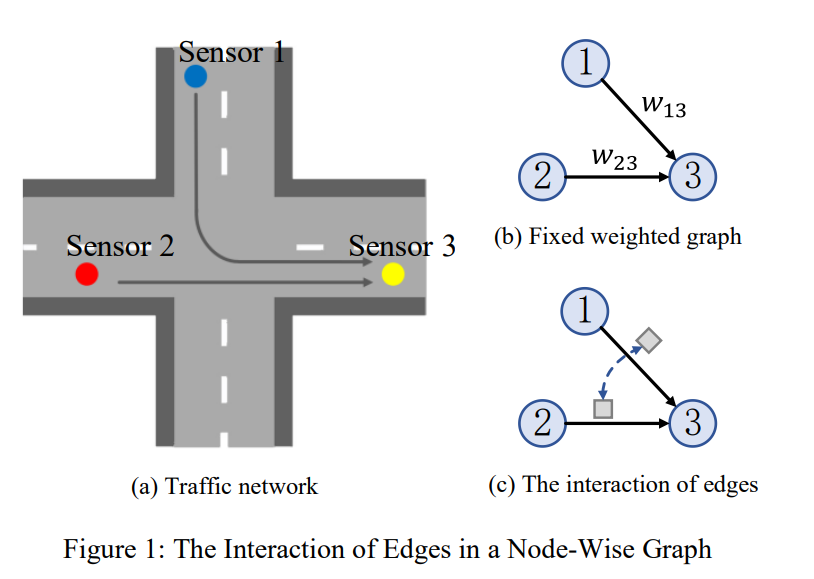

1. 첫째로 위에서 언급한 GCNs의 접근은 고정된 weighted graph를 기반으로 한 GCNs를 통해서 saptial dependency를 구현하는 방식이었습니다. 하지만 두쌍의 nodes 사이 상관관계를 담고 있는 edges는 더욱 복잡하며 edges들 끼리도 역시 상호작용을 합니다. Figure1에서 볼 수 있듯 특정 도로에서 인접한 두 edge들은 서로 상관관계를 가지고 있으며, 이러한 상관관계는 현재 교통 상황에 따라 변하면서 서로 상호작용하게 됩니다. 만일 edge들의 정보에 노드사이의 거리 등과 같은 고정된 weights만 넣어서 GCN을 사용한다면, 이는 edge들끼리의 복잡도와 상호작용을 무시하는 셈이 되고맙니다.

2. 두번째로 위와 같은 접근에서는 주어진(고정된) 이웃 범위에 따라 정보를 모으게 되는데요, 이는 multiple한 범위(multiple-range)의 정보를 놓치게 됩니다. 제각기 다른 범위의 information은 저마다 다른 traffic 성질을 드러내는데요, 적은 이웃 범위를 가정하는 것은 지역적인 공간 표현을 나타내고, 넓은 범위는 상대적으로 넓은 지역의 교통 패턴을 다루는 측면이 있습니다. 더군다나 특정 범위의 정보는 거의 모든 경우에 대해 합리적으로 정보를 contribute 하지 못하게 되곤 합니다. 예를 들어 차 사고가 나게 되면 해당 node는 거의 주위 이웃들에게만 영향을 받게 되야 하는데, 이웃 범위를 특정하게 고정시키고 나면(예를 들어 k-hop 범위) 위 정보를 k-hop 만큼의 nodes 들에게 동일하게 공유해야하는 단점이 있게 됩니다.

따라서 위 두가지 단점을 해결하기 위한 GCN-based 모델의 구현이 필요한 상황이고, 본 논문에서는 *Multi-Range Attentive Bicomponet GCN* 이라는 교통 예측과 관련한 최신 딥러닝 모델을 제안하게 됩니다.

## **2. Motivation**  

위에서 언급한 MRA-BGCN 모델 이전의 GCN-based 모델들을 조금 더 구체적으로 말씀드리며 Motivation을 풀어나가보겠습니다. 

Deep Learning이 본격적으로 개발되면서 Traffic Forecasting을 위해 연구자들은 GCNs을 적용하기 시작하였는데요, 대표적으로 Diffusion Convolutional Recurrent Neural Network 등이 있습니다. 위 모델은 fully-connected layers 를 대신하여 Gated Recurrent Units 을 convolution operator 로 사용하였으며, 주어진 graph 와 이것의 inverse 구조를 양방향으로 고려하여 graph convolution 을 실행할 수 있도록 기여하였습니다. 

또 다른 GCNs 활용 모델은 Spatial-Temporal GCN이 있는데요, graph convolution을 1D-convolution 에 결합하여 사용한 것으로, graph convolution은 saptial-dependency 를 담게 되고 1D-convolution 은 temporal-dependency 를 구현할 수 있도록 하여 일반적인 RNNs 보다 더욱 효과적으로 연산할 수 있도록 기여하였습니다.

위 GCN-based 모델들은 도로 네트워크의 거리를 고정된 weight 로 설정하여 graph 의 spatial dependency 를 표현하는데요, 더욱 복잡한 상관관계를 모델링하기 위하여 **self-adaptive 인접행렬** 등을 통해 숨겨진 spatial dependency 를 담는 연구도 진행되었습니다. 위 self-adaptive 인접행렬을 통해 노드 임베딩의 유사도를 계산할 수 있었으나, 이 역시 단순히 data 가 주어진 상황에서 학습이 진행되기 때문에 도메인 지식이 부족한 측면이 있고, over-fitting 의 위험이 있어 제약이 존재하였습니다. 또한 위 모델들은 이전에 언급하였듯이 edge들의 상호작용을 표현하지 못하며, multiple-range의 정보를 활용할 수 없다는 단점이 있습니다.

Problem Definition에서 말씀드렸듯이, 전술한 문제들을 해결하기 위해 논문에서 Multi-Range Attentive Bicomponet GCN(MRA-BGCN)이라는 딥러닝 모델을 제안하는데, 위 모델은 node 상관관계 뿐만 아니라 서로 상호작용하는 edge 상관관계도 다루게 됩니다. 또한 위 모델에서는 multiple-range의 정보를 활용하게 되는데요, 이를 종합하여 논문의 main contributions를 정리하면 아래와 같습니다.

- **MRA-BGCN 라는 bicomponent graph convolution 모델을 제안하여 nodes 와 edges 각각의 상관관계를 규명**
- **Multi-range attention mechanism을 위 모델에 적용하여 각기 다른 이웃 범위의 정보들을 모으고 학습**
- **Real-world 교통 데이터 셋(METR-LA, PEMS-BAY)을 기반으로 실험을 진행하여 우수한 성능을 입증함**

아래 내용부터 어떻게 모델이 개발되었는지 설명드리도록 하겠습니다.

## **3. Method**  

### Model Overview

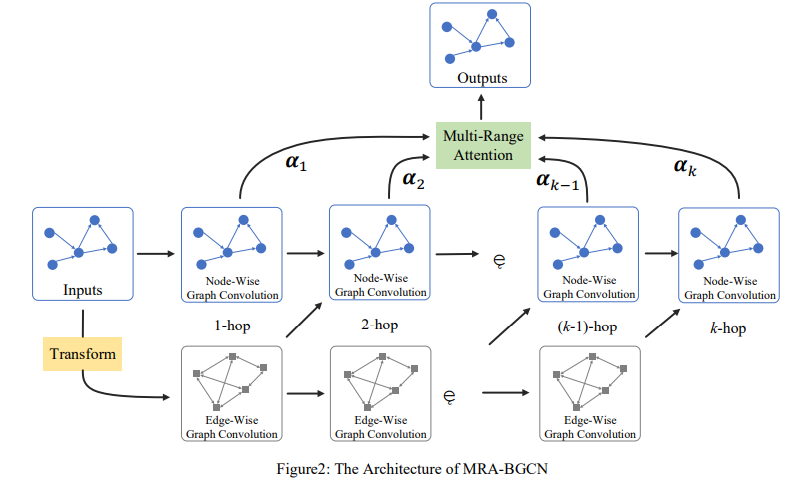

위 그림은 MRA-BGCN 의 전반적인 아키텍쳐를 표현하고 있는데요, 이는 다시 두 가지 parts로 나눌 수 있습니다. 

1. Bicomponent graph convolution module
2. Multi-range attention layer 

Bicomponent graph convolution module은 여러 개의 <u>node-wise graph convolution layers</u> 와 <u>edge-wise graph convolution layers</u> 를 가지고 있는데, 이를 통해 nodes와 edges의 각각의 상호작용을 모두 규명할 수 있게 됩니다. 

Multi-range attention layer는 다른 범위의 이웃들의 정보를 모으고, 그들의 중요도를 학습하는 역할을 합니다. 부가적으로 위 연구에서는 traffic forecasting의 temporal-dependency를 구현하기 위해 **MRA-BGCN을 RNN에 합쳤으며**, 자세한 방법은 아래와 같다.

### Bicomponent Graph Convolution

위 논문에서는 nodes 와 edges 의 상호작용을 모두 구현할 수 있는 bicomponent graph convolution을 제안하는데요, 이때 우리가 기존에 정의한 Graph 구조인 와는 별개로 edge-wise graph 구조는 원래 의 edge들이 node가 되고, 해당 edge들의 연결을 고려하여 새로운 graph 의 edge를 정의허게 됩니다. 이때 인접행렬은 *unweighted* 상태인데요, 단순히 원래 graph의 edge들의 연결상태만을 1과 0으로 표현해준 것입니다. 그러나 traffic forecast 에서 edge 의 상호작용 패턴을 고려하는 것은 매우 중요하기 때문에 위 논문에서 인접행렬의 *weight*는 두 가지로 구분되어 정의해줍니다.

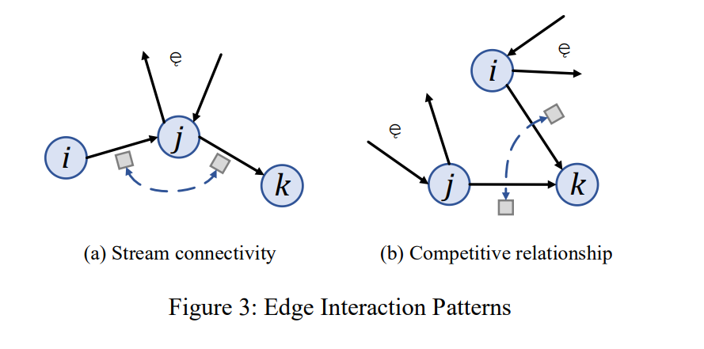

**Stream connectivity:** 위 Figure 3 (a) 처럼, 두 edges 가 중간 노드를 기준으로 이어지는 구조를 stream connectivity 라고 하는데, 이때 *(i → j)*를 upstream edge, *(j → k)*를 downstream edge 라고 하며 둘은 상관관계를 가지고 있습니다. 직관적으로 만일 가 많은 수의 이웃 노드를 가지고 있다면 노드에서 가 아닌 다른 이웃노드로 빠져나갈 확률이 높아지기 때문에 위 upstream edge와 down stream edge 의 상관관계는 약해질 것입니다. 따라서 인접행렬 의 *weight*를 다음과 같이 구할 수 있습니다.

이때 )와 )는 node-wise graph 에서 들어오는 노드와 나가는 노드의 수를 의미하며, 는 node degrees의 표준편차를 의미합니다.

**Competitive relationship:** Figure 3 (b) 와 같이 다른 node들에서 특정 node로 들어오는 두 edge의 관계를 competitive relationship 이라고 정의하는데, 위 Figure3에서는 *(i → k), (j → k)* 두 edge 의 관계로 확인할 수 있습니다. Stream connectivity 와 유사하게, competitive relationship 의 강도는 source node 의 수와 연관이 있습니다. 예를 들어 특정 edge의 source node가 multiple한 outcoming edge들을 가지고 있다면 traffic resourse의 경쟁에 있어 강건한 성격을 띌 것이기 때문입니다. 따라서 competitive relationship일 때의 인접행렬 A 의 weight는 다음과 같습니다.

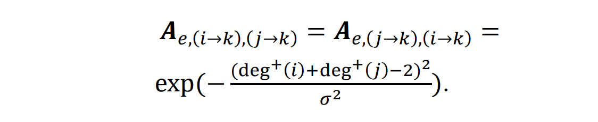

위 두가지 경우를 모두 고려한 edge-wise graph 가 준비된 후에, Figure 2와 같이 bicomponet graph convolution이 수행되어 node 와 edge 각각의 상호작용이 나타나게 되며, -hop bicomponent graph convolution의 꼴은 아래와 같습니다.

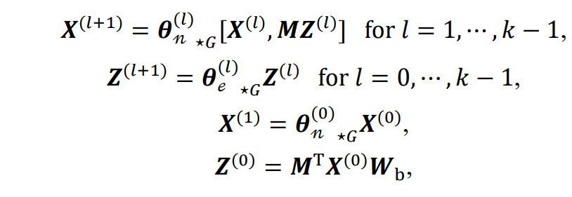

위 graph convolution 에서 등장하는 여러 *notation*의 의미는 다음과 같습니다. 는 **graph convolution 에 필요한 파라미터**를 의미하고, 는 **연결 operation**, })은 **node-wise graph convolution 의 input**, })은 **edge-wise graph convolution 의 input**, 은 **각 node와 edge의 연결 상태를 표현하는 근접행렬**입니다. })은 **각각의 노드에 연결되어 있는 edge representaion을 모아주는 역할**을 하며, 이와 반대로 })는 **각 edge 에 연결되어 있는 node representation 을 모아주는 역할**을 합니다. 는 오리지널 node }) 을 오리지널 edge에 맞도록 변환해주는 **학습 가능한 정사영 행렬**입니다.

### Multi-Range Attnetion

Bicomponent graph convolution이 각기 다른 이웃범위의 중요도를 학습할 수 있도록 위 논문에서는 multi-range 방법을 사용하는데요, 단순히 -hop 만큼 주어진 이웃 범위가 아닌 다양한 이웃 node 및 edge들의 정보를 취합할 수 있도록 해줍니다.

Bicompoent graph convolution 모듈은 가능한 최대한 많은 범위의 hop을 기준으로 layer를 설정하고 이에 대응되는 node representation })을 가지고 있으며, 이들은 각각 라는 <u>representation dimension</u>을 가지고 있습니다. Multi-range attention layer는 multiple한 이웃 범위에서부터 통합된 표현을 담는 것이 목표인데요, 이를 위해 먼저 처음부터 끝 layer에게 동일하게 라는 선형 변환 함수를 곱하고, 여기에 라고 하는 <u>context embedding vector</u>를 곱하여 attention coefficients 를 계산합니다. 이때 는 초기에는 랜덤한 값을 input 해주고, 가면 갈수록 함께 학습이 되는 vector입니다. 최종적으로 각 coefficients 들을 정규화하기 위한 *SoftMax* 함수를 적용시켜서 아래와 같은 값을 산출하게 됩니다.

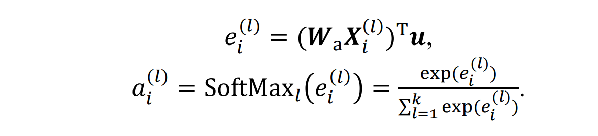

하나의 node에 대한 예측 값은 각 coefficients를 해당 layer의 })값에 곱한 값들을 선형 결합 해준 것으로 다음과 같습니다.

### Bicomponent Graph Convolutional RNN

논문에서는 RNNs 을 통해 temporal dependency를 모델링하기 위해 fully-connected layers 대신 GRU를 사용하여 MRA-BGCN을 완성시켰는데요, 이러한 RNN 구조를 <u>Bicomponet Graph Convolutional GRU</u> 라고 명칭하며 수식은 아래와 같습니다.

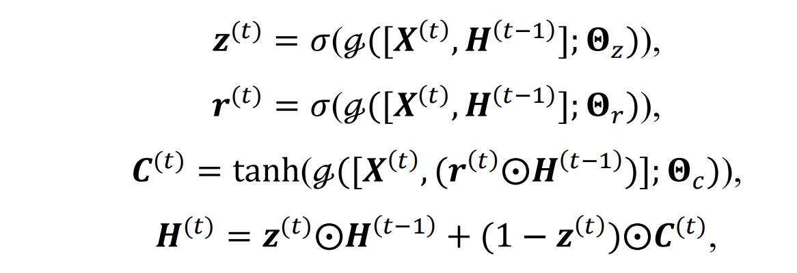

여기서 })와 })는 각각 time step 에 대한 input과 output을 나타내며, })와 })는 time step 에서의 업데이트 게이트, 리셋 게이트, 는 시그모이드 함수, 는 아다마르 곱을 의미합니다. Multiple한 기간을 예측하는 모델의 전반적인 아키텍쳐는 다음과 같습니다. 

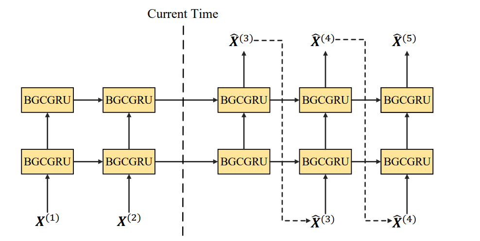

## **4. Experiment**  

### Dataset

위 논문에서는 MRA-BGCN을 두 개의 공공 traffic 데이터셋에서 평가하였는데, *METR-LA*와 *PEMS-BAY* 교통 데이터이다. *METR-LA*는 Los Angeles의 고속도로 207개의 sensor에서 측정되는 4달 동안의 통계자료이다. *PEMS-BAY*는 Bay area의 325개의 sensors 에서 측정되는 6달 동안의 통계 자료이다. 이들은 동일한 전처리 과정을 거쳤으며 5분 단위로 데이터가 습득이 되었다. node-wise graph의 인접행렬은 *Gaussian kernel*을 거친 도로 네트워크 거리를 기반으로 만들어졌으며, Z-score 표준화가 inputs 데이터에 적용되었습니다. 양쪽 데이터셋 모두 발생 순서대로 70%의 training 셋, 10%의 validation 셋, 20%의 testing 셋으로 구성되었습니다.

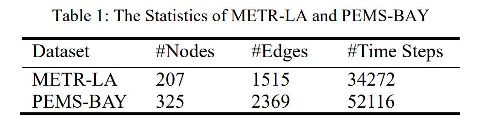

### Baseline

위 논문에서 MRA-BGCN은 다음 모델들과 비교합니다.

- **HA:** Historical Average
- **ARIMA:** Auto-Regressive Integrated Moving Average Model with Kalman filter (Hamilton, 1994)
- **FC-LSTM**: Recurrent neural network with fully connected LSTM hidden units (Sutskever et al., 2014)
- **DCRNN**: Diffusion Convolutional Recurrent Neural Network (Li et al., 2018b)
- **ST-GCN**: Spatial-Temporal Graph Convolution Network (Yu et al., 2018)
- **Graph WaveNet** (Wu et al., 2019a)

모든 neural network들에 대해서 가장 좋은 하이퍼 파라미터를 설정하였습니다.

### Experimental Settings

이전의 모델 역할에 대해서, 과거 의 데이터셋을 통해 미래 의 traffic forecasting을 하는 것이 목표라고 밝혔는데, 이때 와 같이 과거와 미래의 데이터셋 및 예측 시간은 동일하게 고정시킵니다.

위 실험에서 BGCGRU layers의 수는 2개로 고정시키며, 64개의 hidden units으로 설정합니다. Bicomponent graph convolution의 maximum hop 는 3으로 설정하며, 모델은 *Adam optimizer*로 학습시켜 100 epochs, 64 batch-size에 대해 MAE를 최소화 하도록 합니다. 초기 학습 rate는 1e-2와 함께 *decay rate*는 10 epochs 당 0.6으로 설정하고, 부가적으로 더 나은 성능을 위해서 *scheduled sampling* 기법과 2e-4의 *decay weight*를 가지는 L2 정규화 역시 사용하였습니다.

Traffic forecasting을 위해 3가지 공통된 metrics가 채택되었는데, 이는 다음과 같습니다.

1. Mean Absolute Error (MAE)
2. Mean Absolute Percentage Error (MAPE)
3. Root Mean Squared Error (RMSE)

### **Result**  

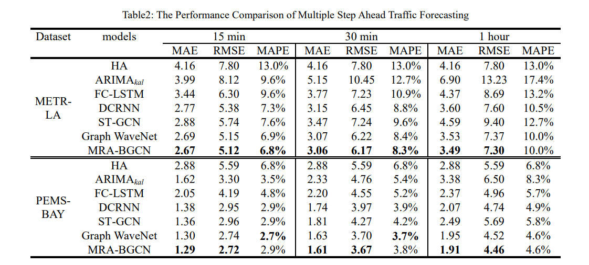

Table2에서 나타났듯이 MRA-BGCN 과 baseline model들을 15분, 30분, 1시간 예측으로 나누어 비교하였는데요, 다음과 같은 현상이 관찰되었습니다.

- MRA-BGCN이 모든 예측에서 가장 우수한 성능을 보였는데, 전통적인 traffic forecasting 방법론인 HA, ARIMA, FC-LSTM 보다 매우 뛰어난 성능을 보였으며, vanilla GCN-based 모델들인 DCRNN과 ST-GCN보다 더 좋은 성능을 보였습니다. 이는 직접적으로 fixed weighted graph 보다 더욱 좋은 성능을 보인다는 것을 의미합니다.
- 두번째로 좋은 성능을 보인 Graph WaveNet 모델에 대해서도, MRA-BGCN은 PEMS-BAY 데이터 셋에서 작은 개선을 보였으며 METR-LA에서는 다소 큰 개선을 이루어냈습니다. 또 다른 관점에서, 예측해야 할 범위가 커질수록 논문에서 제시한 모델의 성능은 다른 모델들의 성능과 큰 차이를 보였습니다. 다시 말해서, METR-LA와 같이 도로의 상황이 복잡할수록, 그리고 장기간의 예측이 필요할수록 위 모델이 적합하다는 뜻이 됩니다. Graph WaveNet 은 self-adaptive graph를 사용하여 hidden spatial dependency를 담아냈는데, 이는 위에서도 언급하였듯이 데이터에 의존성이 높아 복잡한 장면을 발견하기 어려운 경향이 있습니다. 이에 반해 논문의 모델은 edge 들의 상호작용 패턴에 의해 구현되었으며, 이를 통해 데이터를 종합적으로 표현하고 핵심적인 중요도를 담을 수 있게 되었습니다.

#### Effect of the Edge-Wise Graph

제안된 모델의 edge-wise graph의 효과를 판별하기 위하여, 두가지 변형된 모델과 비교를 진행하였습니다.

1. MRA-BGCN-Identify: 모델에서 edge 상관관계를 무시하여 edge-wise 인접행렬을 그저 identity matrix로 대체한 모델
2. MRA-BGCN-LineGraph: edge-wise graph를 line graph로 대체하여, 다양한 edge 상호작용 패턴을 무시한 모델

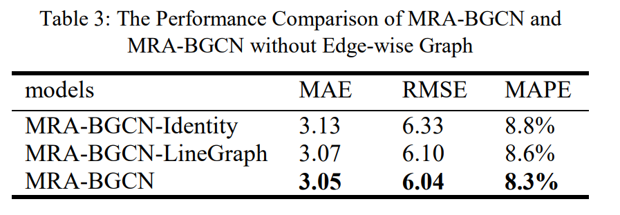

Table3는 MAE, RMSE, MAPE 세가지 metrics을 통해 위 변형된 모델과 제안된 모델을 비교하는데요, 모든 경우에 대해서 MRA-BGCN이 가장 낮은 error를 기록하였으며, 이는 직관적으로 edge-wise graph가 stream connectivity, competitive relationship이 필요하다는 것을 의미합니다.

#### Effect of the Multi-Range Attention Mechanism

추가로 제안된 모델의 multi-range attention mechanism의 성능을 판별하기 위해 이번에는 다른 두가지 변형된 모델과 비교하였습니다.

1. BGCN: multiple range 정보와 주어진 범위의 이웃노드의 정보조차 사용하지 않고 오직 layer 의 output만을 사용한 모델로 아래 Figure 5 (a)와 같습니다.
2. MR-BGCN: MRA-BGCN과 동일하게 multi-range bicomponent graph convolution network는 맞으나, 이에 대한 가중치를 동일하게 부여한 방식으로 아래 Figure 5 (b)와 같습니다.

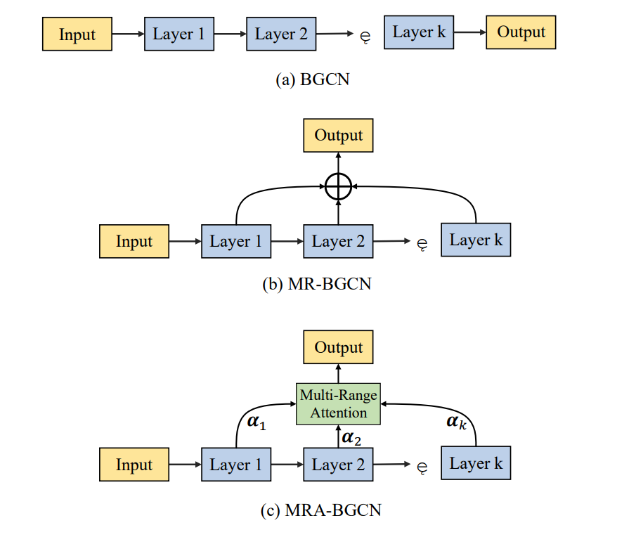

이에 대한 성능은 아래 Table 4에 기록되어있는데, multiple range information를 사용하고 각각의 가중치를 다르게 부여한 MRA-BGCN이 가장 좋은 성능을 보였습니다.

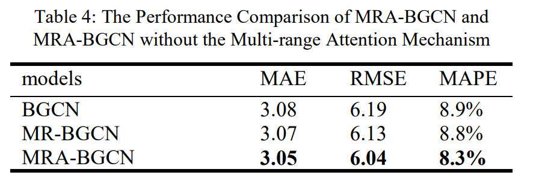

## **5. Conclusion**  

### Summary

위 논문에서는 Traffic Forecasting을 위한 Multi-Range Attentive Bicomponent Graph Convolutional Network 이라는 모델을 제안하였습니다. 특히, bicomponent graph convolution이 nodes와 edges 각각의 상관관계를 표현하기 위하여 사용되었으며, edge-wise graph를 구성할 때 stream connectivity와 competitive relationship을 구분하여 임베딩하여 더욱 구체적으로 edge 관계를 표현하였습니다. 

Multi-range attention mechanism은 multiple-range의 정보를 효율적으로 활용하고 통합 표현을 생성하기 위해 제안되었으며, 이를 두 개의 traffic 데이터셋에 대하여 검증하였습니다.

Future work로 논문에서는 두 가지 측면을 연구해볼 것이라고 제안합니다.

1. 제안된 모델을 다른 spatial-temporal forecasting 분야에 적용하기
2. 위 모델을 교통 사고나 주위 흥미거리 등 다양한 요소들을 추가한 더욱 복잡한 spatial-temporal dependency 에 적용하기

### Opinion

평소에 GNN을 물류나 Traffic에 연결지어서 문제를 해결하는 방안에 대해서 관심을 가지고 있었는데요, 저희가 진행했던 프로젝트 역시 그러한 관점에서 시도했던 것이었습니다. 팀으로 진행한 Paper Review가 우연히 Graph Convolution Networks를 맡게 되어 이와 연관이 있는 Paper Review2 과제를 준비하다 보니 본 논문을 찾게 되었습니다. 

나름 최신의 논문이고, 어떻게 Graph와 Traffic data를 적은 오차로 연관지어 예측할 수있을까 궁금했는데, 완벽하게 이해하기에는 제가 아직 많이 부족하지만 몇가지 실마리를 찾은 것 같습니다. Baseline이 되는 다른 model과 관련한 논문들도 찾아서 읽어볼 필요성을 느꼈습니다. 

---

## **Author Information**  

* Sejong Lim

  * Dept. of Industrial and System Engineering, KAIST

  * Multi-Agent RL / Reinforcement Learning / GNN

    

## **6. Reference & Additional materials**  

Please write the reference. If paper provides the public code or other materials, refer them.  

* CS224W: Machine Learning with Graphs
