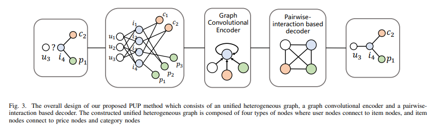

# **PUP(Price-aware User Preference-modeling)**

# 1. Problem Definition

추천 시스템의 많은 task 들은 유저의 아이템에 대한 선호도를 파악하고, 이를 통해 이전에 구매한적 없는 물건 들 중, 유저가 ‘살만한’ 아이템을 추천하는데에 있음.

해당 논문에서는 이러한 추천 시스템에 아이템 가격을 활용하여 추천 정확도를 높이고자 함. 또한 단순히 가격을 사용하는 것을 넘어, 상품 카테고리가 가격 민감도에 영향을 미치는 것을 고려하여, 이를 반영한 카테고리별 아이템 가격 민감도를 추천에 반영하고자 함.

$$U$$, $$I$$ : 사용자(M개), 아이템(N개) 집합

$$R_{M*N}$$ : 사용자-아이템 interaction matrix. $$u→i$$ 구매 시 $$R_{ui}=1$$

$$p = \{ p_1, p_2, ..., p_N \},c = \{ c_1, c_2, ..., c_N \}$$ : item 의 가격/카테고리

- 단, 가격 p 는 min-max 범위에 따라 10-level로 변환하여 사용 $$\lfloor{{x-min}\over{max-min}} *10 \rfloor$$

**입력** : $$R, p, c$$

**출력** : user-item pair ($$u, i$$).의 예측된 구매 확률

# 2. Motivation

## 2.0 Background

경제학/마케팅에서 가격 민감도를 다루는 방식은 이반적으로 **Willing to pay(WTP)** 라고 함.

> ‘willingness to pay’는 소비자 혹은 고객이 한 단위의 재화나 서비스를 이용하기 위해 지불할 의사가 있는 최대가격을 말합니다. 구태여 그냥 가격이 아닌 최대가격이라고 말하는 이유는 ‘willingness to pay’가 소비자의 효용극대화로부터 나온 개념이기 때문입니다. ‘willingness to pay’의 개념 속에는 주어진 예산 제약 하에서 소비자가 자신의 효용을 극대화하기 위해서는 최대한 이 가격만큼 지불할 의사가 있다는 의미가 담겨 있습니다.

해당 논문에서는 카테고리에 따라 WTP의 차이가 있다는 믿음에 따라 __Category willing to pay(CWTP)__ 의 개념을 사용.

여기서 CWTP는 사용자가 구매한 물건 중 가장 큰 금액의 물건으로 정의했고, 카테고리 당 부여되는 개념이기 때문에, 한 사용자가 여러 카테고리의 물건을 구매했다면 여러개의 CWTP 값을 가지게 된다(카테고리당 하나씩).

## 2.1 Motivation & contribution

**추천시스템의 근본적인 목표는 “판매자의 관점에서 사용자가 소비할 가능성이 높은 항목을 추천하는 것”.**

사용자의 관심에 대한 증거로서 과거 소비이력을 사용했고, 이를 통해 CF모델들로 연구가 시작되었고, FM, NFM 등 다양한 연구들이 계속되어왔음.
이전 마케팅 분야에서의 연구들이 소비자가 소비를 결정하는 가장 큰 요인중 하나가 바로 ‘가격’이라는 것을 증명함에도 불구하고, 추천시스템에서는 이에 대한 연구가 적었음. 해당 연구에서는 이러한 문제제기에 따라 **추천시스템에서 가격 요소에 초점을 두어 사용자의 구매 의도를 예측하는 방법론**을 제시하고자 함.

이전 연구들에서 이런 시도가 쉽게 일어나지 않은 것은 몇가지 이유가 있음

1. **Implicit**(**Unstated price awareness)** : 아이템 가격에 대한 사용도의 선호도/민감도 를 알 수 없고, 구매 기록에 따라 implicitly reflected 된 것 만을 볼 수 없다는 점
   → GCN을 통해 가격을 node 로 구성하여 학습
2. **Complex**(**Category-dependent influence)** : 아이템 가격이 사용자의 구매의도에 미치는 영향은 카테고리에 따라 크게 다를 수 있다는 점
   →카테고리를 propagation 과정에 통합하여 학습

해당 연구에서의 Contribution은 다음과 같음.

1. 상품을 추천할때 가격 요소의 중요성을 강조, 사용자 선호도를 학습하기 위해 아이템 가격과 카테고리 영향력을 통합하는 그래프 기반 솔루션 제안
2. 실제 데이터셋에서의 검증, 콜드 스타트 시나리오에서 가격 모델링이 유용함을 정당화, 탐색되지 않은 카테고리의 상품을 추천.

# 3. Method

## 3.1 Overview

저자들은 모델에 세가지 특성이 있다고 이야기 하는데 간략한 요약은 다음과 같음, 아래 각 파트에서 보다 더 자세하게 다룬다.

- **Unified heterogeneous graph**
  - 일반적으로 가격정보, 카테고리는 node feature로 다루는 경우가 많은데, 해당 논문에서는 이를 각각의 node로 heterogeneous graph를 구성. user, item, category, price 네가지 타입의 노드를 가짐.
- **Graph convolutional encoder**
  - Heterogeneous graph 로 구성된 네가지 종류의 노드 임베딩을 item 노드에 aggregate 하기 위함으로 보임. 이를 통해 가격 민감도를 capture.
- **Pairwise-interaction based decoder**
  - FM(Factorization Machine)에서 영향을 받은 decoder 구조, 각 pair 별 상호작용에 기반한 decoder.

해당 논문의 핵심인 복잡한 추천 안에서 price factor의 영향을 살펴보기 위해 이를 두가지(category dependent / price aware) branch로 나누어 생각.

1. Global branch : Price-aware 에 관한 부분, 카테고리와 관련 없이 사용자 구매행동에 따른 구매력을 글로벌 효과로서 모델링
2. Category branch : Category dependent 에 관한 부분, price factor가 카테고리에 영향을 받는다는 가정, 이를 반영한 모델링

(Branch 라는 다소 모호한 개념은 3.4 절에서 본격적으로 다룸, 일단 브랜치가 있다는 것을 이해하고 넘어가면 됨.)

## 3.2 **Unified Heterogeneous Graph**

Price aware의 개념을 다루고자 하지만, 사용자와 가격은 실제로 직접적인 관계를 맺고 있지 않음. 논문에서는 price-user 관계에서 item이 이를 연결하는 가교 역할을 해준다고 표현.

따라서 이를 위해 item을 중심으로 user / category / price 가 연결되는 heterogeneous graph를 구성함.

일반적으로 추천시스템에서는 user/item bipartite graph 에 price, category 등의 정보를 feature vector로 넣어서 학습 시킨다. 해당 논문에서는 이와 상당히 다른 방법을 취했는데, 저자들은 이러한 구조를 사용하는 이유로, FM의 철학을 반영하여 보다 explicit 한 방식으로 **category-dependent price awareness** 를 나타내기 위함 이라고 이야기 하고 있다. price 와 category를 노드로 지정함으로서, 보다 직관적으로 **노드간 상호작용**(price-category, price-user, category-user 등) 을 모델링 할 수 있도록 하기 위해 위와 같은 구조를 차용했다.

## 3.3 Graph Convolutional Encoder

Encoder 는 기본적으로 LFM의 컨셉을 따름([참고](https://wooono.tistory.com/149)).

일반적으로 FM추천 시스템에서는 user, item의 차원을 나타내는 (u,i) pair에 대한 vector 표현을 다루는데, 이 heterogeneoug graph 에서는 (i,p), (i,c),(u,p) pair 또한 고려해야 한다. 따라서 이를 위해 LFM 의 개념을 확장하고, 모델링을 효과적으로 하기 위해 GNN의 massage passing 개념을 차용한다. Encoder 는 Embedding, propagation, aggreagation 세가지 layer로 구성된다.

### 3.3.1 Embedding Layer

사실 해당 레이어에서 하는 일은 별로 없다. price/category 정보가 새로운 node로 표현되었기 때문.

변환이 필요한 feature는 user/item 의 id 정보이며, 이를 dense 한 벡터표현으로 만들기 위해, $$d$$ 차원을 가진다고 정의한 embedding space에 각 node를 표현한다.

$$
e^\prime \in R^d
$$

> $$d$$ : embedding space 의 차원

### 3.3.2 Embedding propagation layer

연결된 두 노드 사이에 propagation을 진행함. user-item, item-price, item-category 관계에서 전파를 진행하고, 전파가 진행됨에 따라 정보가 손실(over smoothing)되는 것을 막기 위해 item-item 사이의 self loop 추가하고, 이를 regularization 함.

노드 j 에서 i 로 가는 propagated embedding은 다음과 같다.

$$
\mathbf{t}_{j i}=\frac{1}{\left|\mathcal{N}_{i}\right|} e_{j}^{\prime}
$$

> $$\mathcal{N}_i$$ : node i 의 이웃
> 
> $$e^\prime_j$$ : 노드 j 의 embedding

### 3.3.3 Neighbor aggregation layer

GCN에서 영감을 받아, 이웃 노드들을 aggregate 함으로서 이웃한 노드 사이의 embedding 을 가깝게 만듦. → 논문에서는 aggregator로 average pooling에 nonlinear activation function을 사용하나, 노드 종류에 따라 다른 룰 적용

(category는 price 와 같음)

$$
\begin{aligned}O_{u}=& \sum_{j \in\left\{i \text { with } R_{u i}=1\right\} \cup\{u\}} \mathbf{t}_{j u}, \\O_{i}=& j \in\left\{u \text { with } R_{u i}=1\right\} \cup\left\{i, \mathbf{c}_{i}, \mathbf{p}_{i}\right\} \\O_{c}=& \mathbf{t}_{j c}, \\O_{p}=& j \in\left\{i \text { with } \mathbf{c}_{i}=c\right\} \cup\{c\} \\e_{f}=& \tanh \left(O_{f}\right), f \in\{u, i, c, p\} .\end{aligned}
$$

식은 복잡해 보이나, user, item, price, category 네가지 종류의 노드들이 각자 연결되어있는 그래프의 구조에 따라 aggregate 할 대상이 다른 것을 표현하였을 뿐임.

GCN 에서 가장 보편적으로 사용하는 구조중 하나이며, 역시 activation function으로 tanh 를 사용하였음.

## 3.4 Pairwise-interaction Based Decoder

앞서 Branch 에 대한 설명이 모호한 측면이 있었는데, 구체적으로 다음과 같이 다루게 됨.

$$
\begin{aligned}s &=s_{\text {global }}+\alpha s_{\text {category }} \\s_{\text {global }} &=e_{u}^{T} e_{i}+e_{u}^{T} e_{p}+e_{i}^{T} e_{p} \\s_{\text {category }} &=e_{u}^{T} e_{c}+e_{u}^{T} e_{p}+e_{c}^{T} e_{p}\end{aligned}
$$

1. Global branch : 넓은 범위의 가격 효과를 모델링해서 유저의 **전체 구매력**에 집중.
2. Category branch : ‘로컬’한 수준에 집중해서 **카테고리가 유저의 가격 민감도에 영향**을 미치는데 집중.

각각 branch에서 디코더를 통해 확률을 예측하고, 이를 결합하여 최종 결과로 사용.
저자들은 이런 행위가 price의 global factor와 category dependent factor를 분리하여 보다 강력한 해석력을 얻기 위함이라고 언급.

각 branch 마다 encoder-decoder가 따로 있으며 즉, $$s_{global}$$ 에서와 $$s_{category}$$에서 각 embedding은 표현은 같으나, 서로 다르고 독립적임.

이해를 돕기위해 수정, 실제 모델의 흐름은 다음과 같다.

### **Global branch**

- user-item : user’s interest
- user-price : user’s **global price effect**(카테고리를 떠나서 유저의 전반적인 가격민감도)
- item-price : item’s price bias
  →고객의 전반적인 구매력/가격민감도

카테고리는 aggregation 과정에서 정규화 term으로만 사용, 그래프 내 같은 카테고리 아이템들을 가깝게 만들어주는 역할만 수행. 즉, 여기서 category-price(local) 효과는 나타나지 않음.

### **Category branch**

- user-category : user’s category interest
- user-price : user’s **global price effect**(카테고리를 떠나서 유저의 전반적인 가격민감도)
- category-price : category price bias
  → 카테고리 의존적 가격 민감도

item embedding을 제거하고, user-category/price를 이어주는 역할만을 함 으로서, category의 역할을 부각, 카테고리가 가격민감도에 미치는 영향을 반영.

## 3.5 Model training

### **Semi-supervised graph auto-encoder**

기본적으로 auto encoder 모델이기 때문에, encoder를 통해 얻은 embedding을 바탕으로 decoder를 거친 link prediction 진행, 이 결과를 real value와 대조하는 방식으로 학습이 진행됨.

이때 각 노드별 link 가 있지만, primary-goal에 해당하는 item-price link 만을 reconstruct.

### Loss function

다양한 item들에 대한 선호를 학습하기 위해 Bayesian Personalized Ranking (BPR)에서 제안된 BPR loss 사용.

BPR loss는 negative sample 보다 positive sample에 더 높은 rank를 부여하도록 설계됨, 이를 통해 항목들간 상대적 선호를 부여하는데 중점을 둠

$$
L=\sum_{(u, i, j) \in \mathcal{O}}-\ln (\sigma(s(u, i))-\sigma(s(u, j)))+\lambda\|\Theta\|^{2}
$$

> $$\mathcal{O}$$ : positive-negative sample pairs
> 
> $$\sigma$$ : sigmoid function
> 
> $$\Theta$$ : model parameter (L2 normalization)

# 4. Experiments

## 4.1 **Experiment setup**

### Dataset

두개의 데이터셋 사용

- **Yelp** : Yelp2018 open dataset
  - 미국의 맛집 정보 사이트, interaction, price, category 존재
  - Price 가 이미 1~4 level로 표현되어있기 때문에, 그대로 사용
  - 10개 이상의 interaction을 가지는 user, item 만을 택하는 10-core data 사용
- **Beibei** : 수집경로 밝히지 않음.
  - 중국의 e-commerce 사이트, interaction(구매), price, category 존대
  - Price 가 value 형태이기 때문에 10-level로 quantization
  - 10개 이상의 interaction을 가지는 user, item 만을 택하는 10-core data 사용

둘 모두 6:2:2 split / Interaction 있을 시 positive, 그외 negative 로 간주 / Negative sampling 진행

### Baseline

총 네가지 컨셉으로 baseline을 구성

- **Non-personalized :**
  - ItemPop : 단순히 training set 에서 가장 인기있는 걸 추천
- **CF(collaborative filtering):**
  - BPR-MF : BPR loss 를 적용한 기본적인 Matrix Factorazation model(MF)
  - GC-MC : 그래프 기반 matrix completion 모델, 여기선 그래프 구조만을 사용(w/o side information)
  - NGCF : 그래프 기반 collaborative filtering 모델, 여기선 price 정보를 포함시켜 사용
- **Attribute-aware :**
  - FM : Factorazation Machine, 여기선 price, category 를 feature로 사용
  - DeepFM : 같은 세팅의 FM 에 Neural network 앙상블
- **Price-aware :**
  - PaDQ : Collective matrix factorization(CMF) 기반 price-aware model, Price 정보를 활용했으며, 가격을 예측하는 과정을 추가해서 설명력을 높임.

### Evaluation Metric

NCF의 setting을 사용했다고 밝힘

**NDCG@K, Recall@K** 를 K가 50,100 일때 총 네가지 metric으로 성능 비교(모두 높을 수록 좋은 결과)

## 4.2 **Result**

### Main result

저자들은 RQ를 따로 정의한 것은 아니나. main result table을 분석하며 이에 대한 네가지 문제를 제기하고, 이를 설명해 보임

1. **Incorporating Price into Recommendation Improves the Accuracy**

   일반적으로 attribute를 추가하면 (당연히)좋은 성능을 보이고,실험에서도 이를 보여줌.

   **FM/DeepFM vs BPR-MF** : price 정보가 있는 전자가 좋은 성능NGCF vs GC-MC : price 정보가 있는 전자가 좋은 성능

   가격 정보를 가지는 모델의 성능이 더 좋지만, 이것이 실제로 가격이 미치는 영향을 증명할 수 없음.

2. **Price Should be Considered More as an Input Rather Than a Target**

   FM vs PaDQ : 둘 모두 price를 사용했지만 PaDQ는 latent factor로 price prediction 을 하는 task를 추가한 모델, feature에 통합한 FM에 비해 현저히 낮은 성능

   → 가격은 예측 대상(**Target**)이 아닌 추천 시스템의 입력(**Input**)이 되어야 함.

3. **Neural Based Methods and Graph Based Methods Have an Advantage over Other Methods**

   Neural network 사용한 DeepFM, GC-MC, NGCF 가 전반적으로 좋은 성능.

   → 추천 시스템에 그래프 신경망이 도입된다면 좋은 성능을 가져올 수 있음.

4. **Our Proposed PUP Method Achieves the Best Performance**

   모든 metric 에서 일관된 최상의 결과, t 검정시 p<0.005

   → PUP 가 category price를 효과적으로 활용, 추천시스템을 개선할 수 있다.

### Ablation Study

(해당 리뷰에서 논문에 있는 모든 실험결과를 포함하진 않겠습니다. 읽고 관심이 생기신 분들은 한번 찾아보시는 것도 좋을 듯 합니다.)

- The Two-branch Design
  
  - 두 branch 사이의 중요도가 곧 가격 factor에 global과 category dependent 중 어떠한 것이 중요한지를 나타낼 수 있다고 생각
  - 이때 중요도는 embedding size를 통해 결정 할 수 있음→ 고차원 = 많은 정보량 = 높은 중요도
  - Global branch에 큰 embedding size를 부여했을때 가장 좋은 결과를 보임

### Utilizing Price to Tackle Cold-Start Problems

추천 시스템에서 가장 주요한 task중 하나인 cold start 문제는 정보가 부족(혹은 전혀 없는) user에게 어떤 물건을 추천해 줘야 할지에 대한 문제임.

특히 대부분 모델이 특정 category 내에서 user interaction을 기반으로 같은 카테고리 내 추천을 하는 방식으로 구성되고, 이는 구매경험이 한번도 없는 카테고리의 물건을 추천할때 Cold start problem을 일으킴.

저자는 Price 정보가 이를 완화시키는데 도움이 된다는 idea를 제시

- **Evaluation Metic**
  - **CIR :** test set 에서 구매할 카테고리의 item이 후보
  - **UCIR** : CIR + training set 에서 나오지 않은 카테고리 들의 Item이 후보
  ex) A~E 카테고리 중 traning set 중에는 A,B 카테고리 의 구매 이력만 있고, test 시 C 카테고리의 물건을 추천해 줘야 할때 CIR 에서는 C 카테고리만이, UCIR 에서는 C,D,E 카테고리가 후보군이 됨.

‘PUP-’ = category node가 제거된 PUP

- **PUP vs GCMC :** 가격 정보가 coldstart 문제를 완화
- **PUP vs PUP-** : 카테고리 노드가 효과를 보임

저자들은 GCMC가 user-item-**user**-item 만을 이용할 수 있음에 비해 PUP는 user-item-**price**-item 간 연결이 가능하고, user-item pair에 비해 적은 level수(10개)로 구성된 price-item 의 연결이 훨씬 dense 하기 때문에, 이를 통해 coldstart 문제를 완화 할 수 있다고 주장.

# 5. Conclusion

- 추천에 가격을 통합하는 것이 중요함.
- Two branch를 통해 글로벌하고 로컬(카테고리)한 가격 인식 효과를 분리한 디자인Cold start problem을 완화시키는데 price 가 유효할 수 있음.
- 가격 민감도 모델링을 디자인 했지만, 해당 논문의 핵심은 feature로 고려하던 정보를 node로 표현한 heterogeneous graph, 이를를 통해 다른 attribute도 통합할 수 있다.
- 변화하는 가격의 dyamic을 반영하는것이 future work.

### 느낀점

1. 익숙하게 사용하는 node/edge feature가 아니라 이를 따로 node를 등장시키는 개념이 새로웠다. 다양한 부분에 적용해 볼 수 있을 듯
2. 앞서 마케팅 분야의 논문을 소개하여 문제제기 하는 과정에서 “왜 이 문제가 진짜 해결되어야 하나” 에 대한 어필이 되는듯
3. FM의 철학, 이게 진정 FM에서 바라던 것이다! 이모델이 훨씬 직관적이다. 와 같은 끊임없는 자기 어필, 확신을 가진 글을 쓰는게 좋은듯
4. 베이스라인 선정에 있어 논리 전개에 유리한 모델을 선정한듯 하다. 단순히 state of art 인 논문이 아닌, 실제 분석에 사용할 수 있는 특성을 가진 baseline을 선정하는것이 좋아보였음.

# Author Information

- Kim Daehee(김대희)
- M.S student in the Graduate school of Knowledge Service Engineering of the Korea Advanced Institute of Science and Technology(KAIST)
- Research interest is applying graph neural network to product search and recommendation

# 6. Reference

1. S.-F. S. Chen, K. B. Monroe, and Y.-C. Lou, “The effects of framing
   price promotion messages on consumers’ perceptions and purchase
   intentions,” Journal of retailing, vol. 74, no. 3, pp. 353–372, 1998.
2. L. Krishnamurthi, T. Mazumdar, and S. Raj, “Asymmetric response
   to price in consumer brand choice and purchase quantity decisions,”
   Journal of Consumer Research, vol. 19, no. 3, pp. 387–400, 1992.
3. [https://en.wikipedia.org/wiki/Willingness_to_pay](https://en.wikipedia.org/wiki/Willingness_to_pay)
4. [https://m.blog.naver.com/PostView.naver?isHttpsRedirect=true&blogId=deselorigin&logNo=221175532633](https://m.blog.naver.com/PostView.naver?isHttpsRedirect=true&blogId=deselorigin&logNo=221175532633)
