# Handling Distribution Shifts on Graphs: An Invariance Perspective

논문 [링크](https://arxiv.org/abs/2202.02466)

Official Github은 아직 공개되지 않았습니다.

## **1. Problem Definition**

### **1-1. Background**

#### **1-1-1. Out-of-distribution Generalization**

현실 문제에서 보지 않은 데이터를 처리하는 것에 대한 요구가 증가함에 따라 _out-of-distribution(OOD) generalization*_ 에 대한 연구가 활발해지고 있지만, 최근 연구들은 인공신경망(Neural Networks)들이 _distribution shift_ 에 민감하기 때문에 새로운 환경 내에서 만족스럽지 못한 성능을 보일 수 있음을 시사하고 있습니다.
_OOD generalization_ 에 대한 최근의 연구들은 training 데이터와 test 데이터 사이의 _distribution shift_ 의 원인을 잠재적으로 알려지지 않은 환경 변수 로 취급합니다.
머신러닝 문제를 가 주어졌을 때 를 예측하는 것으로 가정한다면, 앞서 언급한 환경 변수 는 데이터 생성 분포에 영향을 미칩니다: =p(\mathbf{x}|\mathbf{e})p(\mathbf{y}|\mathbf{x},\mathbf{e})).
따라서, OOD 문제는 아래와 같이 표현할 수 있습니다.

$$\begin{equation}\min_{f}\max_{e \in \mathcal{E}} \mathbb{E}_{(\mathbf{x}, y) \sim p(\mathbf{x},\mathbf{y}|\mathbf{e}=e)}[l(f(\mathbf{x}), y)|e]\end{equation}$$

여기서, 는 환경변수의 support, 는 예측모델, ) 은 loss 함수를 의미합니다.

\* Out-of-Distribution Generalization

대부분의 모델들은 Training 데이터와 Test 데이터가 동일한 분포를 가진다고 가정합니다. 그러나 그림 1과 같이 모델이 예측하는 데이터가 training 데이터에 적절히 표현되어 있지 않았던 경우, 이 데이터를 OOD (out-of-distribution)라고 합니다. 모델은 각 예측마다 자신의 예측에 대한 신뢰도(또는 불확실도)를 확률값으로 출력하는데, 이러한 OOD 데이터가 모델에 입력되었을 때 그림 2와 같이 자신 있게 잘못된 예측을 하는 경우가 발생하게 됩니다.

좀 더 자세한 내용은 아래의 survey 논문과 workshop을 참고해주세요:

* [Towards Out-of-Distribution Generalization: A Survey](https://arxiv.org/abs/2108.13624)
* [NeurIPS 2021 Workshop - Out-of-distribution generalization and adaptation in natural and artificial intelligence](https://nips.cc/Conferences/2021/ScheduleMultitrack?event=21852)
* [NeurIPS 2021 Workshop - Distribution Shift: connecting method and application (DistShift)](https://neurips.cc/Conferences/2021/ScheduleMultitrack?event=21859)

  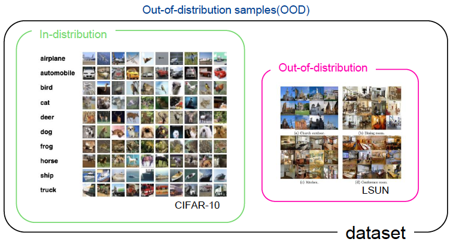

<em>그림 1 - OOD 예</em>

  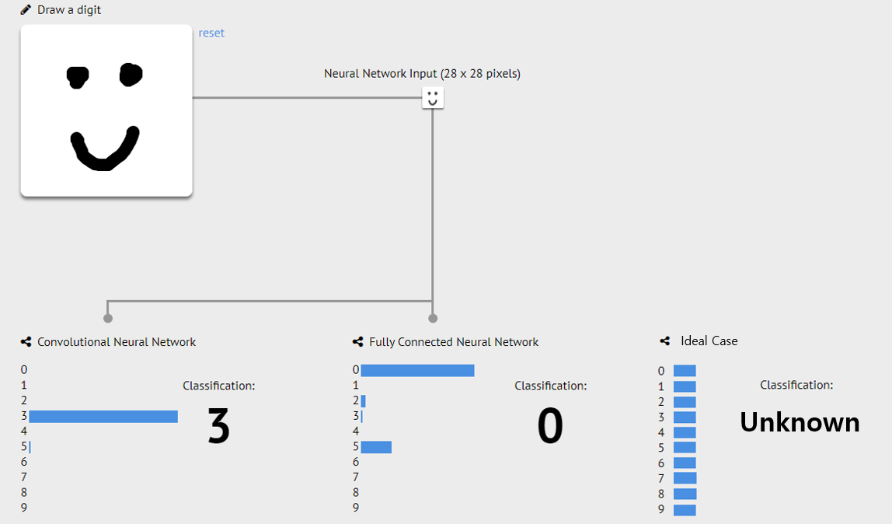

<em>그림 2 - OOD 샘플에 대한 높은 신뢰도의 잘못된 예측의 예</em>

#### **1-1-2. Invariant Model**

실제로 training 데이터가 모든 환경은 포함하고 있지 않기 때문에 Eq1과 같은 OOD 문제를 푸는 것은 매우 어려운 일입니다. 다시 말하면, 실제 목표는 )의 데이터로 학습된 모델을 ) 데이터에서도 일반화시키는 것이 됩니다.
최근 연구[1](#fn1)는 다음과 같은 __data-generating__ 가정을 통해 domain-invariant model을 학습하는 새로운 가능성을 제시했습니다:

> 여러 다른 환경에 걸쳐서 를 예측하는데 invariant한 정보가 의 일부(portion)에 존재한다.

이를 근거로, 이들은 _equipredictive_ representation model 를 학습하는 것을 중요한 포인트로 봅니다 (이 때, 는 모든 환경 에 대해 같은 conditional distribution ,\mathbf{e}=e))을 생성). 즉, 이런 representation )는 임의의 환경에서 어떤 downstream classifier에 대해 같은 (최적의) 성능을 가져올 것이라는 것을 의미합니다. 이런 모델을 ) invariant 모델 또는 predictor라고 부릅니다.

### **1-2. Problem Formulation**

앞서 1-1장에서 일반적인 OOD Generalization에 대한 배경지식을 살펴보았으니, 이 장에서는 범위를 좀 더 좁혀 본 논문에서 실제 풀고자 하는 OOD Generalization 문제를 좀 더 엄밀히 정의해보겠습니다.

대부분의 OOD에 대한 연구는 이미지 등과 같은 Euclidean data에 대해 탐구되었고 그래프 구조 데이터와 관련된 연구는 거의 없었습니다.
그래프 구조 데이터에 대한 많은 연구가 개별 노드들에 대한 예측 문제를 포함하는데, 이런 그래프 구조의 데이터는  Euclidean data와는 다른 두 가지 특성을 가집니다:

1. Node는 동일한 환경(즉, 하나의 그래프) 내 데이터 생성 측면에서 non-independent 및 non-identically distributed하게 상호 연결되어 있습니다게
2. Node feature 이외에도 structural 정보가 예측에 있어서 중요한 역할을 하며, 환경이 변화하는 상황에서 모델이 일반화하는 과정에 영향을 미칩니다.

__따라서, 본 논문은 그래프 구조 데이터의 node-level task에서 발생할 수 있는 OOD 문제를 distribution shift의 관점에서 해석하여 이를 해결하는 새로운 방법론을 제시하려 합니다.__

#### **1-2-1. Out-of-distribution Problem for Graph-Structured Data**

앞으로의 논의에서 사용할 표기법(notation)은 다음과 같습니다.

* Input graph: )
    * Random variable of input graph: 
* Node set: 
* Adjacency matrix: 
* Node feature: 
* Label: 
    * Random variable of nodel label vector: 

그러므로 Eq.1은 다음과 같이 표현될 수 있습니다. =p(\mathbf{G}|\mathbf{e})p(\mathbf{Y}|\mathbf{G},\mathbf{e}))

다만, 위의 정의는 node-level task에는 적합하지 않습니다. 왜냐하면, 대부분의 node-level task는 다양한 노드를 포함하는 하나의 단일 그래프가 모델의 input이기 때문입니다. 따라서 본 논문은 local view를 보는 방법을 선택해 각 노드에 L-hop ego-graph(이를 필요한 모든 정보를 포함하고 있는 부분 집합인 [markov blanket](https://en.wikipedia.org/wiki/Markov_blanket)으로 볼 수 있음)를 취하는 방법으로 문제를 변형하여 정의합니다.

그렇다면, 위의 표기법들을 각각  노드에 대한 ego-graph 용으로 다음과 같이 표현할 수 있습니다.

* Centor node: 
    * Random variable of nodes: 
* L-hop neighbors of node : 
* Input graph: )
    * Random variable of input graph: 
* Adjacency matrix: 
* Node feature: 
* Label: 
    * Random variable of nodel label vector: 

그러므로, 데이터 생성 과정 \}_{v&space;\in&space;V}&space;\sim&space;p(\mathbf{Y}|\mathbf{G},\mathbf{e}))은 다음과 같이 2 단계로 나타낼 수 있습니다:

1. 전체 input graph가 )를 통해 생성되고 이것은 로 분리
2. 각 노드의 label은 )를 통해 생성

그렇다면 Eq.1은 다음과 같이 표현될 수 있습니다.

$$\begin{equation}\min_{f}\max_{e \in \mathcal{E}} \mathbb{E}_{\cancel{G \sim p(\mathbf{G}|\mathbf{e}=e)}}\bigg[\frac{1}{|V|}\sum_{v \in V}{\mathbb{E}_{y\sim p(\mathbf{y}|\mathbf{G_v}=G_v, \mathbf{e}=e)}[l(f(G_v),y)]}\bigg]\end{equation}$$

#### 1-2-2. Invariant Features for Node-Level Prediction on Graphs

1-1-2절에서 논의한 것과 같이 Invariant model은 data-generating 과정에 대한 다음과 같은 가정을 가진다: Input의 일부의 feature(invariant feature)는 1) target에 대한 충분한 예측정보를 가지고 있고, 2) 다양한 환경에 걸쳐서 downstreaam classifier에 대한 동일한 (최적의) 성능을 가져온다.

Node-level에서 invariant feature를 정의하기 어렵기 때문에, 이들은 Weisfeiler-Lehman test를 활용해 invariant 가정에 대한 정의[2](#fn2)[3](#fn3)[1](#fn1)를 확장했습니다.

  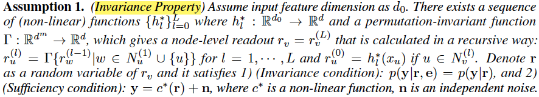

이 정의는 각 레이어에 이웃된 노드는 다양한 환경에 걸쳐 y를 안정적으로 예측하는데 기여하는 causal feature를 일부분 가지고 있다고 해석할 수 있습니다. 이는 1) (non-linear) transformation 가 각 레이어 마다 다를 수 있다는 점과 2) 임의의 노드 u의 centor node v에 대한 causal effect는 ego-graph에서의 상대적인 위치에 따라 달라질 수 있다는 이점을 가지기 때문에, 그래프 데이터에 대해 유연한 모델을 생성할 수 있습니다.

## **2. Motivation**

앞서 1-2-2절에서 논의한 Assumption 1을 기반으로 한 간단한 실험에서 저자들은 GCN이 가지는 한계를 발견하고 이를 Motivation으로 삼습니다.

Ego-graph  (와 )를 1-hop으로 정의하고, 논의를 간단하게 하기 위해 와 를 identity mapping으로, 를 mean pooling으로 정의해 봅시다.
그리고, 2차원의 node feature },x_v^{(2)}])와

$$\begin{equation}y_v=\frac{1}{|N_v|}\sum_{u \in N_v}{x_u^{(1)} + n_{v}^{(1)}}, x_v^{(2)}=\sum_{u\in N_v}{y_u+n_v^{(2)}+\epsilon}\end{equation}$$

로 가정하고, 이 때 },n_v^{(2)})는 independent standard normal noise이고, 은 평균이 0이고 분산은 0이 아닌 환경 변수 e에 종속적인 random variable 입니다.

이를 바탕으로 vanilla GCN이 예측 모델이라면 }&plus;\theta_2&space;x_{u}^{(2)}}이고, solution은  입니다. 즉, GCN은 invariant feature (i.e. https://latex.codecogs.com/svg.image?x_{u}^{(1)})을 알아낼 수 있다는 것을 의미합니다. 하지만, 아래의 명제를 보다시피 __일반적인 empirical risk minimization(ERM)를 사용할 때, 우리는 ideal solution을 도출할 수 없음__ 을 확인하게 됩니다 (자세한 증명은 논문의 Appendix 참고).

  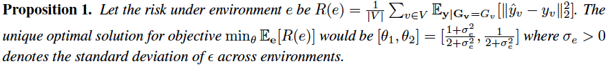

여기서 저자들은 명제 2를 통해 다양한 환경에 걸쳐 variance를 tackle하여 최적 해를 도출할 수 있는 새로운 objective를 제안합니다. 

  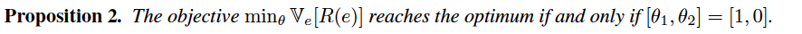

즉, 본 논문은 node-level task에서의 OOD 문제를 정의하고, 기존의 접근법과 달리 varience를 tackle하는 접근법을 통해 invariant 가정에 근거한 새로운 학습 방법 (_Explore-to-Extrapolate Risk Minization; EERM_)을 제시합니다.

## **3. Method**  

### **3-1. Stable Learning with Explore-to-Extrapolate Risk Minimization**

  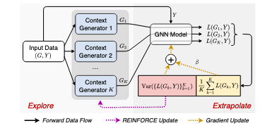

<em>그림 3 - The proposed approach Explore-to-Extrapolate Risk Minimization which entails K context generators that generate graph data of different (virtual) environments based on input data from a single (real) environment. The GNN model is updated via gradient descent to minimize a weighted combination of mean and variance of risks from different environments, while the context generators are updated via REINFORCE to maximize the variance loss</em>

앞선 toy example에서 벗어나 일반적인 케이스로 돌아오면 2장에서의 발견을 통해 새로운 학습 목표를 다음과 같이 정의할 수 있습니다.

$$\begin{equation}\min_{\theta}\mathbb{V}_{\mathbf{e}}{[L(G^{(e)}, Y^{(e)};\theta)]}+\beta\mathbb{E}_{\mathbf{e}}{[L(G^{(e)}, Y^{(e)};\theta)]},\end{equation}$$
where },&space;Y^{(e)};\theta)=\frac{1}{|V_e|}\sum_{v\in&space;V_e}{l(f_{\theta}(G_{v}^{(e)}),y_{v}^{(e)})}) and  is trading hyperparameter.

Eq. 4는 바람직한 extrapolation을 위해 다양한 환경에서 부터 생성된 data가 필요하다는 것을 의미하지만, node-level task는 하나의 환경에서 training 데이터로 하나의 graph만을 가지기 때문에 Eq. 4에 대한 변경이 필요합니다.
따라서, 저자들은 K-fold의 graph data 를 생성하기 위해  K auxiliary context generator }{(K=1,&space;...,&space;K)})를 도입합니다. 이는 하나의 input 를 기반으로 다양한 환경에서의 training 데이터를 모사하기 위함입니다. 따라서 Generator는 GNN의 학습을 안정적으로 만들고 다양한 환경을 탐색하기 위해 variance loss를 maximize하는 방향으로 학습됩니다.

  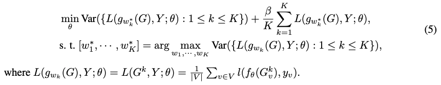

이제 남은 한 가지 문제는 )를 어떻게 특정하느냐 입니다. 저자들은 최근 그래프에서의 adversarial robustness에 대한 연구를 따라, edge를 추가하거나 제거하는 것을 통해 그래프 구조를 변경하는 방법을 활용합니다.

1. Boolean matrix )를 가정하고, A의 대체 그래프로 를 정의 (I 는 Identity matrix)
2. View k에 대해 변형된 graph ) (이 때, 는 element-wise 곱)를 얻음

는 미분 불가능하기 때문에 최적화하기가 어렵습니다. 따라서, policy gradient 방법인 REINFORCE(graph generation 과정을 decision 과정으로 다루고 edge editing 과정을 action으로 다룸)를 활용해 최적화하는 방법을 도입합니다 (이에 대한 자세한 내용은 Appendix를 참고). 

저자들은 이러한 Eq. 5 Explore-to-Extrapolate Risk Minimization (EERM)를 제안하였습니다.
간단한 방법론의 구조는 그림 2에서 확인할 수 있으며, 아래와 같이 알고리즘으로 표현할 수 있습니다.

  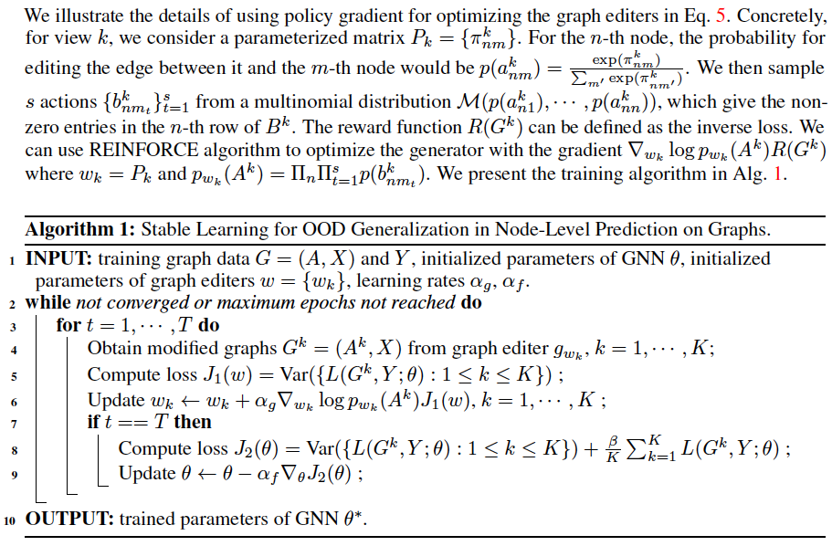

### **3-2. Theoretical Discussion**

> 이 후 나오는 Theorem에 대해서는 그 의미를 파악할 뿐 증명은 생략합니다. 자세한 증명은 논문의 Appendix를 참고해주세요.

이론적인 논의를 위해 다음에 표기법(notation) 추가하고, 필요한 것들을 정의해보겠습니다.

* GNN model 는 encoder 와 classifier 로 구분 가능
* Mutual Information: )
* =p(\cdot|\mathbf{e}=e)), =I(\cdot|\mathbf{e}=e))
* KL divergence: 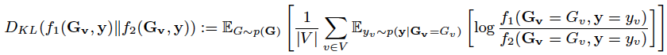

새로운 목적함수 Eq. 4가 OOD 문제 (Eq. 2)의 타당한 해임을 보장하기 위해서는 아래와 같은 data-generating 분포에 관한 또 다른 가정이 필요합니다.

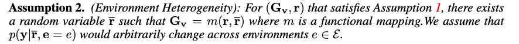

결국, Assumption 1과 2는 Input data의 feature의 두 부분으로 나눌 수 있음을 의미합니다: 1) domain-invariant () 2) environment sensitive ()

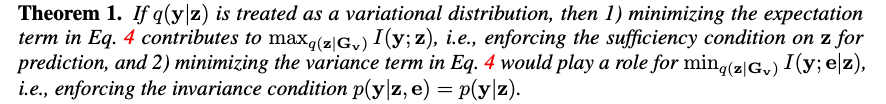

Theorem 1을 통해 dnflsms invariance principle과 OOD 문제를 연결할 수 있습니다.

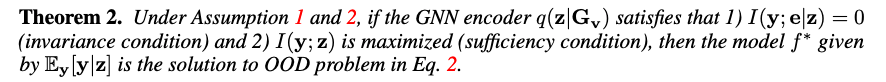

Theorem 2를 통해 결국 Eq. 4가 그래프 구조 데이터의 OOD 문제에 대한 타당한 해임을 이론적으로 증명할 수 있게 됩니다.

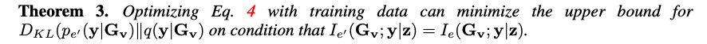

Theorem 3을 통해 OOD error에 대한 bound를 좁히는데 Eq. 4가 기여하는 것을 확인할 수 있으며, z가 다양한 환경에 걸쳐 sufficient representation이라면 이 조건을 만족하게 됩니다. 
이로써, EERM은 OOD 데이터에 대한 generalization error를 줄이는데 기여하고 GNN의 extrapolation 능력을 강화할 수 있음을 의미합니다. 

## **4. Experiment**

### **4-1. Datasets & Evaluation Protocol**

본 논문은 다양한 distribution shift에 대한 EERM의 효과를 확인하기 위해 Table 1과 같이 6개의 데이터 셋([Cora](https://paperswithcode.com/dataset/cora), Amazon-Photo[4](#fn4), [Twitch-explicit](https://snap.stanford.edu/data/twitch-social-networks.html), [Facebook-100](https://masonporter.blogspot.com/2011/02/facebook100-data-set.html), [Elliptic](https://www.kaggle.com/datasets/ellipticco/elliptic-data-set), [OGB-Arxiv](https://ogb.stanford.edu/docs/nodeprop/#ogbn-arxiv))을 가지고 실험했습니다. Distribution shift는 다음과 같이 분류할 수 있습니다.

* Artificial Tranformation: 인위적으로 전혀 상관없는 feature를 추가
* Cross-Domain Transfer: 여러 개의 그래프가 있는 데이터를 가지고 특정 도메인에서 학습한 모델을 다른 domain으로 transfer
* Temporal Evaluation: 시간이 따라 성장하는 그래프 데이터 셋에서 과거 시간으로 training 한 후 다음 시간의 데이터에 모델 적용

Train/Val/Test split은 Domain 또는 Time을 기준으로 나눴고, 평가 척도로는 흔히 사용되는 [Accuracy](https://en.wikipedia.org/wiki/Accuracy_and_precision), [ROC-AUC](https://en.wikipedia.org/wiki/Receiver_operating_characteristic), [F1-Score](https://en.wikipedia.org/wiki/F-score)를 사용했습니다.
마지막으로 Baseline은 일반적인 ERM을 통해 학습시켰습니다.

  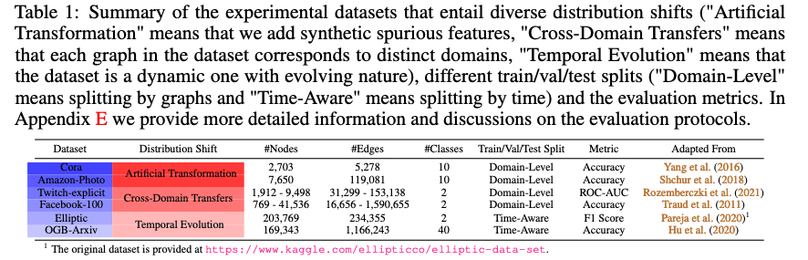

### **4-2. Handling Distribution Shifts with Artificial Transformation**

저자들은 Distribution Shift 중 Artificial Transformation에서의 모델 효과를 검증하기 위해 Cora, Amazon-photo 데이터에 다음과 같은 세팅으로 시험했습니다.

1. original node feature를 가지고 node label 생성
2. node label 및 environment id를 기반으로 상관없는 fetuare를 각각 생성

서로 다른 environment id를 가진 10-fold의 그래프를 생성하고 1/1/8fh training/validation/testing을 나눴고, 2-layer vanilla GCN을 사용했습니다.

그림 4의 (a)를 보시면, EERM이 ERM보다 모든 test graph에서 좋은 성능을 내는 것을 확인할 수 있습니다. 또한, Amazon-Photo 데이터의 EERM의 결과가 Cora에서의 결과보다 작은 variance를 가지는 것을 확인할 수 있는데, 이는 Cora는 주변의 feature가 prediction에 영향을 주는 많은 정보를 가지고 있는 반면, Photo는 그렇지 못함을 의미합니다. 이 결과를 토대로 invariant 한 feature와 spurious한 feature가 mixup 되면 Graph convolution에 좀더 의존하는 전자(Cora)의 경우, 분류에 어려움을 겪을 수 있음을 의미합니다.

그림 4의 (b)는 validation accuracy가 가장 높은 epoch의 training accuracy로 spurious한 feature가 있는 경우와 없는 경우를 실험한 것입니다. ERM의 경우 spurious한 feature에 많은 영향을 받은 반면, EERM은 비교적 robust한 것을 확인할 수 있습니다. 또한, 그림 4 (c)는 여러 encoder의 test accuracy를 측정한 것으로 다양한 encoder에서도 성능 향상을 확인할 수 있습니다.
한

  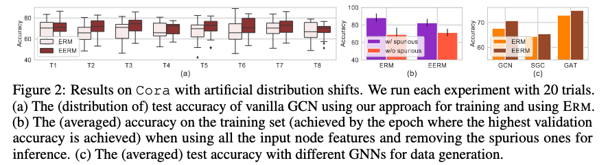

  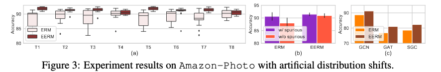

<em>그림 4 - Artificial Transformation 결과</em>

### **4-3. Generalizing to Unseen Domains**

이 실험에서는 여러 개의 그래프를 가지고 있는 Twitch-Explicit, Facebook-100 데이터를 가지고 실험을 진행했습니다. 제한된 그래프 (e.g. 1 개)를 가지고 학습한 모델을 새로운 unseen graph에 일반화했을 경우의 성능을 비교하는 시험입니다.

그림 5의 위 그래프는 하나의 그래프를 가지고 training한 후 unseen domain에 일반화한 결과이고, 아래의 표는 여러 개의 그래프를 가지고 학습해 unseen domain에 일반화한 결과입니다. 두 결과 모두를 통해 EERM이 일반적인 ERM에 비해 더 좋은 성능을 보임을 확인할 수 있습니다. 특히 그림 5의 아래의 그림을 통해 확인할 수 있듯이 EERM은 다양한 training 데이터에서도 robust하게 좋은 성능을 보임을 확인할 수 있습니다.

  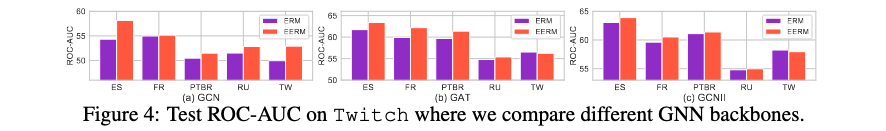

  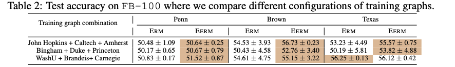

<em>그림 5 - Generalizing to Unseen Domains 결과</em>

### **4-4. Extrapolating over Dynamic Data**

마지막 실험에서는 EERM이 dynamic graph에서도 좋은 성능을 보이는지 살펴 본 실험입니다. Dynamic graph 환경에서 특정시간의 그래프에서 학습을 진행하고 미래의 새로운 데이터를 다루는 성능을 평가하는 실험입니다. 

그림 6의 왼쪽 그래프는 Dynamic Graph Snapshot을 다루는 능력을 실험하기 위한 것으로, 5/5/33 snapshot을 train/val/test로 분리했습니다. 보시다시피, EERM이 ERM에 비해 좋은 성능을 보이는 것을 확인할 수 있습니다. 다만, T7 이후에 두 방법론 모두 성능이 매우 하락하는데 이는 실제 T7 시점에 dark market이 shutdown 되었기 때문이며, 이런 갑작스러운 event는 외부요인에 의한 것으로 제한된 training 데이터를 통해 예측하기 어렵습니다.
그림 6의 오른쪽 그래프는 시간에 따라 증가하는 새로운 노드들을 다루는 능력을 실험하기 위한 것으로, 2011년 이전까지의 그래프를 training으로 하고, 2011년 부터 2014년 사이를 validation으로 하고, 2014-2016/2016-2018/2018-2020을 각각 test 데이터로 실험하였습니다. 이 세팅에서서 또한 EERM이 ERM에 비해 우수한 성능을 보임을 확인할 수 있습니다.

  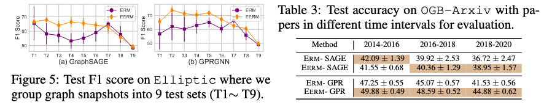

<em>그림 6 - Extrapolating over Dynamic Data 결과</em>

## **5. Conclusion**

본 논문은 그래프 구조 데이터의 node-level task에서 OOD 문제를 해결하고 했습니다. 기존의 OOD 문제를 node-level task에 맞게 변형하고, variance를 활용한 목적함수로 기존의 접근법이 가지고 있는 한계점을 개선하여, 다양한 distribution shift 상황에서 좋은 성능을 보이는 모델을 제안하였습니다. 

**Takeaway**

Feature 중에서 environment에 영향을 받지 않고 어떤 상황에서든 downstream classifier에 대해 동일한 (최적의) 성능을 내는 invariant feature를 찾는 과정이 신선했습니다. 또한 Distribution shift를 다양한 관점에서 정의해 자신들의 모델의 우수성을 보여준 것도 매우 흥미로웠습니다.

**Limitation**

다만, 실제로 모든 상황에서 invariant property를 가지는지 의문이 들었습니다. 실제로 Openreview에서도 리뷰가 지적했듯이 invariant property를 도출하는 Assumption 1이 현실적인 가정인지 좀 더 확인해 볼 필요가 있을 것 같습니다.
또한, Baseline을 일반적인 ERM만 가지고 실험한 것도 아쉬운 부분입니다. 비슷한 문제를 다루는 다른 방법론들과 같이 비교했으면 더 좋은 실험이 되지 않았을까 싶습니다.

***

## **Author Information**

* [오윤학(Yunhak Oh)](https://yunhak0.github.io)
  * M.S. Student in [DSAIL](https://dsail.kaist.ac.kr) at KAIST
  * Research Topic: Artificial Intelligence, Data Mining, Graph Neural Networks

## **6. Reference & Additional materials**

<a name="fn1">1</a>: Martín Arjovsky, Léon Bottou, Ishaan Gulrajani, and David Lopez-Paz. Invariant risk minimization. CoRR, abs/1907.02893, 2019.

<a name="fn2">2</a>: Mateo Rojas-Carulla, Bernhard Schölkopf, Richard E. Turner, and Jonas Peters. Invariant models for causal transfer learning. Journal of Machine Learning Research, 19:36:1–36:34, 2018.

<a name="fn3">3</a>: Mingming Gong, Kun Zhang, Tongliang Liu, Dacheng Tao, Clark Glymour, and Bernhard Schölkopf. Domain adaptation with conditional transferable components. In International Conference on Machine Learning (ICML), pp. 2839–2848, 2016.

<a name="fn4">4</a>: J. McAuley, C. Targett, Q. Shi, and A. Van Den Hengel. Image-based recommendations on styles and substitutes. In SIGIR, 2015.
