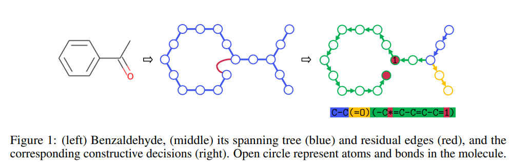
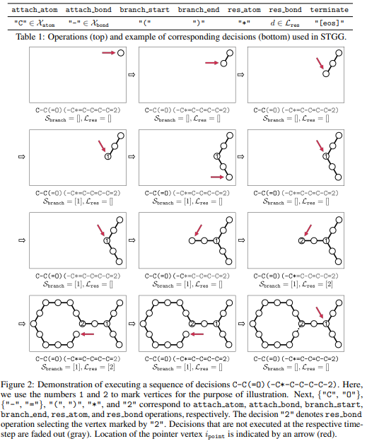
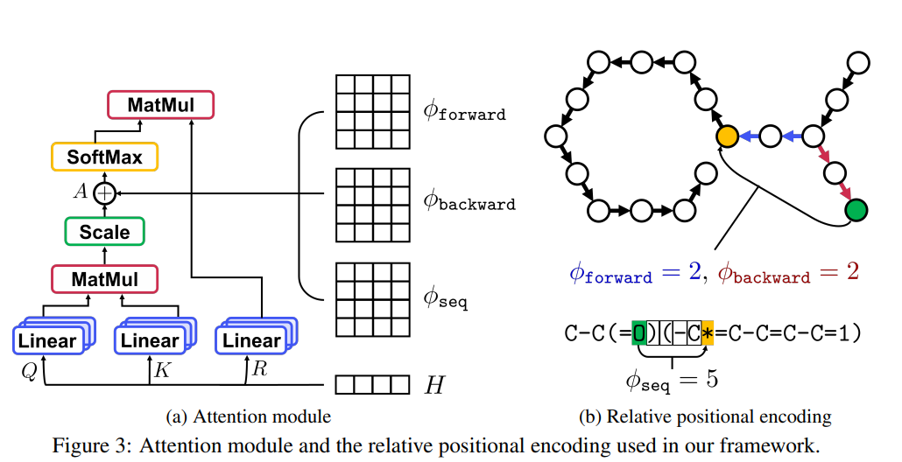
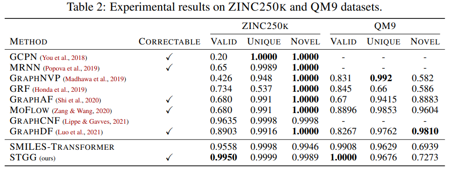
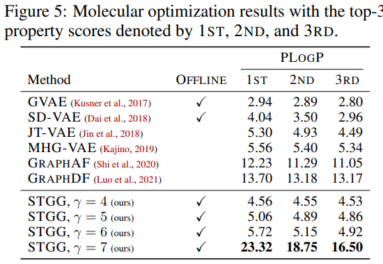

# **Spanning Tree-based Graph Generation for Molecules** 

## **1. Problem Definition**  

해당 논문이 다루는 문제는 Sparse Graph Generation 이다. Sparse Graph란 Node degree가 적은 형태의 graph를 지칭한다. 대표적으로는 Chemical Graph 가 있다. 이 논문에서는 Molecular Generation Task (Chemical Graph Generation) 에 좀 더 집중해서 방법론을 검증한다. 

## **2. Motivation**  

Generative Model 에 대한 탐구는 많이 이루어졌지만, 거의 대부분이 Image, Speech 등 연속적인 데이터를 다뤘었다. Graph 처럼 불연속 적이고 특이한 데이터를 생성하는 것은 특유의 어려움이 따른다. 

특히 Chemical Graph는 chemcal rule 을 만족시켜야 하며, 화학적은 특수한 성질을 부여하고 싶은 경우가 많기 때문에 Generation 문제는 더욱 까다롭게 된다. 

기존에 VAE 기반 방법들로 Chemical Graph Generation을 주로 Tackle 하였지만, 만족할 만한 성능을 내지는 못하고 있는 상황이다. 

## **3. Method**  

### Constructive Process of Tree Spanning

해당 논문은 Chemical Graph를 Tree 구조로 설정한 후, 각 Tree Node와 Edge를 Decision Step 마다 설정하는 방식의 방법을 차용한다. 

이러한 방법을 소위 Constructive Heuristic 이라고 하며, Travelling Salesman Prolem (TSP) 등 NP-hard 문제를 풀기 위해 기존 딥러닝 연구들에서 주로 제안되었던 방법론이다. 

  

해당 논문이 굉장히 잘 한 부분은 Chemical Graph의 Branch, Residual 특성을 잘 반영했다는 것이다. 밑에 그림에서 1 이라고 나타난 부분이 Branch 이다. Branch가 만들어지면, Leaf node까지 생성한 후 Pointer를 다시 돌려 놓는다. 

Residual 은 2로 표현을 하고 이는 마지막 Branch를 의미한다. 즉 2번 node로 부터 파생된 tree 들은 leaf 가 생성되며 construction 이 마무리 되게 된다. 

이러한 Tree Spanning 알고리즘은 굉장히 간단하지만, 기존의 chemical graph generation task에서 압도적인 성능을 거둘 수 있었다. 

### Transformer Architecture

해당 논문이 제안한 Tree Spanning 알고리즘은 transformer 구조를 만나면서 그 효과가 배가된다. 해당 논문에서는 transformer 구조를 chemical graph에 사용 될 수 있도록 refine 하였다. 

특히 positional embedding 부분이 가장 큰 technical novelty 라고 볼 수 있다. 이 논문에서는 각 time step에 생성된 node 사이의 forward, backward 거리, 그리고 time step의 차이, 3개를 embedding 하여 positional embedding 으로 사용한다. 

이러한 positional embedding은 sequential decision transformer의 time step에 대한 context를 부여해주는 효과가 있다. 

## **4. Experiment**  

### **Experiment setup**  
* Dataset  

QM9, ZINC250k, MOSES

* Baseline

Other SOTA chemcal graph generation models

* Evaluation Metric  

Validity (10000개 sample중 chemical rule을 만족시킨 sample 비율)
Uniqueness (겹치는 것이 없는 비율)
Novelty (Training set에 비해 새로운지)

penalized octanol-water partition coefficient (PLOGP): conditional generation 추가실험에서만 비교. 

### **Result**  

### **Main Result**  

메인 결과는 위에 그림과 같이 STGG 모델이 3가지 측면에서 모두 압도적인 성능을 거두었다. 사실 해당 모델은 Validity는 항상 1을 가질 수 있는 것이, construction step에서 chemical rule을 만족시키지 않을 경우, masking을 통해 decision을 제한할 수 있다. 

결과 report에는 딱히 masking algorithm을 사용하지 않고 평가하였다. 

### **Conditional Generation (Optimization)**  

사실, molecular generation 도 중요하지만, optimization 에도 관심이 몰리고 있다. 이러한 generative model 들에게 reward를 conditioning 하여, 학습 하고, 높은 reward의 sample을 generation 하는 외삽 task를 수행하게 할 수 있다. 

이는 결국 offline optimization setting과 같아진다. 

해당 논문에서는 제안한 generative model의 외삽 성능도 평가하였으며, 타 모델 대비 압도적인 optimization 성능을 보여주었다. 

하지만, 이 논문이 conditional generation을 염두해 두고 focus 한 방법론은 아니기 때문에 further work에서 더 tackle 할 room 이 있어보였다. 

## **5. Conclusion**  

해당 논문은 굉장히 practical 한 task인 molecular generation 을 위한 새로운 모델 아키텍쳐와, decision scheme 을 제시하였다. 매우 이해하기 쉽운 알고리즘이지만 좋은 성능을 보여주는 훌륭한 논문이였다. 

---  
## **Author Information**  

* Sungsoo Ahn
, Binghong Chen
, Binghong Chen
, Le Song
    * Lead Author Affilation : Postech
    * Research Field: Deep Learning

## **6. Reference & Additional materials**  

@inproceedings{ahn2021spanning,
  title={Spanning tree-based graph generation for molecules},
  author={Ahn, Sungsoo and Chen, Binghong and Wang, Tianzhe and Song, Le},
  booktitle={International Conference on Learning Representations},
  year={2021}
}

