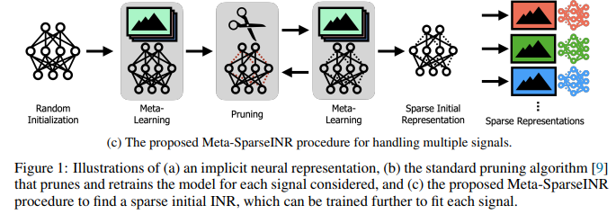

# Meta-learning Sparse Implicit Neural Representations

## **1. Problem Definition**

Implicit Neural Representations (INRs) also known as coordinate-based representations could provide a generic way of representing all kinds of data modalities. INRs are obtained by training a neural network with continuous activation functions to predict the coordinate-to-value mapping. Take an image as an example: the neural network map the pixel locations to RGB values and directly store the parameters of the network.

Scalability is a huge challenge nowadays since discrete representation requires a huge amount of storage and computation capacity. INR can provide a generic way to represent data while compressing it. Furthermore, using continuous data representation instead of the typical discrete representation render the data independent from spatial resolution, allowing high dimension processing. However, training INR requires a lot of parameters, memory, and computations steps. In this papaer, the authors are proposing an efficient algorithm to train a sparse neural network for a large number of signals to get INRs.

## **2. Motivation**

Existing works in implicit neural representation are parameters heavy. As a result, they require a lot of memory and computations steps.

There are three main approaches to train the INRs on multiple signals. The first one uses a latent code vector to share information across the neural network. The second one uses meta-learning to pre-train the model. The last approach adds a uniform quantization of the weights for each INR. None of those approaches can combine the efficiency in both memory and computation with the ability to generalize to new signals.

The authors' solution to this problem is called Meta-SparseINR. This new framework consists of adding neural network pruning to the meta-learning approach to obtain sparse INR. Network pruning removes parameters from the neural representation by fixing them to zero, thus creating sparse networks. The "winning ticket" method demonstrated that a sparse subnetwork can match the results of the original dense model when trained from scratch. Furthermore, it's possible to transfer a winning ticket to a new highly relevant dataset. Existing works are focusing on pruning randomly initialized models but the authors are proposing to prune a meta-trained model instead.

## **3. Method**

To find a well-initialized sparse subnetwork structure, the authors developed an algorithm called Meta-SparseINR based on the alternation of meta-learning with pruning. For starters, the weights are initialized according to the standard scheme for INR. Then, the algorithm can be described in three steps :

1. Meta-Learning of the signals using Model-Agnostic Meta-Learning (MAML) : MAML is a kind of few-shot meta-learning that provides a method for fast adaptation of neural networks. It can be used with any model performing gradient descent. MAML relies on the idea that some internal features are more transferrable than others. As such, the model can generalize well with only a few gradient descent steps and few training data. In order to obtain a sparse subnetwork, the authors are adding to the MAML a binary mask performing an element-wise product with the parameters.
2. Magnitude-based pruning : the algorithm first computes the magnitude score of the learned INR and proceeds to remove a percentage of the connections. Connections with a magnitude below the common threshold for every layer will be cut off instead of pruning every individual signal.
3. Retrain and repeat : the algorithm keeps going until the sparsity degree is attained.

## **4. Experiment**

### **Experiment setup**

* Dataset for image regression : CelebA for face data, Imagenette for natural images and 2D SDF for geomtric pattern.
* Model : Meta-SparseINR algorithm with multi-layer perceptrons and sinusoidal activation functions.
* Baseline : Random Pruning, Dense-Narrow, MAML+OneShot, MAML+IMP, Scratch
* Evaluation Metric : Peak signal-to-noise ratio (PSNR) to evaluate the reconstruction quality of images and videos

### **Results**

The goal of the authors is to propose an efficient method to train compressed INRs in regard of memory and computation steps.

_Memory performance_

In figure 3, the authors propose to compare the PSNR of Meta-SparseINR against the baseline for a different number of model parameters. Meta-SparseINR outperforms all baseline for all three datasets. The results are particularly significant for very sparse models since the baseline score are dropping before Meta-SparseINR.

As we can see in the table, Meta-SparseINR needs half the number of parameters of the strongest baseline Dense-Narrow and Random Pruning to obtain a similar PSNR. So Meta-SparseINR is a memory efficient method to train INRs.

_Computation performance_

In another experiment, the authors compared the PSNR of Meta-SparseINR against the baselines after training on a small number of optimization steps (<100). Meta-SparseINR steadily offers better results than the baselines.

Since the authors' model require less computational step and memory to achieve the same PSNR as other model, they succeeded in providing an efficient method to train INRs.

## **5. Conclusion**

In this paper, the authors proposed an efficient way to train implicit neural representations on a large group of signals. They achieved such a result by combining meta-learning and network pruning. Using MAML allowed them to learn the initial weights with a small number of gradient steps in a few-shot learning fashion. While using network pruning introduces sparsity by reducing the number of parameters. By pruning the entire network instead of each signal individually, they can keep their model efficiency concerning computation. In the end, they outperformed the usual dense models with half the number of steps. Since the main contribution of this paper lies in their new pipeline, they used relatively simple methods for implementation. Performing different tasks like neural compression or attaining better representation could be explored by adding layers of complexity to the pipeline.

> Alternating between meta-learning and network pruning to find a well-initialized sparsed INR is computer efficient in regard of memory and computation while maintaining the generalization ability of the model.

***

## **Author Information**

* Emeline BAGORIS
  * KAIST, Graduate School of AI

## **6. Reference & Additional materials**

* Github Implementation : https://github.com/jaeho-lee/MetaSparseINR
* Meta-Learning Sparse Implicit Neural Representations : https://arxiv.org/abs/2110.14678
