# Hypergraph with DHT

***

```
Jaehyeong Jo , Jinheon Baek , Seul Lee , Dongki Kim , Minki Kang , Sung Ju Hwang / Edge Representation Learning with Hypergraphs / NeurIPS - 2021
```

***

## 1. Problem Definition

* 주어진 그래프의 edge를 정확하게 representing 하기

## 2. Motivation

* _**Motivation**_
  * 대부분의 GNN 연구는 그래프의 “node”에 관심을 가지고 있다. → “edge”에 대한 연구 **미약함**
    * node level representation을 증가시키기 위해 부가적으로 edge 정보를 사용하고 있음
  * 하지만, 그래프 reconstruction/generation와 같은 task 에서는 그래프의 edge를 정확하게 표현하는 것이 중요함
    * edge의 연결이 부정확하게 된다면 완전히 다른 결과를 나타낼 수 있기 때문
  * 따라서 본 논문에서는 현재 존재하는 edge representation learning 방법론의 한계를 극복하기 위한 scheme 제안
* _**Challenges**_
  * edge를 다루는 데 가장 어려운 점은 edge에 대한 message-passing scheme이 없거나 혹은 suboptimality에 이른다는 점
    * edge를 **hypergraph**의 노드로 표현하여 이 문제를 해결하고자 함
  * 또, 원본 그래프의 edge를 hypergraph의 edge로 변환하는 방법인 Dual Hypergraph Transformation (DHT)를 제안
    * 이 방법으로 인해 any off-the-shelf message-passing schemes를 적용 할 수 있음
* _**Idea**_
  * 각 edge를 표현하는 것만으로는 전체 그래프의 정확한 representation을 얻기에 불충분하기 때문에 2개의 graph pooling method 제안
    * **HyperCluster** : 비슷한 edge를 single edge로 묶음
    * **HyperDrop** : 불필요한 edge 제거

## 3. Method

> 📌 **관련 용어**
>
> * **Message-passing**
>   * node 혹은 edge 간의 연관성을 고려하면서 피처를 업데이트하기 위한 방법
> * **Graph pooling**
>   * pooling 연산을 통해 그래프를 더 작은 그래프 혹은 벡터로 압축하여 정확한 그래프 representation을 학습하는 것을 목표로 함
>   * 가장 간단한 pooling 방법은 모든 node representation에 대해 mean, sum 혹은 max 등을 취하는 것

* Edge HyperGraph Neural Network (EHGNN) : 본 논문에서 제안하는 edge representation learning framework with dual hypergraphs
* **먼저 일반적인 GNN에서의 message-passing 방법에 대해 살펴보자!**
* Graph neural networks
  * 그래프(n개의 노드, m개의 edges를 가진)는 node 피처  , edge 피처  그리고 인접행렬인  로 정의됨
  * 은 각각 node와 edge 피처의 차원
  * 그래프가 주어졌을 때, GNN의 목적은 message-passing을 통해 이웃 node 사이의 node level representation을 학습하는 것
  * 일반적으로 message-passing은 다음처럼 이루어짐
    * %7D\)\))
      * %7D): 번째 레이어에서의 node 피처
      * AGGREGATE : 노드 v의 이웃 노드들로부터 message를 합치는 함수
      * UPDATE : 노드 v의 representation을 업데이트 하는 함수
      * ): 노드 v의 이웃 노드들 (인접행렬 A로 부터 이웃노드를 얻을 수 있음)
* Edge representation learning
  * edge representation learning에 대해 message-passing 함수를 정의하는 방법은 (**1)edge에 대한 인접행렬을 만들거나, (2)edge neighborhood 구조를 정의하거나 혹은 (3)line graph 변환을 사용하는 것**
    * 그러나 이 방법들은 ) 시간복잡도를 요구하기 때문에 suboptimal!
  * 즉, 이것이 message-passing 방식을 edge 에 직접적으로 적용할 수 없는 \*\*주요 문제점\*\*이기 때문에, 본 논문에서는 \_**Hypergraph**\_를 사용하여 이를 해결하고자 함
* **그렇다면 Hypergraph는 무엇인가?**
* Hypergraph
  * Hypergraph는 그래프 구조의 데이터를 노드 간의 high-order 관계로 모델링 할 수 있는 그래프
  *   전통적인 그래프에서 edge가 2개의 node만을 연결 할 수 있는 것과 달리, hypergraph에서는 하나의 edge가 random개의 노드와 연결할 수 있음

      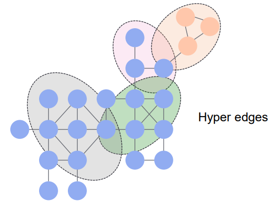
  * 따라서, 이런 high-order 관계를 표현하기 위해 incidence matrix  사용
    * incidence matrix : n개의 nodes와 m개의 hyperedges 사이의 관계를 표현하는 행렬
    * incidence matrix \&space;=\&space;%5Cbegin%7Bcases%7D1\&space;%5Cquad\&space;if\&space;,\&space;\&space;v\&space;%5Cin\&space;e%5C0\&space;%5Cquad\&space;o.w%5Cend%7Bcases%7D)
  * 결국, hypergraph는 )와 같이 정의할 수 있음
    * node 피처  , edge 피처  그리고 incidence matrix인 
  * 전통적인 그래프 역시 위와 같은 모양으로 정의 할 수 있음
    * 
    * 이때 M은 오직 2개의 노드와 관련이 있는 행렬을 의미
* **이제, 그래프의 edge를 hypergraph의 노드로 바꾸는 과정을 살펴보자!**
* Dual Hypergraph Transformation
  * node와 edge의 정보를 유지하면서 그 역할을 바꿀 수 있다면, edge를 학습하는데 있어 어떤 node-based message-passing 방식도 사용 할 수 있을 것
  *   따라서 본 논문에서는 원본 그래프의 edge를 hypergraph의 node로, 원본 그래프의 node를 hypergraph의 edge로 변환하는 방식 제안

      **→** **Dual Hypergraph Transformation**
  *  \* !\[]\(https://latex.codecogs.com/svg.image?G%5E\\\*)은 원본 그래프의 dual hypergraph \* 주어진 그래프의 node와 edge의 구조적인 역할을 바꿈 \* 원본 incidence matrix를 transpose 하여 hypergraph의 incidence matrix를 얻음
  *  \* dual hypergraph가 원본 그래프의 정보를 모두 가지고 있기 때문에 다시 원본 그래프로 복구하는 것도 가능함 \* 즉, DHT는 \*\*bijective transformation\*\*
  * DHT는 변환에 있어 정보의 손실을 일으키지 않으며, 피처를 representation하는데 추가적인 메모리가 필요하지도 않음
* Message-passing on the dual hypergraph
  * %7D\&space;=\&space;UPDATE\(X%7Be%7D%5E%7B\(l\)%7D\&space;,\&space;AGGREGATE\(%7B\&space;E\_f%5E%7B\(l\)%7D\&space;:\&space;%5Cforall\&space;f\&space;%5Cin\&space;%5Cmathcal%7BN%7D\(e;M%5ET\)%7D\)\))
    * %7D): 의 번째 레이어에서의 node 피처
    * AGGREGATE : 노드 e의 이웃 노드들로부터 message를 합치는 함수
    * UPDATE : 노드 e의 representation을 업데이트 하는 함수
    * ) : 노드 e의 이웃 노드들
  * 따라서, 위의 dual hypergraph에서의 message passing 식을 이용해 정리하면,
    * 
    * EHGNN은 DHT를 이용한 본 논문에서의 learning framework
* **이제, 전체 그래프의 edge를 정확하게 표현하기 위해 edge-wise representation을 사용하는 방법을 보자!**
* Graph-level edge representation learning with edge pooling
  * 본 논문에서는 **HyperCluster, HyperDrop** 이라는 두가지 graph pooling 방법 제안
  * graph pooling
    * graph pooling의 목적은 전체 그래프의 representation을 학습하는 것
    * 최근의 graph pooling method들은 node를 뭉치거나 혹은 불필요한 node를 drop 하는 방법
    * 그러나 이 방법들은 node와 edge의 정보를 손실한다는 단점 존재
    * 따라서 본 논문은 이런 한계를 극복하고자 함
  * **HyperCluster**
    * global한 edge representation을 얻기 위해 비슷한 edge들을 single edge로 만드는 방법
    * %5ET\&space;=\&space;C%5ETM%5ET)
      * ) ; 먼저 hypergraph의 node representation 을 얻음
      * 그 다음 위 식과 같이 HyperCluster 진행
      *  : edge 피처 로부터 생성된 cluster assignment 행렬
      * 
  * **HyperDrop**
    * 불필요한 edge를 제거하는 방법
    * %5ET\&space;=\&space;\(M%5ET\)%7Bidx%7D;\&space;idx\&space;=\&space;top\_k\(score\(E\)\))
      * hypergraph에서 점수를 계산하고 이때 top-ranked node를 선택 → 결국 원본 그래프의 top-ranked edge를 선택하는 것과 동일한 의미
      * 그 다음 위 식과 같이 HyperDrop 진행
        *  : 점수에 따라 k개의 elements를 선택하는 것
        * ) : 각 node의 점수를 계산
        *  : row-wise (i.e., node-wise) indexing vector
    * HyperDrop의 가장 큰 장점은 deep GNNs에서의 _**over-smoothing(지나친 획일화)**_ 문제를 약화시킨다는 것
  * **따라서, 위 방법들을 통해** %7D)**를 얻을 수 있음**
*   DHT 도식화

    !\[]\(../../.gitbook/2022-spring-assets/WYE/DHT image.png)

## 4. Experiment

* 본 논문에서는 EHGNN을 3가지 task 관점에서 검증함
  * graph reconstruction
  * generation
  * classification
* **task에 대해서 하나씩 살펴보자!**

1. Graph recontruction task
   * 이 task의 목적은 compressed representation에서 edge 피처를 재구성하는 것
   * EHGNN with HyperCluster을 검증하려고 함
   * Dataset
     * synthetic two-moon graph 사용 (PyGSP 라이브러리에 의해 생성된)
       * node 피처는 좌표, edge 피처는 색깔(RGB)을 의미
     * real world graph로 ZINC dataset 사용
       * 12K molecular graphs로 구성되어 있음
       * node 피처(좌표)는 atom types, edge 피처는 bond types
   * Evaluation Metric
     * accuracy : 모든 node와 edge의 분류 정확성을 측정
     * validity : 화학적으로 타당하게 생성된 molecules의 수
     * exact match : 원래의 molecules와 동일하게 생성된 molecules의 수
   * Baseline
     * EGCN, MPNN, R-GCN, EGNN
     * 위 GNN들은 node 피처를 업데이트 하는데 부가적인 정보로 edge 피처를 사용함
     * 여기에 현재 존재하는 graph pooling 방법 GMPool을 결합
     * EHGNN+HyperCluster와 baseline 비교
   *   Edge reconstruction results

       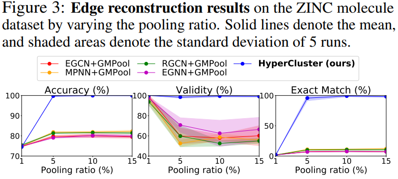 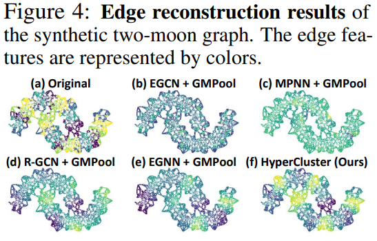

       * fig3을 보면, 본 논문에서 제시한 모델이 baseline에 비해 좋은 성능을 보임을 알 수 있음
       * fig4를 보면, 본 논문에서 제시한 모델이 원본 two-moon graph와 가장 비슷하게 edge 색깔이 구분되었음
         * 이는 논문에서 제시한 방법이 의미있는 edge cluster를 구분할 수 있다는 것을 보여줌
   *   Graph reconstruction results

       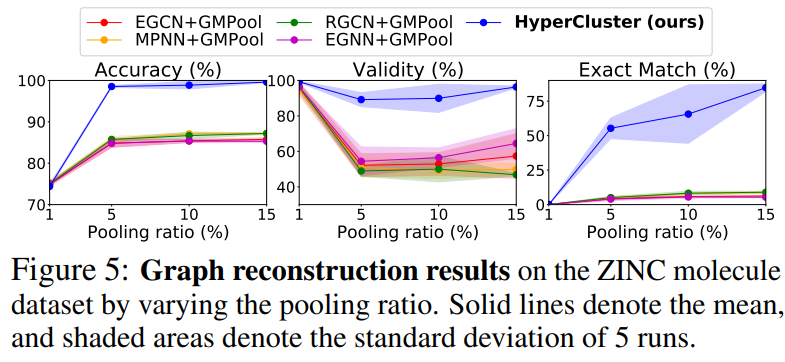

       * 마찬가지로 논문에서 제시한 모델이 baseline에 비해 높은 성능을 보임
       * 이는 node representation 뿐 아니라 정확한 edge representation을 학습하는 것이 graph representation 성공의 중요한 요소임을 시사함
   *   Qualitative analysis

       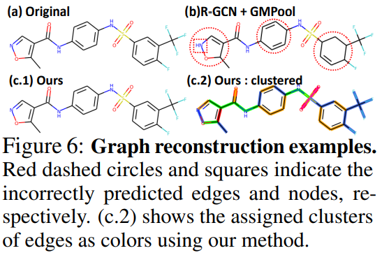

       * 제시한 모델이 baseline(b)에 비해 원래의 graph를 더 정확하게 재구성함을 보임
   * Graph compression
     * 제시한 모델이 large, dense한 그래프를 압축하는데 효과적인지 검증하고자 함
     * 따라서 모델을 Erdos-Renyi random 그래프에 적용
       *   Erdos-Renyi random 그래프는 node가 $10^3$개로 고정되어 있고 edge는 \~ 개로 랜덤

           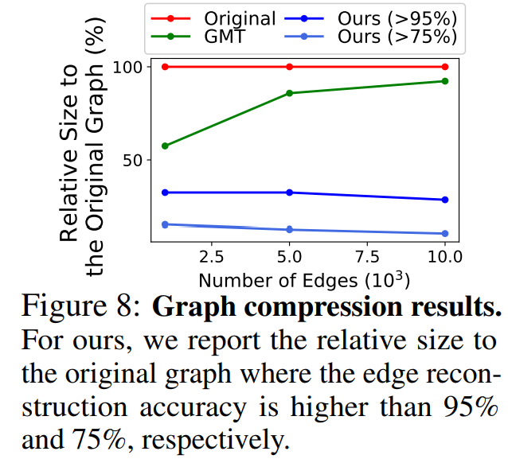
       * edge가 많아질 수록, 즉, 그래프의 사이즈가 커질 수록 baseline은 compact하게 압축하지 못하지만, 본 논문에서 제시한 모델은 compact하게 압축함을 보임
2. Graph generation
   * 그래프의 edge가 잘못 만들어지면 전혀 다른 의미를 가지게 됨
   * 따라서, edge 생성이 제대로 되는지 검증하기 위해 graph generation task 진행
   * Evaluation Metric
     * Synthetic Accessibility (SA) : 화합물의 합성 용이성을 평가하는 지표
     * Druglikeness (QED) scores
   * Baseline
     * MolGAN
       * GAN을 사용하여 molecular graph를 만듦
       * node level message-passing에 R-GCN 사용 ↔ EHGNN을 사용해 edge 정보를 얻고 그래프 encoder에서 mean pooling 방법을 사용
     * MArkov moleculaR Sampling (MARS)
       * MCMC 샘플링을 통해 molecule을 만듦
       * edge representation을 얻기 위해 Message Passing Neural Network (MPNN) 사용 ↔ EHGNN을 사용하여 edge representation 얻음
   * Expreriment setup
     * 4가지의 molecule 특성을 최대화하도록 모델을 학습시킴
       * , , QED, SA score
       * success rate는 모든 특성이 충족된 비율을 의미
   *   MolGAN results

       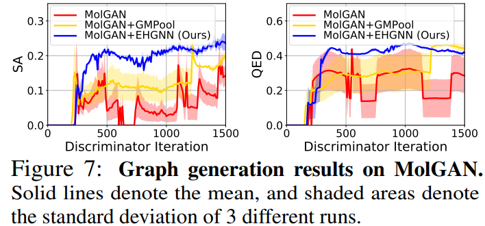

       * 본 논문에서 제시한 모델이 baseline 대비 stable하며 뛰어난 성능을 보임
   *   MARS results

       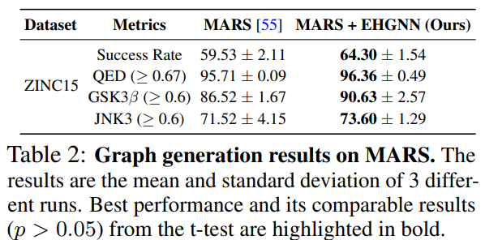

       * 본 논문에서 제시한 모델이 모든 evaluation metric에서 baseline보다 높은 성능을 보임
       * 여기서,  score가 중요한데, 이는 edge를 정확하게 학습하는 것이 target protein과 interact하는, 더 **효과적인 molecules을 생성**할 수 있다는 것을 시사
3. Graph and node classification
   * 이제, classification task 관점에서 본 논문이 제시한 EHGNN with HyperDrop을 검증하고자 함
   * Dataset
     * 6 datasets from the TU datasets
       * 3개의 dataset은 biochemical 도메인, 나머지 3개는 social 도메인
     * 4 molecule datasets from OGB datasets
   * Evaluation Metric
     * Accuracy - TU dataset에 대해 측정
     * ROC-AUC - OGB dataset에 대해 측정
   * Baseline
     * set encoding baseline
       * DeepSet
     * GNNs with naive pooling
       * GCN, GIN
     * hierarchical pooling
       * DiffPool, SAGPool, TopKPool, MinCutPool, ASAP, EdgePool, HaarPool
     * node pooling methods
       * SortPool, GMT
   * Experimental setup
     * 모든 모델에 대해, node-level message-passing 레이어로 GCN을 사용
   *   Classification results

       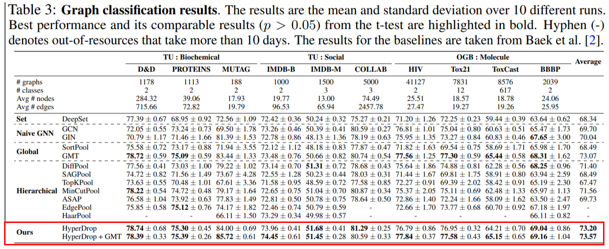

       * 본 논문에서 제시한 모델이 baseline에 비해 높은 성능을 보임
       * HyperDrop은 아무 노드도 제거하지 않기 때문에, 다른 node pooling method와 결합하여 사용할 수 있음
         * 따라서 HyperDrop + GMT(node pooling method)를 결합하여 성능을 확인한 결과, 대부분의 데이터셋에서 최고의 성능을 보임
         * 이는 그래프 분류에 있어 node와 edge를 정확하게 학습하는 것이 중요하다는 것을 시사
   *   Ablation study

       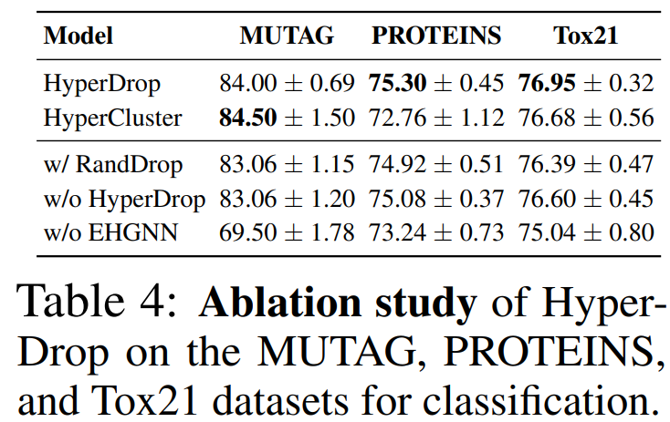

       * node 피처만 사용하는 경우(w/o EHGNN) 보다 edge representation도 같이 학습할 때 성능이 훨씬 향상됨을 확인
   * Over-smoothing with deep GNNs
     *   여기서는, 본 논문이 제시한 모델이 over-smoothing 문제를 약화시킨다는 것을 증명하고자 함

         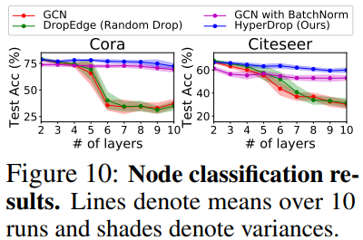
     * 본 논문에서 제시한 모델이 baseline에 비해 안정된 높은 성능을 보임
     * 또한 over-smoothing을 약화시키는 방법 중 하나인 batch normalization과도 비교했을 때 높은 성능을 보임

## 5. Conclusion

* Summary
  * 본 논문은 그래프의 edge respresentation 문제를 다룸
  * 새로운 edge representation learning framework인 DHT를 제안
    * edge → hypergraph의 node로 변환하는 방법
  * 이 방법을 적용함으로써 node representation 학습에서의 message-passing scheme를 edge representation 에 적용시킬 수 있음
  * 또한 2개의 edge pooling method 제시
    * HyperCluseter, HyperDrop
  * 다양한 관점에서의 실험을 통해 본 논문에서 제시한 모델 검증 → baseline보다 좋은 성능을 보임
* My comment
  * node 에 대한 학습은 많이 들어보았지만 edge 학습이라는 점은 조금 생소했음. 하지만 논문을 읽으며 논문에서 적용한 아이디어들에 매우 흥미로워 하면서 재밌게 논문을 읽을 수 있었음. 그래프 피처 표현에 관심이 생기며, 다음으로는 graph와 autoencoder 관련된 논문을 읽고 싶다는 생각이 들음.

***

## Author Information

* 지식서비스 공학대학 20213383 원예은
* Research Topic
  * 물류 자동화, ASRS..

## 6. Reference & Additional materials

* 논문 코드
  * [https://github.com/harryjo97/EHGNN](https://github.com/harryjo97/EHGNN)
* Hypergraph
  * [http://dsba.korea.ac.kr/seminar/?mod=document\&uid=1428](http://dsba.korea.ac.kr/seminar/?mod=document\&uid=1428)
* 자세한 설명 논문 Appendix 참고
